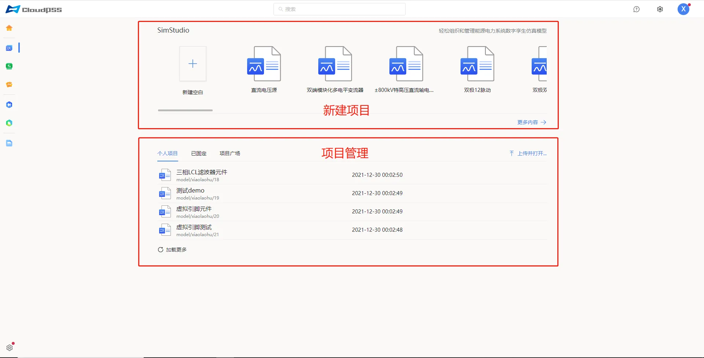
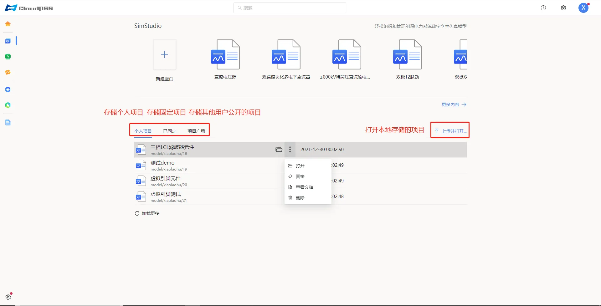

用户成功登录后，在 CloudPSS 主页点击 SimStudio 的图标后，页面将跳转至 `SimStudio 个人中心`，如图所示。该界面包含新建项目、项目管理等。

## 新建项目

点击`新建空白`，会打开一个新的页面并自动创建一个新的项目，点击`模板案例`会打开一个模板项目，点击`更多内容`，也会打开一个新的页面（进入工作台）并自动创建一个新的项目。

## 项目管理

该区域包含：

+ 个人项目：用于存储用户的仿真项目文件。

+ 已固定：用于存储已固定的个人项目。

+ 项目广场：用于显示他人发布的仿真项目文件。

+ 加载更多：加载没有显示全的其余项目。

+ 上传并打开：用于打开保存在本地的项目文件。  

鼠标移至任一个人项目文件，会显示`打开`和`更多选项`操作按钮，可对项目文件进行`打开`、`查看文档`(可以通过点击该项目快速查看)、`固定`(仅限个人项目)、`取消固定`(仅限已固定的项目)操作、`删除`(仅限个人项目)等操作，如图所示。

在项目文件上点击`打开`按钮，会跳转到工作台页面并打开该仿真项目。

在项目文件上点击`查看文档`按钮，页面右侧会出现该项目的文档描述。

