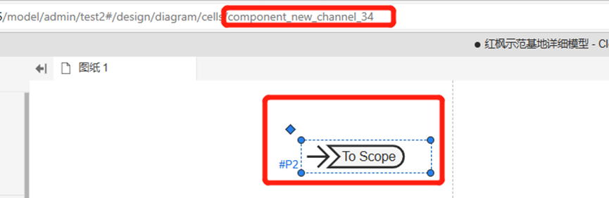

实际物理系统运行中，一系列控制或调度策略可能会因随机性、波动性等特性导致截然不同的动态响应，从而引导系统走向不同的运行状态。在传统仿真中，由于模型是确定的，此类随机特性很难在一次仿真测试中模拟出来。而事件链驱动的多场景仿真会随时根据当前时刻的运行状态和控制逻辑，根据随机性自动分叉出不同的场景，并对每个场景进行仿真，从而获取该控制策略在所有可能随机情况下的全部仿真结果，提供相比传统仿真更准确、更全面的分析结果。

:::question
目前事件驱动仿真功能仅在私有服务器上可用，[公网](https://cloudpss.net/)暂未开放使用。
:::

## 一、事件JSON 格式说明

:::info

事件JSON 格式示例如下，需要设置的参数包括**事件类型**、**触发时间**、**触发的时间类型**以及**触发的应用**等4个部分。

:::

```pyhton
 {
        "eventType": "time",
        "eventTime": "-1",
        "eventTimeType": "1",
        "defaultApp": { 
        }
 }
```

### 1、     eventType 事件类型

a)    monitor 监控事件

b)   time 时间触发，控制事件

### 2、     eventTime 触发时间

a)    当值为-1 时立即触发

### 3、     eventTimeType 触发的时间发生 

a)    0 相对于开始时间触发（相对仿真的开始时间触发）

b)   1 相对于接收时间触发（从接收到消息时算起）

### 4、     defaultApp 触发的应用

a)    用于指定应用内需要触发那些事件


## 二、     监控事件

:::info

监控事件用于给输出量设置某个边界条件，当输出的数据达到该条件时发出通知，或者执行新的事件。当需要使用监控事件时将 eventType 设置为 monitor，并在应用内添加该事件对哪些的元件进行监听，目前可供监听的元件为输出通道，如下 JSON示例监控一个输出通道，当条件触发时产生通知事件或者新的事件。

:::

```pyhton
{
    "eventType": " monitor",
    "eventTime": "-1",
    "eventTimeType": "1",
    "defaultApp": {
        "monitor": {
            "/component_new_channel_34": {
                "a": {
                    "uuid": "asd",
                    "function": "std",
                    "cmd": "add",
                    "period": "5",
                    "value": "-4",
                    "key": "a",
                    "freq": "1000",
                    "condition": "0",
                    "cycle": "0.02",
                    "nCount": "2",
                    "message": {
                        "log": "触发消息",
						 "event":[
                            新的事件
                        ]
                    }
                }
            }
        }
    }
}
```
### 1、    添加元件

在default中添加monitor 字典，其中key为元件的key，在拓扑中选中后可以从url中看到该元件的key，key前面需要加 /；value 为需要监控的参数（输出元件没有可以监控的参数，可以随便填），被监控的元件必须加入到示波器分组中。

### 2、     参数内的数据说明
a)	uuid：该事件的唯一值，相同的值会覆盖

b)	function：条件判断方法 avg，min，max，std，vsj，

c)	cmd: 消息操作类型，add 添加事件，del 删除事件

d)	period：持续时间

e)	value：判断值

f)	key: 于参数值保持一致

g)	condition： 判断条件 0 为 > ; 1 为 < ; 2 为 =

h)	cycle：周期

i)	nCount 最大启动次数

j)	message: 条件达成后发送的消息

## 三、     控制事件
:::info

通过该事件可以给运行中的算例发送修改元件参数的事件。
:::

```pyhton
{
    "eventType": "time",
    "eventTime": "-1",
    "eventTimeType": "0",
    "defaultApp": {
        "para": {
            "/component_new_constant_4": {
                "Value": {
                    "eventTime": "1",
                    "value": "1",
                    "uuid": "xxxx1",
                    "eventType": "time",
                    "cmd": "add",
                    "message": {
                        "log": "数据变化",
                        "event":[
                            新的事件
                        ]
                    }
                }
            }
        }
    }
}
```
###  参数内的数据说明
a)	eventTime: 废弃，固定值就可以

b)	value: 新的值

c)	uuid: 事件的唯一值，相同的值会覆盖

d)	eventType: 废弃，固定值就可以

e)	cmd: 事件操作类型 add 添加事件，del 删除事件

f)	message: 条件达成后发送的消息

##  四、	控制事件-断面保存
:::info

通过该事件，允许用户在算例运行中通知程序保存出一个断面。
:::

```pyhton
{
    "eventType": "time",
    "eventTime": "-1",
    "eventTimeType": "1",
    "defaultApp": {
        "SnapshotCtrl": {
            "SnapshotCtrl": {
                "ctrl_type": "0",
                "snapshot_number": "1234",
                "uuid": "xxxx2",
                "message": {
                    "log": "断面保存成功",

                }
            }
        }
    }
}
```
###  参数内的数据说明
a)	ctrl_type: 控制类型 0 为保存断面，1 为载入断面

b)	snapshot_number: 保存的断面名称（纯数字的字符串）

c)	uuid: 事件的唯一值，相同的值会覆盖

## 五、	控制事件-结束程序
:::info

该事件用于结束程序，格式固定无需要修改,按需要修改触发时间即可。
:::

```pyhton
{
    "eventType": "time",
    "eventTime": "-1",
    "eventTimeType": "1",
    "defaultApp": {
        "SimuCtrl": {
            "SimuCtrl": {
                "ctrl_type": "0",
                "uuid": "xxxx2",
                "message": {
                    "log": "结束"
                }
            }
        }
    }
}
```


