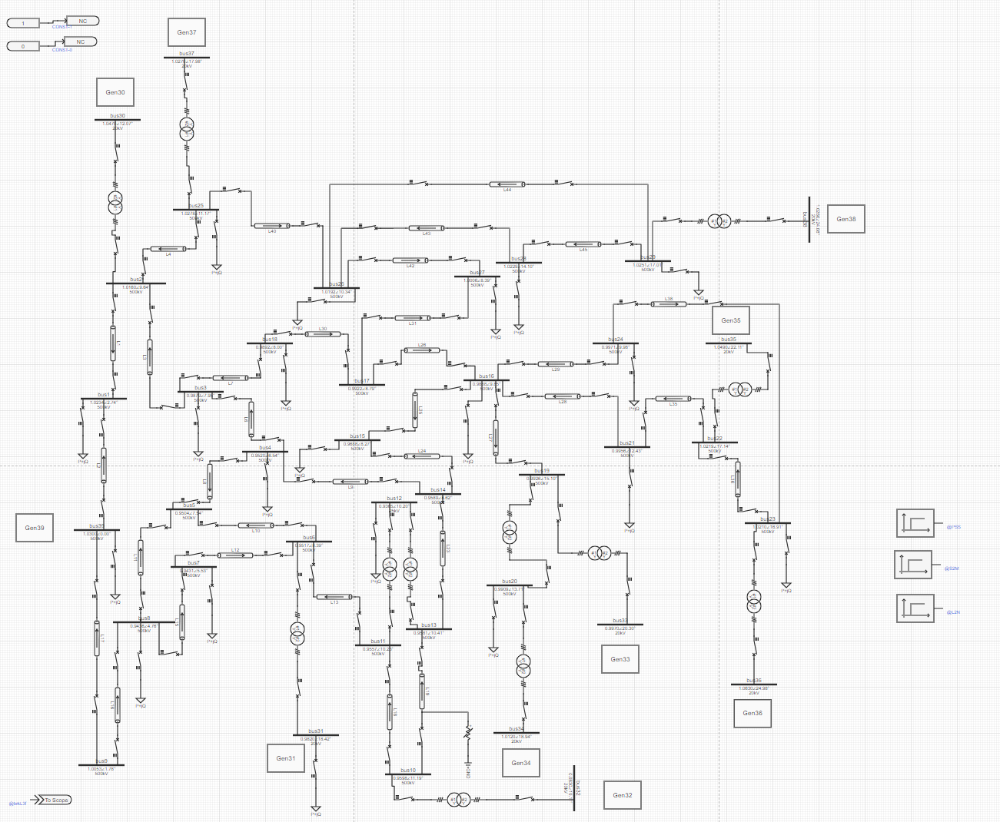
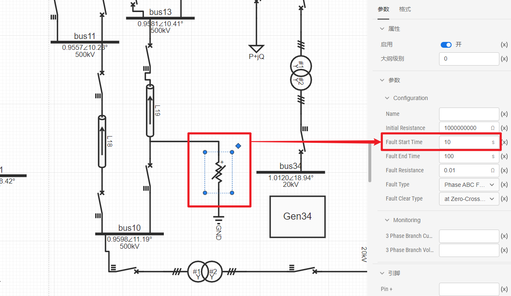
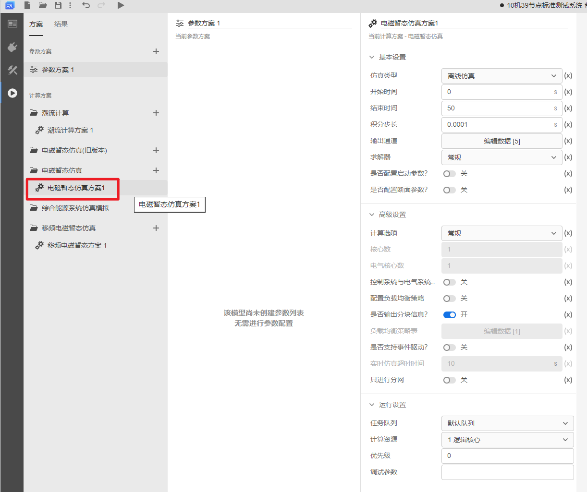
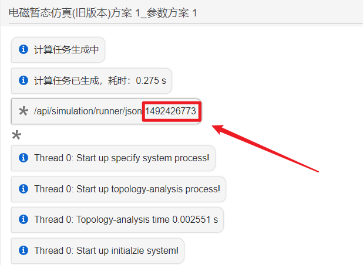
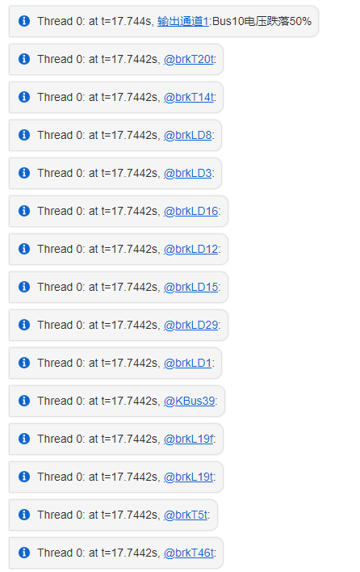
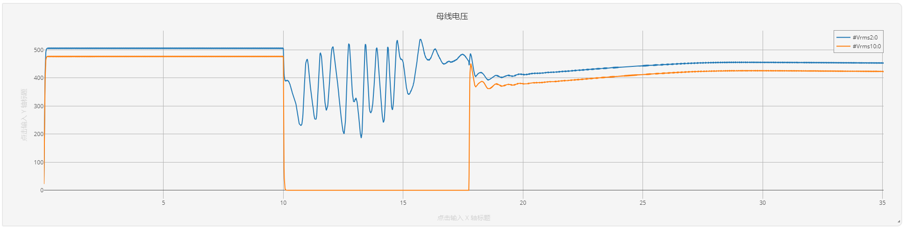
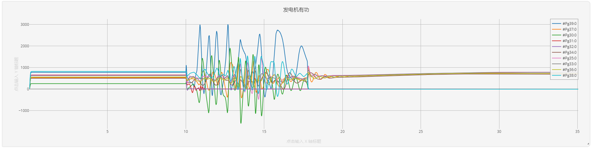
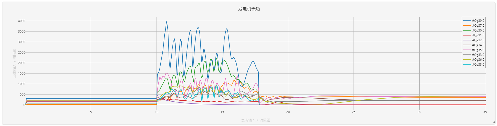

:::info
**本例以通过 Python 脚本对 IEEE39节点标准测试系统算例Bus10的电压监控为例，帮助用户快速入门事件驱动仿真的使用。**
:::
## 1. 算例简介

首先，在 CloudPSS Simstudio 中打开[ IEEE-39 节点标准测试系统算例](https://cloudpss.net/model/cxbaby/IEEE39-event)。


该算例于bus10设置了一个接地故障，故障类型为三相接地故障，故障启动时间设置为10s，故障启动后，bus10的电压会大幅度跌落，本算例将通过python代码监控bus10的电压幅值，在bus10电压跌落至其50%（250kV）后启动对应的安控策略。

## 2. 运行仿真并获取仿真任务ID
其次，点击`运行`标签页，在计算方案中选择默认的**电磁暂态仿真方案1**。


点击`启动任务`运行仿真，在`结果`页面会显示此次仿真的**任务ID**。



## 3. 示例代码
配置好 **Python** 开发环境，输入以下脚本，在仿真开始后输入**仿真任务ID**以及数据库的**主机地址**、**端口**和**密码**，运行**Python**代码。
```python
import sys,os
import json
import redis
import cloudpss
import time
import matplotlib.pyplot as plt
# 监控事件
if __name__ == '__main__':
    
    # 事件链功能
    client = redis.StrictRedis(host='XX', port=XX, password=XX)#输入数据库的主机地址、端口和密码。
    taskId1 = 'XX' # 仿真开始后输入仿真任务ID
    print(taskId1)
    event = {
        'eventType': 'monitor',# monitor:监控事件;time:时间触发，控制事件
        'eventTime': '-1',#当值为-1时立即触发
        'eventTimeType': '1',#0: 相对于开始时间触发（相对仿真的开始时间触发）; 1: 相对于接收时间触发（从接收到消息时算起）
        "defaultApp": {}# 用于指定应用内需要触发哪些事件
    }
    val1 = '0'
    param = {#param 包含了监控事件的参数信息，包括一个具体组件 'a'，该组件定义了电压跌落50%的条件，以及触发后续事件的信息。
        'a': {
            'uuid':'asd',#该事件的唯一值，相同的值会覆盖
            'function':'min',#条件判断方法 avg，min，max，std，vsj，此处取最小值
            'cmd':'add',#消息操作类型，add 添加事件，del 删除事件
            'period':'5',#持续时间
            'value':'250', # 跌落到额定电压50% 
            'key':'a',#与参数值保持一致
            'freq':'1000',
            'condition':'1',#判断条件：0 为 > ; 1 为 < ; 2 为 =
            'cycle':"0.02",#周期
            'nCount':'1',#最大启动次数
            'message': {#条件达成后发送的消息
                 'log': 'Bus10电压跌落50%',
                 "event":[{
                      'eventType': 'time',
                      'eventTime': '-1',
                      'eventTimeType': '1',
                      "defaultApp": {}
                    }]
            },
        }
    }
    param_ctrl = { # 定义监控事件触发的后续事件
        'Value': {
            'eventTime': '1',
            'value': val1,#新的值
            'uuid': 'xxxx1',
            'eventType': 'time',
            'cmd': 'add',
            'message': {}
        }
    }

    eventData = {}
    # 启动故障后的安控策略，包括故障线路切除、切机与切负荷等操作    
    eventData1 = {'/component_new_constant_22': param_ctrl} 
    eventData2 = {'/component_new_constant_53': param_ctrl} 
    eventData3 = {'/component_new_constant_69': param_ctrl}
    eventData4 = {'/component_new_constant_84': param_ctrl}
    eventData5 = {'/component_new_constant_102': param_ctrl}
    eventData6 = {'/component_new_constant_108': param_ctrl}
    eventData7 = {'/component_new_constant_69': param_ctrl}
    eventData8 = {'/component_new_constant_117': param_ctrl}
    eventData9 = {'/component_new_constant_116': param_ctrl}
    eventData10 = {'/component_new_constant_121': param_ctrl}
    eventData11 = {'/component_new_constant_122': param_ctrl}
    eventData12 = {'/component_new_constant_119': param_ctrl}
    eventData13 = {'/component_new_constant_131': param_ctrl}
    eventData14 = {'/component_new_constant_133': param_ctrl}
    eventData15 = {'/component_new_constant_135': param_ctrl}

    param['a']['message']["event"][0]["defaultApp"]['para']={}
    for i in range(1,16):
        exec('cc='+'eventData'+str(i))
        param['a']['message']["event"][0]["defaultApp"]['para'].update(cc)
    eventData = {'/component_new_channel_343': param} # 监控母线10的电压
    event['defaultApp'] = {'monitor': eventData}
    print(json.dumps(event), flush=True)
    client.publish('extern_input_' + str(taskId1), json.dumps([event]))
```
## 4. 仿真结果
运行上述python代码后，仿真结果界面会显示所进行的故障线路切除、切机与切负荷等操作。


母线电压、发电机有功功率与无功功率等曲线如下图所示，在10s发生三相接地故障后，bus10电压大幅跌落，发电机功率发生振荡。在17.74s启动安控策略切除故障后，母线电压与发电机功率恢复稳定。







