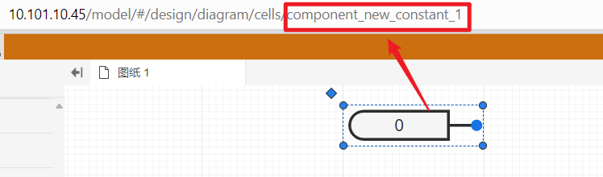

:::info
本实例代码介绍**通过SDK修改正在运行的仿真参数**的流程,首先，配置好 **Python** 开发环境，输入以下脚本，设置好数据库的**主机地址**、**端口**和**密码**；然后，填入需要修改参数的元件的key以及需要修改的参数值；最后，在仿真开始后输入**仿真任务ID**，运行**Python**代码。
:::

```python
import json
import redis

if __name__ == '__main__':  
    client = redis.StrictRedis(host='XX', port=XX, password=XX)
    taskId = 'XX' # 仿真开始后输入仿真任务ID
    event = {
        'eventType': 'time',
        'eventTime': '-1',
        'eventTimeType': '1',
        "defaultApp": {}
    }
    val='1'#设置需要修改的参数值
    param = {
        'Value': {
            'eventTime': '40',
            'value': val,
            'uuid': 'xxxx1',
            'eventType': 'time',
            'cmd': 'add',
            'message': {
                'log': '值变化到 '+val,
                
            },
        }
    }
    eventData = {}
    eventData = {'/component_new_constant_16': param}#选择需要修改参数的元件的key

    event['defaultApp'] = {'para': eventData}
    print(json.dumps(event), flush=True)
    client.publish('extern_input_' + str(taskId), json.dumps([event]))
```

