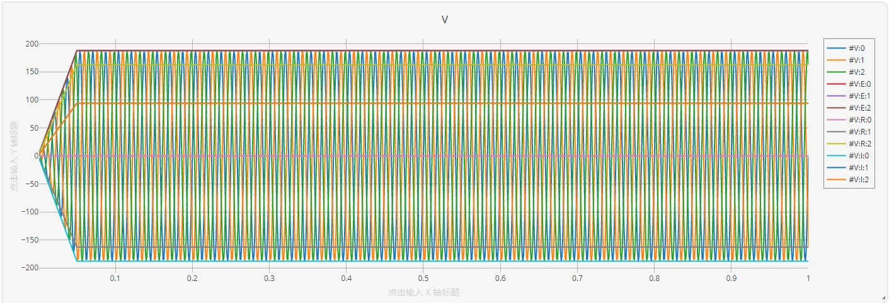

## RLC电路移频计算原理

移频电磁暂态仿真是对传统电磁暂态仿真的一种改进方法，通过对电路中的信号进行移频，可以构造低频的解析包络。对低频的解析包络进行的仿真可以采用更大的步长、达到更高的准确性和更高的效率。

对于移频电磁暂态仿真的基本原理，请参照[移频电磁暂态仿真介绍](../../../features/SFEMT/SFAIntro/index.md)页面。

## 仿真分析

由CloudPSS实现的三相RLC串联电路仿真模型如图所示。图中展示了电路的主体部分以及量测部分。

对于电气部分，这里采用 230 kV，60 Hz 的三相交流电压源，接入到电阻、电感、电容串联的支路上。

对于量测部分，采用电流表、电压表对电流、电压进行测量。用户可以输出信号的复包络实部、虚部、模，或者实际值。
关于复包络信号的量测以及引脚标签（:R, :E, :I, :A），可以参照[复包络信号的量测](../../../features/SFEMT/SFEMTpin/index.md)页面。

从左侧选择`运行`标签页，可建立`参数方案`和`计算方案`。由于该算例简单未进行封装，参数方案为默认参数方案，建立`移频电磁暂态仿真方案`，设置结束时间为1s，积分步长为1000微妙，即0.001s。
同时，在这里可以设置移频频率。在移频电磁暂态仿真中，通常设置移频频率与基频频率一致，因为这样信号复包络的频率最低。在这里，设置移频频率为60Hz。

并设置示波器分组，点击`输出通道->编辑数据`选取需要显示的波形通道，此处用两个示波器窗口分别展示电压和电流的曲线。每个示波器窗口中，均展示移频电磁暂态仿真中的复包络实部、虚部、模，以及该信号的实际值曲线。仿真结果如图所示。

可以放大查看电流波形，如下图所示，图中仅查看B相电流波形。

从图中可以看出，60Hz的实际信号在移频后产生的复包络信号频率在0Hz附近。