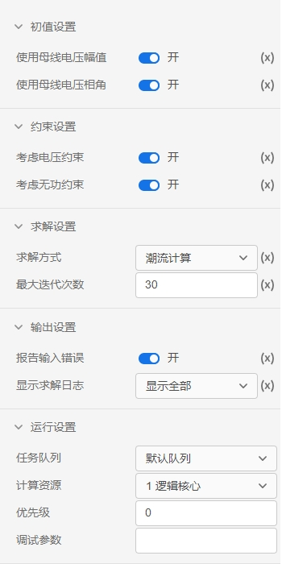

### 进行潮流计算的要求

要使用CloudPSS提供的`潮流计算功能`，首先需要搭建满足要求的算例。 

目前，潮流计算功能支持的设备元件包含**静态负载、三相交流电压源、同步发电机、并联电容/电抗器、三相传输线、三相电阻、三相电感、三相电容、三相双绕组变压器和三相三绕组变压器**，更多元件支持将在后续版本中逐步加入。

潮流计算功能是围绕着**三相交流母线**进行的。因此，上述设备元件中，单电气端口的元件（静态负载、三相交流电压源、同步发电机、并联电容/电抗器）只有当其电气端口与母线直接相连时，才会被计入；对于多电气端口的元件，则其每一个电气端口都必须与母线直接相连。特别地，电流表可以串入电路中，在潮流计算过程中将被忽略。

每条母线至多连接一个电源（三相交流电压源或同步发电机），其节点**类型**和**相关参数**在电源的`Power Flow Data 页面`指定。未连接电源的母线将作为 PQ 节点参与计算。同一个算例中可以包含多个独立的网络，**每个网络都必须包含且仅包含一个平衡节点**。

**注意：潮流计算中暂不考虑静态负载的功率特性。**

### 潮流计算方案的参数设定

潮流计算应用有以下几个可配置的参数：

+ `初值设置`   
  可以配置是否使用母线上设置的电压幅值和相角作为潮流计算的迭代初值。
+ `约束设置`  
  可以配置是否考虑三相交流电压源或同步发电机 Power Flow Data 页面指定的电压约束（作 PQ 节点时）和无功约束（作 PV 节点、平衡节点时）。
+ `求解设置`    
  可以配置两种求解方式：**潮流计算**和**功率不平衡量**求解。潮流计算反复迭代直至收敛或达到最大迭代次数；功率不平衡量求解只迭代1次。
+ `输出设置`   
  可以配置是否检查并报告算例中可能出现的输入错误，可以配置显示求解日志类型：`关`、`仅显示错误`、`显示全部`。
+ `运行设置` 
  可以配置任务运行使用的队列，计算资源，任务优先级和调试参数。

### 创建潮流计算方案的方法

系统默认会添加一个名为`潮流计算方案1`的方案，用户直接点击界面左上角的`启动任务`即可开始潮流计算。

需要增添新的潮流计算方案时，可在在页面左侧的`计算方案->潮流计算`中点击“+”号增添并配置新的方案，接着选中对应的方案，点击界面左上角的`启动任务`即可开始仿真。