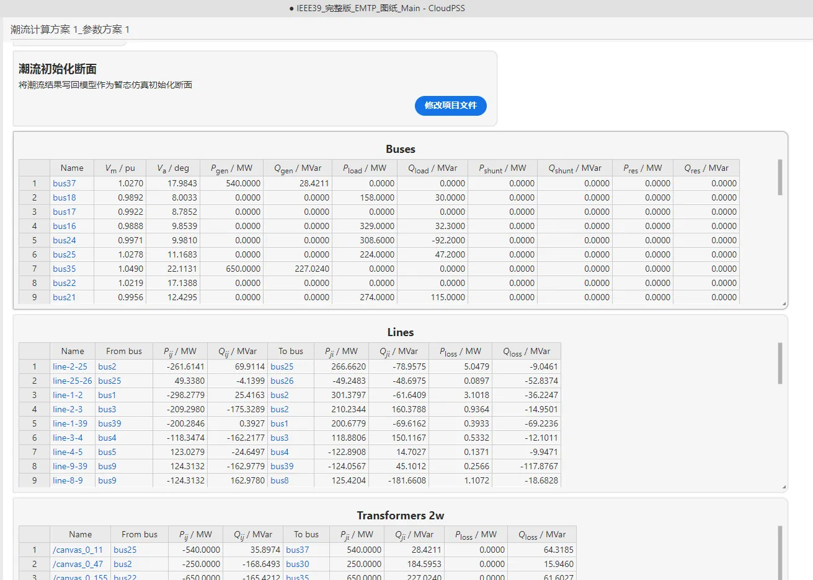

## 描述

IEEE 标准系统的介绍见[电磁暂态仿真案例](../../EMTP/IEEE39.md)。

## 模型参数

除了[电磁暂态仿真案例](../../EMTP/IEEE39.md)中描述的参数外，需要为电机参数进行以下配置，这些参数在发电机元件的 Power Flow Data 栏。

|  | Bus Type | Injected Active Power [MW] | Bus Voltage Magnitude [p.u.] | Bus Voltage Angle [Deg] |
| :--- | :-: | --: | ----: | -: |
| Gen30 | PV | 250 | 1.047 | -  |
| Gen31 | PV | 660 | 0.982 | -  |
| Gen32 | PV | 650 | 0.983 | -  |
| Gen33 | PV | 632 | 0.997 | -  |
| Gen34 | PV | 508 | 1.012 | -  |
| Gen35 | PV | 650 | 1.049 | -  |
| Gen36 | PV | 560 | 1.063 | -  |
| Gen37 | PV | 540 | 1.027 | -  |
| Gen38 | PV | 830 | 1.026 | -  |
| Gen39 | Slack | - | 1.03 | 0  |

## 仿真流程

在左侧选择`运行`标签页，在潮流计算方案配置中，使用默认仿真参数，点击上方`启动任务`按钮或者按下[[ctrl]]+[[R]]进行潮流计算流程。

得到的潮流计算结果如下图所示。

在结果页面，潮流的计算结果分为母线、传输线、串联 RLC、两绕组变压器、三绕组变压器 5 个表格显示（如果算例中没有某一种元件，则该表格不显示）。

母线页面中，$V_m, V_a$ 为母线的电压；$P_{gen}, Q_{gen}$、$P_{load}, Q_{load}$、$P_{shunt}, Q_{shunt}$ 分别为发电机注入功率、恒功率负载消耗功率和恒阻抗负载消耗功率；$P_{res}, Q_{res}$ 表示当前母线上的功率不平衡量，即
$$S_{res} = S_{gen} - S_{load} - S_{shunt} - S_{branch}$$
其中 $S_{branch}$ 表示母线连接支路上的流出功率。对于计算收敛的潮流解，$P_{res}, Q_{res}$ 均为接近 0 的值。

传输线、串联RLC、两绕组变压器页面中，$P_{ij}, Q_{ij}, P_{ij}, Q_{ji}$ 分别表示 from bus 和 to bus 流出的功率，$P_{loss}, Q_{loss}$ 表示线路上的功率损耗，有 
$$S_{loss} = S_{ij} + S_{ji}$$

对于三绕组变压器，类似地，有 
$$S_{loss} = S_{i} + S_{j} + S_{k}$$

在结果页面中，点击`潮流初始化断面`下的`修改项目文件`按钮，可以将潮流计算得到的结果作为元件启动参数填入各元件。

点击`潮流可视化展示`下的`修改项目文件`按钮，可以在图纸上展示此潮流结果，例如传输线的传输功率等将在接线图中展示出来。

结果页面中的表格均可以自由复制，用户可将结果直接复制到excel表格等工具中进行进一步处理。

