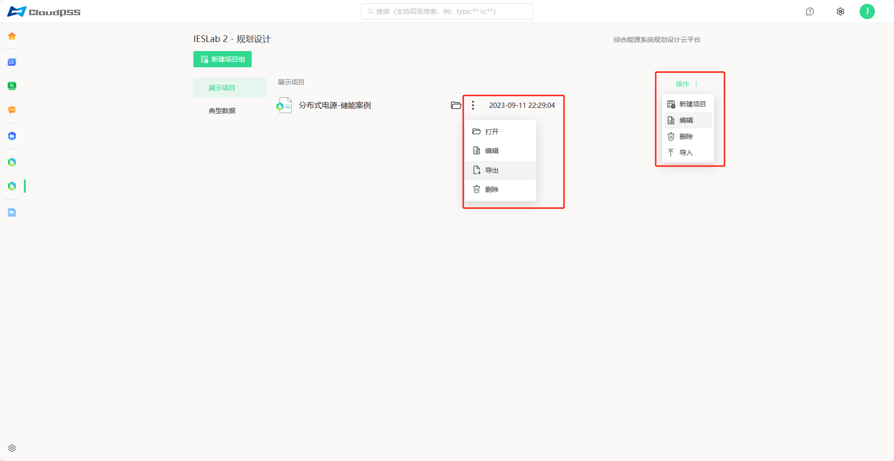

## 项目组管理

点击项目组右侧的`操作`，可以进行`新建项目`、`编辑`项目组、`删除`项目组、`导入`项目算例压缩包 zip 文件 等操作。

点击`编辑`，可对项目组名称和描述信息进行编辑。

## 项目管理

点击项目所在行的`竖点号`，可以对项目进行管理，如`打开`、`编辑`项目、`导出`为本地压缩包 zip 文件、`删除`项目。

点击`编辑`，可对项目名称和描述信息进行编辑。

## 导入与导出

为方便算例的`跨平台移植拷贝`，平台支持将算例`导出到本地`和从`本地文件导入`功能：点击项目算例的点号可以将算例导出为本地文件，点击项目组右侧的“操作”或点号可以将本地文件导入到平台。

由于算例压缩 zip 文件包含近6年的气象数据，文件较大，因此导入导出时加载较慢，请耐心等待

