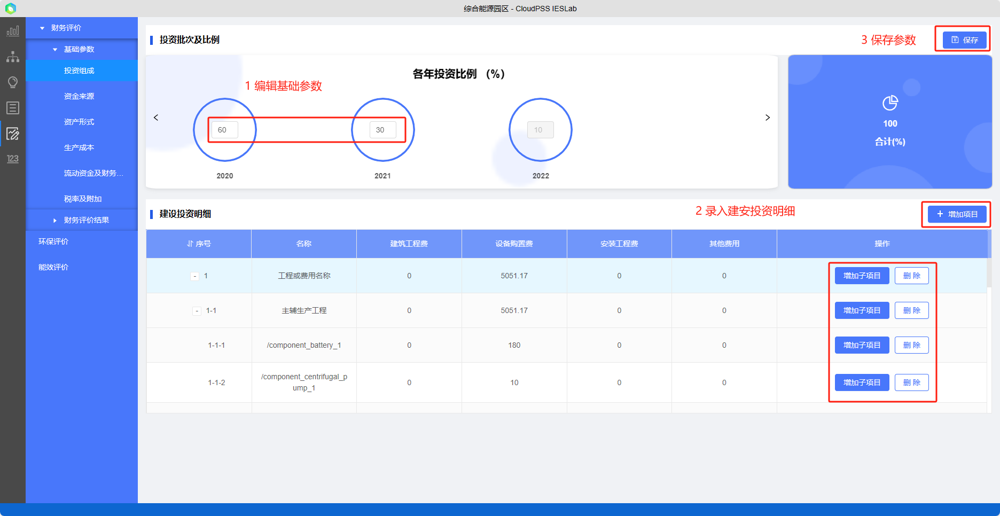

方案评估模块的财务评价需要录入必要的`财务基础参数`后，方可进行计算评估；环保评价和能效评价无需输入参数，平台即可根据所选优化方案，对方案的污染物和能效指标进行计算评估

## 财务基础参数

财务基础参数主要包括：

+ 投资组成：投资批次及比例、建设安装工程投资明细等
+ 资金来源：资本金比例、资本金比例、贷款年限、还款方式（等额本金、等息本金）等
+ 资产形式：固定资产比例、残值、折旧年限等
+ 生产成本：人数、工资、材料费等
+ 流动资金及财务费用：流动资金贷款比例、短期贷款及流动资金利率、现金年周转次数等
+ 税率及附加损益参数：售电增值税税率、任意公积金率、企业所得税税率等

