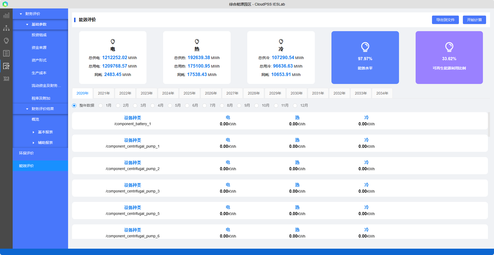

在方案评估模块中选择一个方案，设定基础参数，平台算法会根据财务模型等相关模型自动计算评价指标，显示计算得到的`评价指标`，并支持将结果导出。

方案评估包含：

+ 财务评价：设置财务参数，计算财务参数等，详细评价财务情况。

+ 环保评价：计算项目生命周期内年份月份的污染物排放量。

+ 能效评价：计算项目的能耗、能效水平和可再生能源利用比例。

## 财务评价

综合能源系统财务评价是依据国家现行的财税制度、价格体系和有关的法律法规，从项目角度出发，考察项目建成投产以后的盈利能力、偿债能力和外汇平衡状况，据此判断项目`财务可行性`的一种经济评价方法。

选择一个优化方案，平台将从`优化方案`中取得如配置台数、投资单价等财务基础参数，录入该项目的`基础参数`，如建安成本、资金来源、资产形式、成本、流动资金及税率等。平台根据《工程经济学》的`财务模型`计算相应的财务评价指标，作为项目投资决策的参考依据。

请注意，平台的财务模型及财务评价指标仅供参考，均采用较为基础的模型及指标，且财务评价结果受基础数据的准确性和完整性影响很大。更详细全面的工程项目财务风险评估请咨询专业人士。

## 环保评价

计算项目生命周期内年份月份的`污染物排放量`，根据燃料的`排污系数`和`燃料用量`计算得到，计算结果支持导出。
 
## 能效评价

计算项目生命周期内系统及各个设备不同年份月份的`能源消耗`、`能效水平`和`可再生能源利用比例`，计算结果支持导出。

