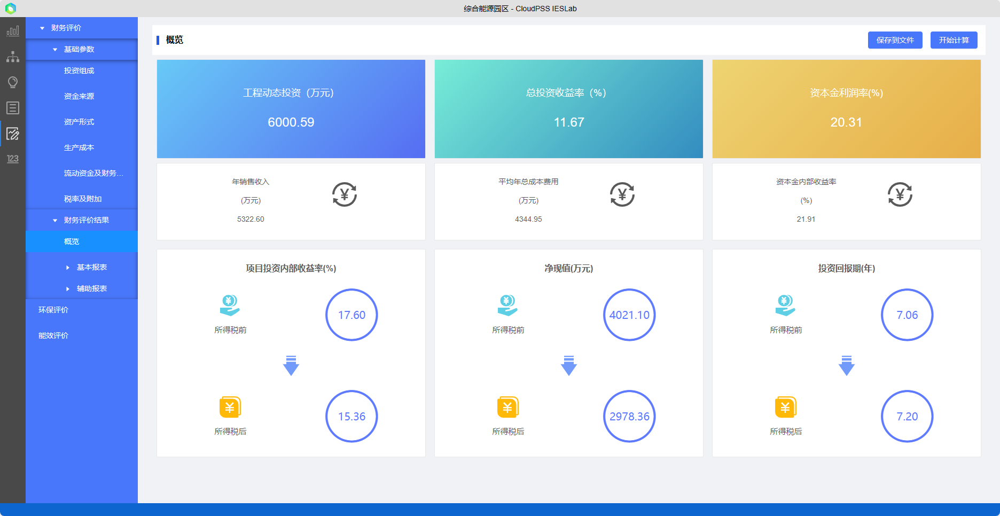
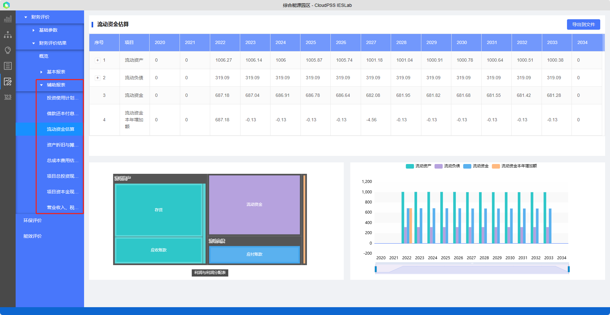

方案详细评估结果主要分为:

+ 财务评价结果：投资估算、收益及财务报表等详细评价财务情况。

+ 环保评价：项目CO2、SO2、NOx及烟尘等污染物排放量。

+ 能效评价：项目的电冷热能耗、能效水平和可再生能源利用比例。

## 财务评价结果

主要对3个方面进行财务评估：

+ 综合能源项目的投资估算：固定资产投资估算和流动资金的估算；
+ 综合能源项目的收益估算：工程项目成本费用估算和税金估算；
+ 综合能源项目的指标估算：主要包含静态指标和动态指标。静态指标有静态投资`回收期`、简单投资收益率、静态计算费用等。动态指标有净现值、净年值、费用现值、费用年值、将来值、`内部收益率`、外部收益率、`净现值`指数等。

财务评估结果主要包括财务概览和财务报表

### 概览指标

综合能源项目经济性评价的`概览指标`是项目最重要的财务指标，反映了项目的财务可行性的基本状况，主要又：工程动态投资、投资收益率、资本金利润率、年销售收入、平均年总成本费用、资本金内部收益率、（税前及税后）项目投资内部收益率、（税前及税后）净现值和（税前及税后）投资回报期。

### 财务报表 

财务报表包括`基本报表`和`辅助报表`，供项目投资决策时参考。此外，平台提供了二次开发接口`SDK`，若用户已有财务模型，可以根据SDK将优化方案结果数据（如设备型号参数、成本、配置、典型日运行曲线、统计数据等）导出后，利用用户的财务模型进行评价。

基本报表包括`利润表、现金流量表和资产负债表`，利润表反应企业会计期间的盈利情况，现金流量表反应企业会计期间的经营、投资、筹资现金流情况，资产负债表反应企业报表日财务状况。

辅助报表包括：投资使用计划与资金筹措、借款还本付息计划、流动资金估算、资产折旧与摊销估算、总成本费用估算表、项目总投资现金流量、项目资本金现金流量和营业收入、税金、附加和增值税估算报表，共9个辅助报表。

