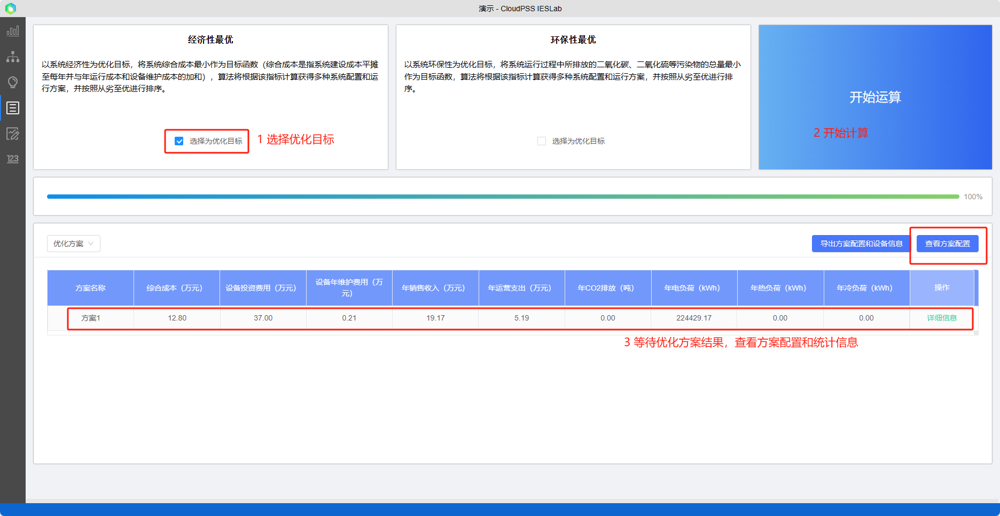

在`方案优选模块`中选择优化目标，点击开始计算后，平台算法会自动根据优化目标自动生成优化问题，调用规划优化的算法（平台使用智能启发算法）求解计算，并将计算得到的可行解按照从劣至优进行显示。

## 优化流程

项目`拓扑结构`及`典型场景`生成后，用户需要首先选定`优化目标`，点击`开始运算`，平台会首先对项目进行设备`选型定容`等型号配置，确定后会对全年各月份的典型日进行`运行优化`得到各个时间点的设备出力、负荷情况、电网、热网潮流情况，最终对形成的方案进行经济性、环保性和主要能耗指标等`各类评价结果统计`。

## 优化目标

平台的`优化目标`包括`经济性`和`环保性`目标。其中,经济性最优目标是：以系统经济性为优化目标，将系统`综合成本`最小作为目标函数（综合成本是指系统`建设成本平摊`至每年并与`年运行成本和设备维护`成本的加和），算法将根据该指标计算获得多种系统配置和运行方案，并按照从劣至优进行排序。

环保性最优：以系统`环保性`为优化目标，将系统运行过程中所排放的二氧化碳、二氧化硫等`污染物的总量`最小作为目标函数，算法将根据该指标计算获得多种系统配置和运行方案，并按照从劣至优进行排序。

经济性和环保性的系统推荐配置主要受`能源价格`、可再生能源及储能电池的`规划容量与投资成本`可供选择的设备的能效与投资建设成本，和系统多能高效互补的设计方案等影响（如热力系统方案设计如是否包含高效梯级利用，是否包含蓄热蓄冷、空气源/水源/地热源热泵、压缩式制冷机和吸收式制冷机等；能量源是否包含燃媒电厂/燃气锅炉、燃气轮机、CHP、CCHP等以化石能源为燃料的会排污的设备）。

一般来说，以经济性为目标时，平台会选择燃料`价格低`（如煤炭，尽管其污染更多）的供能形式，当可再生能源性价比高时，经济性和环保性方案均会选择，当可再生能源性价比低时，仅环保性方案会选择；当峰谷电价差较大，储能电池能够提供收益时，经济性方案会选择更多储能。对于冷热系统的设备型号及容量选择，经济性方案会选择`投资相对较低`，环保性方案则更倾向于`能效相对较高`的设备，以减少能源消耗，减少污染物排放。

平台的优化目标为`单目标优化`，但平台建立了详细的综合评价体系和评价指标，对于任意优化目标下的优化方案，平台`均会计算所有评价指标`（如经济性、环保性）和统计结果；用户在选择经济性目标时，仍可能看到环保性评价指标，方便用户`综合评价`方案，尽可能兼顾多个优化目标。

