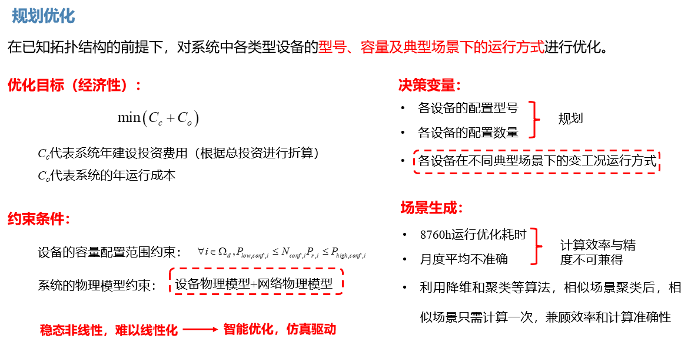

规划设计平台适合有综合能源系统`设备选型`、`容量配置`和`运行优化`需求的场景使用。对于多种能源配合和多种用能需求的综合能源系统来说，相比传统的设计方式，规划设计平台通过智能算法可以尝试更多的`设备型号与容量配置`组合，通过不同设备协同配合出力使得系统`运行最优`；同时，作为一款设计工具，主要是辅助用户进行智能决策和方案评估，方案是否可行，更多依赖于设计人员水平、方案合理性、约束条件、边界条件和优化目标等条件。

对于给定的综合能源系统`拓扑架构`、`负荷场景`、`优化目标`和`约束条件`，利用稳态能量`仿真内核驱动`，对系统中各类型设备的`型号、容量`及典型场景下的`运行方式`进行规划设计和运行优化。因此，在规划优化签，需要先搭建合理的系统拓扑结构并生成综合能源系统典型场景。

## 规划设计

平台能够对系统中各类型设备的`型号和配置容量`进行规划设计，通过算法推荐可行的设备型号和容量配置组合方案，主要用于规划项目初期的选型定容设计。

## 运行优化
确定了项目方案（方案为各类设备的型号和容量配置组合）后，平台通过算法对系统设备在各个时间段的出力进行运行优化，充分发挥综合能源系统多能互补协同，能量高效梯级利用等优势。

由于智能启发式算法的计算量比较大，且平台支持变挡位设备，编码空间大；连续变量较大，计算时间可能较长，具体计算时长与算例优化变量、优化空间和算例设置有关；同时由于启发式算法为近似算法，容易陷入局部最优中，而大量随机性又会增大计算量，平台在计算规模和准确性进行了平衡，一般而言，系统算例的多次规划设计最优可行解基本一致，初始方案（排序初始及较前的可行解）可能不同。

