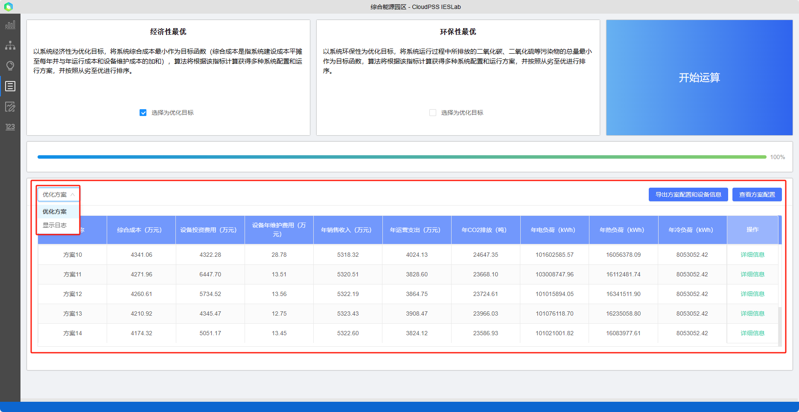
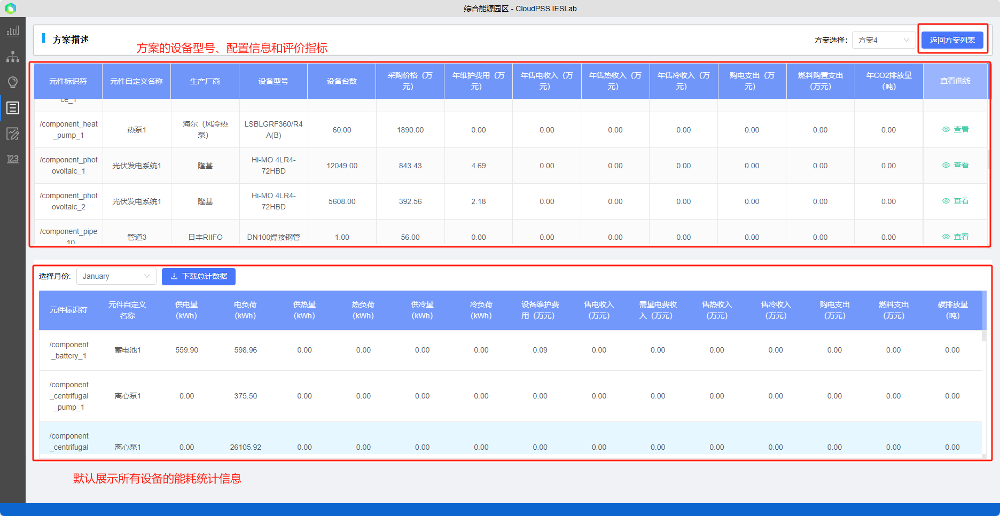
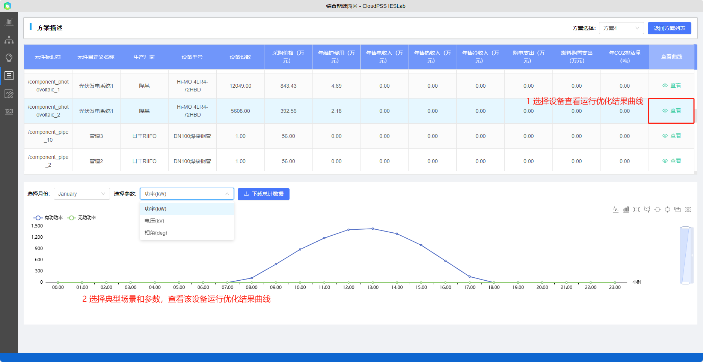

方案优化模块的计算结果主要分为优化方案配置结果和运行优化结果两部分，方案配置结果主要展示每个方案所选设备型号、容量配置和方案经济性环保性统计指标；运行优化结果详细信息则展示具体方案在每个综合能源场景的设备运行优化详细结果。

查看了方案的具体设备配置及评价参数、方案在每一个典型日的运行优化结果后，可以在页面右上角点击“返回方案列表”返回，重新选择其他方案。
## 方案配置

在方案信息展示表格中，用户可以清楚的看到方案的`设备型号、容量配置和方案经济性环保性统计指标`，并支持导出方案配置和设备信息、查看方案配置等。

`经济性指标`包括设备投资费用、设备年维修费用、年销售费用、年运营支出，`环保性指标`包括年CO2，NOX，烟尘排放量。同时统计`能耗`情况如电负荷，冷热负荷等相关参数。用户可在在经济性和环保性中进行综合权衡并生成多种方案，选择最合适的方案。

在优化计算开始后，用户需等待一段时间，才能看到相关优化方案；用户也可由`优化方案`切换到显示`日志`，查看计算过程日志信息。

平台支持导出规划优化的方案和方案设备信息参数，点击`查看方案配置`可以查看每个优化方案所选的`设备型号`和`配置台数`。

## 详细优化结果

点击方案右侧的`“详细信息”`可以进入详细方案优化结果信息页面。分为上下两个展示页面，上半部分的表格主要展示了方案整体及各个设备的`设备型号、容量配置和主要评价指标`，包括设备配置参数（厂家、型号、台数、采购价格及运维费用）、收入及支出等经济性参数、年CO2排放量和方案统计信息。下半部分默认展示方案所有设备的`电冷热能耗统计信息`，包括负荷能耗、收入及支出、运维和碳排放量等统计信息，统计信息支持下载。

选择设备，点击所在行右侧的“查看”，选择典型场景和参数，查看该设备的运行优化结果曲线，曲线数据支持下载。

对于每一个优化出来的方案，首先应检查方案结果是否有误，避免因约束等算例设置错误导致计算不收敛，如查看电网潮流结果（如检查电压、功率、传输线电损范围等）、热力参数（流量、温度、流向等）。
