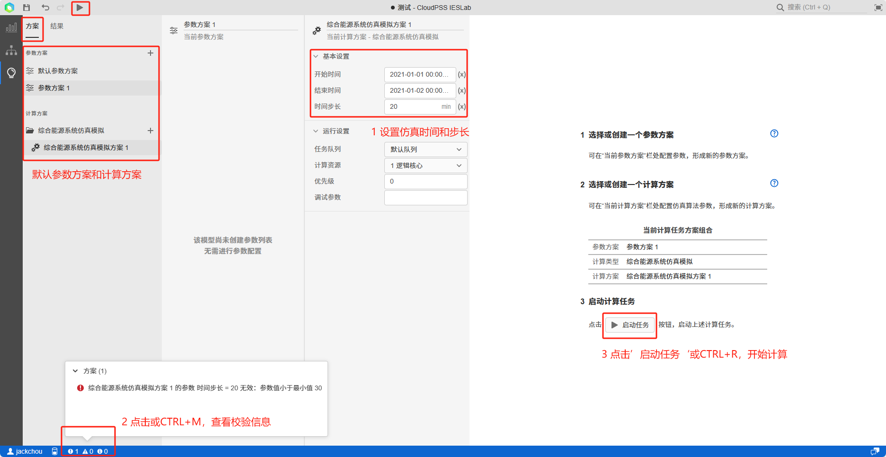

在`拓扑编辑模块`中完成系统拓扑结构搭建、元件设备参数绑定、仿真策略等边界条件参数设置，并`保存`项目后，可以进入仿真模拟模块。

在`仿真模拟模块`可以设置仿真方案、计算并展示计算结果。有`方案`和`结果`两个标签页面。

仿真`方案`页面配置包括了`参数方案`配置以及`计算方案`配置两部分，平台默认添加了一组参数方案和计算方案，参数方案无需修改，如下图所示。

### 仿真时间与时间步长

仿真模拟方案参数需要设置`仿真时间`和`时间步长`。
**仿真时间**：开始时间与结束时间，用户需点击时间，通过弹出的时间插件选择输入时间；
**时间步长**：平台为`稳态能量流仿真`计算，考虑到热力系统的稳态时间较长，为分钟级，因此时间步长范围为：30min-240min；
对于综合能源系统的仿真模拟，平台支持**8760h**计算。注意仿真时间段太长会消耗较多计算资源，计算时间也较长，计算数据较大，可能造成服务响应缓慢。
设置完仿真时间和时间步长后，平台会自动校验，并在左下角展示响应信息。

### 开始计算

完成仿真模拟计算方案设置后，点击`启动任务`或`CTRL + M`，便会自动校验拓扑和算例设置，并开始仿真计算。

