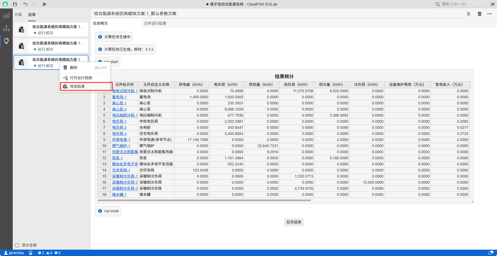

结果页面提供两个标签页：`结果概览`标签页下显示了仿真日志和结果统计表格；`元件运行结果`标签页下显示了当前系统拓扑，用户可通过点选元件查看对应元件的时序运行结果曲线

## 结果概览

结果概览由报错信息、仿真信息和结果统计概览三部分组成。当仿真出现不收敛等错误情况时，报错信息将会给出相应的提示；`结果统计概览`会将仿真结果进行分析，统计供电冷热量、电冷热负荷及收入支出等。

### 元件运行结果

元件运行结果页面展示了当前计算结果的系统拓扑，支持用户选择元件并查看相应的结果数据曲线。数据结果图形支持缩放、平移、重命名坐标轴名称、重命名标题名称、`数据下载`、图像下载等操作。

### 结果导入导出

平台对用户的每一次仿真结果都进行存储，用户可通过切换左侧的仿真结果标签进行结果查看，右击结果标签可进行`导出`以及删除操作。

计算结果可`导出`为'`cjob`'格式文件到本地，同时平台支持结果`导入`，按住`CTRL` + `I`(i)，选择'`cjob`'格式的结果文件，即可上传导入到平台。

