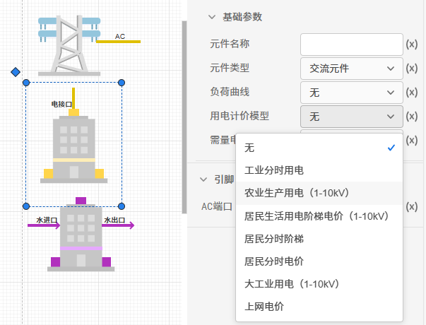

## 参数绑定

在数据管理模块输入的`设备、负荷、能源信息`等基础参数，可以在拓扑编辑模块进行绑定。

### 设备参数绑定

在数据管理模块输入的源网荷储设备的基础参数后，拓扑模块搭建的元件可以绑定，用于仿真模拟设备的运行状态。

数据管理模块录入设备：

拓扑编辑模块绑定设备参数：

### 负荷绑定

负荷作为仿真模拟重要的边界条件，平台提供了`典型日负荷（8760h）`、`分月详细负荷`和`自定义负荷`三种模型供选择，在数据管理模块建立**电/冷/热**负荷模型后后，拓扑模块拖拽出来的负荷元件可以进行绑定。

数据管理模块建立负荷模型：

拓扑编辑模块绑定设备负荷：

### 电价绑定

平台搭建的在综合能源系统主要承担投资建设运营者的角色，运营商首先需要从外部购买一次能源，因此在外部电源（如火电厂）、燃气锅炉和燃气轮机等处需要付费支出，运营商通过建设`高能效`的综合能源系统，向多能用户提供多种能源，对负荷收取对应的电费及冷热费用；因此在`电冷热负荷处有收入`。

在数据管理模块建立**电/冷/热**价格模型后后，拓扑模块拖拽出来的外部电源、电冷热负荷元件可以绑定。

数据管理模块建立价格模型：

在元件参数的`计价模型`处，若选择`无`，则该元件不计算其`收入和支出`。

对于`外部电源`元件，`购电计价`模型主要用于计算从外部电网购电所需的费用，为`项目支出`；`上网计价`模型主要用于计算光伏风机等新能源向外部电网反送电的收益，为`项目收入`。

对于`电冷热负荷`元件，`用电计价`模型主要用于计算综合能源系统将能源供给给`电冷热负荷`的收益，为`项目收入`。

拓扑编辑模块绑定计价模型：

### 燃料绑定

燃料主要为煤制品等化石燃料，外部电源（如火电厂）、燃气锅炉和燃气轮机等将一次能源转换为二次能源。

在数据管理模块建立**燃料**模型后后，拓扑模块的`外部电源、燃气锅炉和燃气轮机`元件可以进行绑定。其中，`燃料热值`用于计算燃料的消耗量；`燃料价格`用于计算购买燃料的费用，为项目支出；`污染物释放系数`用于计算消耗燃料时排放的污染物，计算其环保性指标。

数据管理模块建立燃料模型：

拓扑编辑模块绑定设备燃料：

