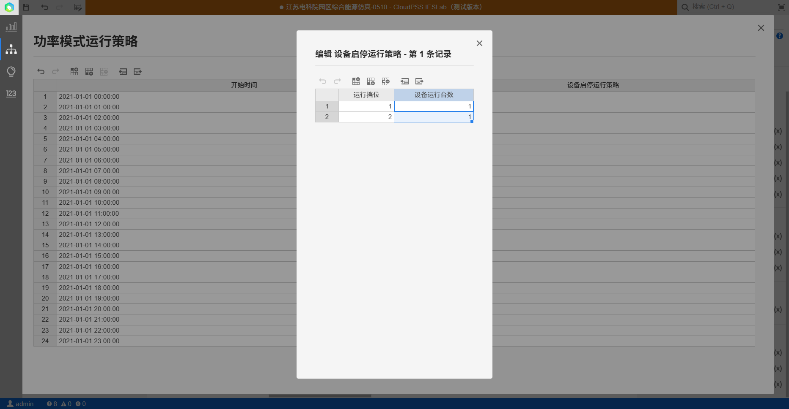

## 基本描述

**该元件指吸收式制冷机的设备设施，吸收式制冷系统，制冷剂液态在蒸发器中吸热蒸发，所形成的蒸气被吸收剂所吸收，在此之后，吸收了制冷剂蒸气的吸收剂由溶液泵送至发生器，在发生器中被加热，而分离出制冷剂蒸气，该蒸气在冷凝器中被冷凝成液体，再经节流后进入蒸发器。常用的吸收式制冷机有氨水吸收式制冷机和溴化锂吸收式制冷机两种。**

 **以溴化锂吸收式制冷机为例，它是以溴化锂溶液为吸收剂，以水为制冷剂，利用水在高真空下蒸发吸热达到制冷的目的。为使制冷过程能连续不断地进行下去，蒸发后的冷剂水蒸气被溴化锂溶液所吸收，溶液变稀，这一过程是在吸收器中发生的，然后以热能为动力，将溶液加热使其水份分离出来，而溶液变浓，这一过程是在发生器中进行的。发生器中充有溴化锂溶液，且压力较低，稍加热时，水便从溴化锂溶液中蒸发由来(水比溴化锂易蒸发)。蒸发出来的水蒸汽在冷凝器中冷凝，成为制冷剂水，经节流阀在蒸发器中蒸发。带走箱内的热量，蒸发出的水气又被吸收器中的溴化锂溶液吸收(溴化锂溶液特易吸收水气)，此溶液再在发生器中加热蒸发，就这样不断循环，实现制冷循环。发生器中得到的蒸汽在冷凝器中凝结成水，经节流后再送至蒸发器中蒸发。如此循环达到连续制冷的目的。其数学模型如下：**

> 水力方程
> $$∆p=p_{in}-p_{out}=k*m*|m|/ρ^2$$
> 热力方程
>  $$Q_{heat}*\eta = Q_{cool} = m\left( h_{out}{- h}_{in} \right)$$
> 式中：∆p是进出口压差(kPa)，$p_{in} 、p_{out}$分别为流体进出口压力(kPa)，k是局部压降系数 (kPa/(m³·s⁻¹)²), m是质量流量(kg/s)，ρ是密度（kg/ m³·），$Q_{heat}$是热源一次侧的供热功率(kW)，$\eta$是制冷机的冷热比，$Q_{cool}$是冷源二次侧的出口制冷功率(kW)，$h_{in},h_{out}$分别为工质的进出口比焓（kj/kg）。

> 

## 数据管理模块设备参数

### 额定参数
- 局部压降系数(kPa/(m³·s⁻¹)²)
- 功率因数

### 变工况参数示例
| 挡位 |  冷热比 |  制冷功率（kW）  |  电功率（kW）  |
| :--- | :--- | :--- | :--- |
| 1 |  0.5 | 100 |  2  |
| 2 |  0.6 | 180 |  2.5  |
| 3 |  0.7 | 280 |  3  |
| 4 |  0.75 | 360 |  3  |
| 5 |  0.8 | 400 |  3  |

### 设备运行约束
- 热水侧最大出口温度(℃)
- 热水侧最大出口温度(℃)
- 热水侧最大出口温度(℃)
- 热水侧最大出口温度(℃)

### 设备经济性参数

- 采购成本(万元/台)
- 固定运维成本(万元/年)
- 可变运维成本(元/kWh)

### 引脚

电输入接口，设备耗电量  
一次侧水进口和水出口，一次侧为热水驱动源，高温热源（一般90℃）在发生器中，热源散热驱动吸收式制冷机的制冷剂蒸发为蒸汽，蒸汽吸收热源热量，使其降温（一般降低至75℃左右）
二次侧水进口和水出口，二次侧为冷水，较高温度的水（一般12℃）进入蒸发器中，吸收式制冷机的制冷剂不断喷淋到水管并蒸发为蒸汽，吸收水的热量，使其温度降低（一般降低到℃左右）  
可以在引脚处填写相同的字符使得两个元件相连。

## 仿真平台参数

**在对综合能源系统进行仿真模拟和运行优化前，务必录入编辑基础参数和仿真参数哦**

### 基础参数

>**在基础参数出编辑设备名称、台数等参数，并绑定数据管理模块录入的设备参数**
> 
> **元件名称**：输入该元件名称，方便管理及结果查看
> 
> **元件类型**：选择直流/交流元件，注意，交直流元件不能直接相连
> 
> **设备配置台数**：对于电力系统的设备元件，相当于于连在同一个母线上，均为PQ节点
> 
> **待选设备类型**：选择数据管理模块录入的设备，系统将自动绑定对应的设备及参数

### 仿真参数

>**在仿真参数出输入设备的仿真边界条件，主要包含运行方式和运行策略曲线**
> 
> **设定运行模式**：在输入仿真运行策略前需要指定设备运行模式。对于冷热源设备，主要有指定功率运行模式和温度运行模式。对于温度运行模式，设备功率由进出口温度与流量计算得到。对于功率运行模式，温度则由功率与流量计算得到，由于热力系统求解时需要有温度参考点，一个冷热系统中至少设置一个温度运行模式，当用户没有设置温度运行模式时，系统将任意指定一个温度参考点。
> 
> **温度模式运行策略**：录入各个时间段对应的设备运行策略，若仿真时间缺少响应的运行参数，平台采用插值和外推算法填充。
> 
> **功率模式运行策略**：录入各个时间段对应的设备功率运行策略，为更好地仿真模拟设备在启停等复杂动态过程，平台模型为多挡位变工况稳态模型，因此，设备的功率模式运行策略为各个挡位的设备组合运行策略，当前时间段的功率为各个挡位的功率与设备台数的乘机和，总功率为：
>  $$P=\sum P_{i}N_{i}$$
> 式中，$P_{i}$为第i个挡位的功率，$N_{i}$为处于第i个挡位的设备台数
> 若仿真时间缺少响应的运行参数，平台采用插值和外推算法填充。
>
> 注意，选择运行模式后，仅当前模式运行策略可编辑，其他模式策略无法编辑
> 
>

### 优化参数

>**在运行优化前，需要设置优化参数**
> 
> **是否优化该设备**：选择“是”，则设备的运行策略由系统优化得到，系统不读取仿真参数的运行模式和运行策略；选择“否”，则系统按照仿真参数的运行模式和运行策略运行

## 规划设计平台参数

**在对综合能源系统进行规划设计前，务必录入编辑基础参数和约束条件哦**

### 基础参数

>**在基础参数出编辑设备名称**
> 
> **元件名称**：输入该元件名称，方便管理及结果查看
> 
> **元件类型**：选择直流/交流元件，注意，交直流元件不能直接相连

### 规划参数

**规划设计平台主要规划选择设备型号和容量配置，并在规划年对设备运行方式按照优化目标进行运行优化**

> **待选设备类型：可选`设备类型待选`或`绑定数据管理模块录入的设备`**
 
> **选择设备类型待选时，需要输入容量配置范围。系统会从待选型号中优化选择出合适的设备型号，并进行容量配置。**
> **最小供冷容量配置**：配置范围的最小值，注意不是机组出力时的最小值，机组出力是由系统优化得到
> **最大供冷容量配置**：配置范围的最大值，录入最大范围前应分析一下系统拓扑，最大容量建议比对应供能需求的最大值稍大一点。

> **指定设备型号时，需绑定数据管理模块录入的设备参数并输入配置台数：系统对该设备无需选型定容，仅做运行优化**
> **设备配置台数**：对于电力系统的设备元件，相当于于连在同一个母线上，均为PQ节点

### 仿真参数

>**在仿真参数出输入设备的仿真边界条件，主要包含运行方式和运行策略曲线**
> 
> **设定运行模式**：在输入仿真运行策略前需要指定设备运行模式。对于冷热源设备，主要有指定功率运行模式和温度运行模式。对于温度运行模式，设备功率由进出口温度与流量计算得到。对于功率运行模式，温度则由功率与流量计算得到，由于热力系统求解时需要有温度参考点，一个冷热系统中至少设置一个温度运行模式，当用户没有设置温度运行模式时，系统将任意指定一个温度参考点。
> 
> **温度模式运行策略**：录入各个时间段对应的设备运行策略，若仿真时间缺少响应的运行参数，平台采用插值和外推算法填充。
> 
> **功率模式运行策略**：录入各个时间段对应的设备功率运行策略，为更好地仿真模拟设备在启停等复杂动态过程，平台模型为多挡位变工况稳态模型，因此，设备的功率模式运行策略为各个挡位的设备组合运行策略，当前时间段的功率为各个挡位的功率与设备台数的乘机和，总功率为：
>  $$P=\sum P_{i}N_{i}$$
> 式中，$P_{i}$为第i个挡位的功率，$N_{i}$为处于第i个挡位的设备台数
> 若仿真时间缺少响应的运行参数，平台采用插值和外推算法填充。
>
> 注意，选择运行模式后，仅当前模式运行策略可编辑，其他模式策略无法编辑
> 
>

### 优化参数

>**在运行优化前，需要设置优化参数**
> 
> **是否优化该设备**：选择“是”，则设备的运行策略由系统优化得到，系统不读取仿真参数的运行模式和运行策略；选择“否”，则系统按照仿真参数的运行模式和运行策略运行