**CloudPSS** 是一款基于云计算的高性能仿真平台，具有灵活、共享、高效、免费等特点。该平台专注于复杂交直流电网的精确电磁暂态建模，覆盖多时间尺度物理过程仿真，以解决大规模风电场、光伏电站详细建模仿真难题，可作为主动配电网、微电网动态模拟和研究的支撑工具。CloudPSS 利用 GPU 并行计算快速解决方案，提供统一数据接口应用平台，具有以下三大特点：

## 云仿真

CloudPSS 的核心是由清华大学电机系自主研发的云仿真技术。该技术基于“云计算”思想，用户本地搭建的仿真模型发送至云端，由云端大型仿真服务器完成对仿真模型的高效、快速运算并返回仿真结果数据。通过云仿真技术可实现超大规模风电场电磁暂态仿真、电力系统硬件在环仿真、多功能互补耦合仿真以及其他复杂电力系统电磁暂态仿真功能。

## 云同步

用户的所有仿真设计、文档都由云数据库存储，只需登录账号，即可随时在任何终端进行访问。较之传统离线仿真软件只能在本地环境运行，CloudPSS 极大地解放了设计者的时间与空间，让您随时随地随心工作。

## 云协作

针对日益复杂化的电网设计趋势，CloudPSS 采用图层管理技术，团队用户可在不同图层、终端中分别进行仿真设计，实现相对独立且无缝对接的分工工作。

------------------------------

更多学习帮助和讨论，欢迎关注 CloudPSS 知乎专栏 - [CloudPSS 能源互联网建模仿真](https://zhuanlan.zhihu.com/cloudpss)，我们会定期推送 CloudPSS 建模方法、技术原理。

CloudPSS 文档采用[知识共享署名-非商业性使用 4.0 国际许可协议](https://creativecommons.org/licenses/by-nc/4.0/)进行许可。

## CloudPSS XStudio更新日志

**2023.3.31更新**

1 SimStudio更新至v3.5.0版本

&ensp;&ensp; 1.1 SimStudio接入了全新任务管理服务和消息流服务：

&ensp;&ensp;&ensp;&ensp; 1.1.1 SimStudio中的计算功能支持从FuncStudio动态读取可用的计算方案列表；

&ensp;&ensp;&ensp;&ensp; 1.1.2 支持读取任务管理服务设置的任务策略，支持选择计算节点、计算资源和任务优先级

&ensp;&ensp;&ensp;&ensp; 1.1.3 支持从消息流服务读取任务输出，支持断点续传功能，用户运行计算任务后，可关闭当前页面，在后续打开时再次接收和查看结果。

&ensp;&ensp; 1.2 添加了线形元件支持，可以将两端口元件转换为连接线形式。支持设置线条路由类型（无/正交）、连接类型（无/平滑/圆角）属性

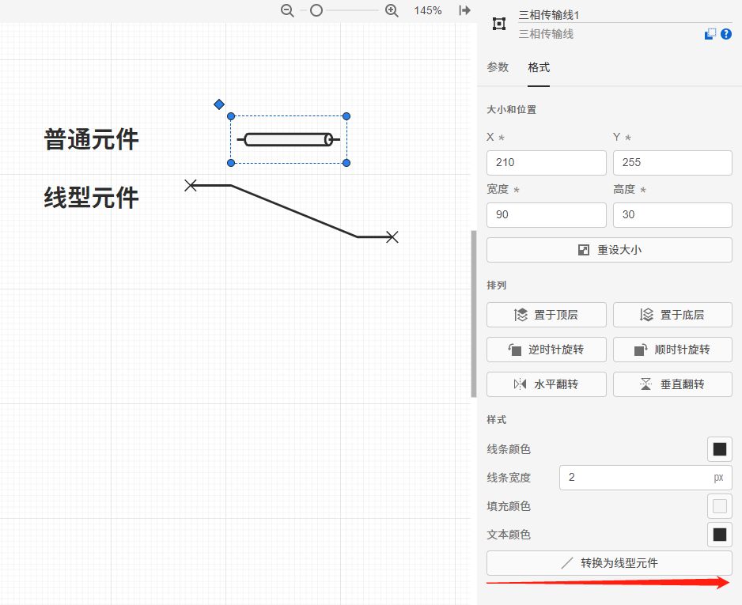

&ensp;&ensp; 1.3 在“实现”页面的“图纸选项”中，新增开启/关闭“引脚标签”显示选项。

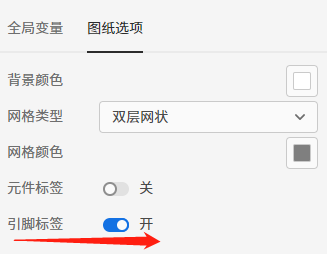

&ensp;&ensp; 1.4 更新了结果页面的显示功能和性能：

&ensp;&ensp;&ensp;&ensp; 1.4.1 重构计算结果展示页面，优化了图形渲染性能；

&ensp;&ensp;&ensp;&ensp; 1.4.2 新增对复杂样式设置的支持；

&ensp;&ensp;&ensp;&ensp; 1.4.3 添加了多标签页功能，支持在计算结果展示页面显示拓扑标签页，支持在拓扑标签页中搜索和定位元件；

&ensp;&ensp;&ensp;&ensp; 1.4.4 多标签容器支持垂直标签布局；

&ensp;&ensp;&ensp;&ensp; 1.4.5 添加树形容器；

&ensp;&ensp;&ensp;&ensp; 1.4.6 新增对更多类型绘图接口的支持；

&ensp;&ensp;&ensp;&ensp; 1.4.7 新增将表格类结果导出为CSV文件的功能；

&ensp;&ensp;&ensp;&ensp; 1.4.8 新增将结果整体导出为ZIP文件的功能（见结果页面右上角“…”按钮）；

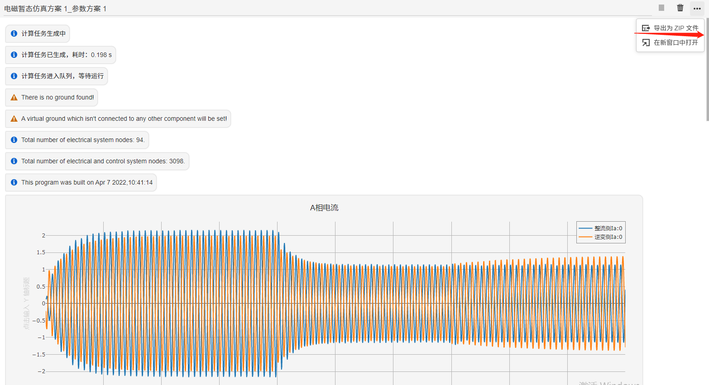

&ensp;&ensp; 1.5 在“运行”页面的计算结果页面支持在新窗口中打开（见结果页面右上角“…”按钮）。

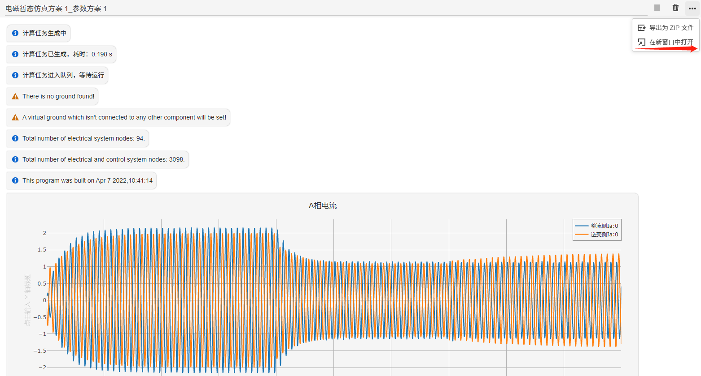

&ensp;&ensp; 1.6 优化了“打开”对话框的性能；

&ensp;&ensp; 1.7 搜索功能更新，新增 `<参数名/引脚名>=<keywords>` 语法，支持对特定参数、特定连接关系的元件和值进行搜索定位。

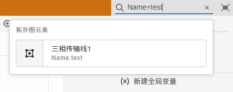

&ensp;&ensp; 1.8 优化错误检查性能，修复错误过多时无法显示的问题。

&ensp;&ensp; 1.9 支持打开历史运行结果及拓扑快照的功能；在打开的快照中，可以获取当次运行结果及其对应的算例拓扑、参数。

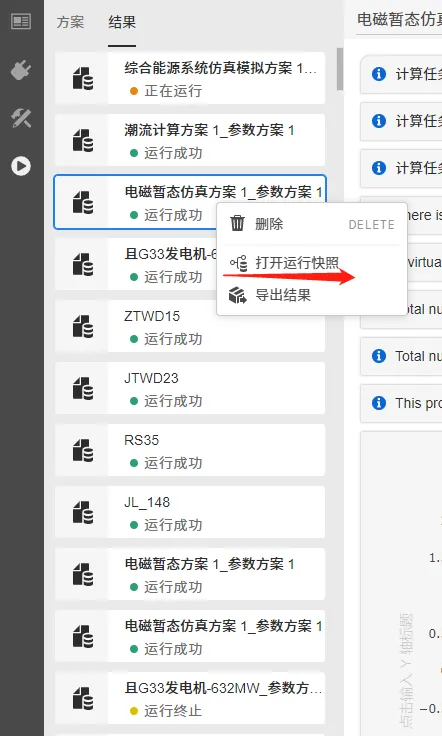

&ensp;&ensp; 1.10 优化了选择、多选控件在选项过多时的性能。

&ensp;&ensp; 1.11 元件库的“模块-基础”分组新增“模块虚拟端口”元件，为封装后的模块提供虚拟端口。

2 用户中心更新至v3.5.0版本

&ensp;&ensp; 2.1 管理员账户新增任务管理、节点管理、策略管理功能。

&ensp;&ensp; 2.2 修复界面显示app数据无过滤的问题。

&ensp;&ensp; 2.3 修复cloudpss-doc未安装时导致搜索结果失效的问题。

3 CloudPSS SDK更新至v3.1.0版本

&ensp;&ensp; 3.1 Runner类添加terminate方法，用以结束当前运行的任务。

&ensp;&ensp; 3.2 cloudpss命名空间下新加currentJob，用以获取当前的FunctionExecution 实例

&ensp;&ensp; 3.3 cloudpss.function新增FunctionExecution类，代替原Job类，优化了FunctionExecution类中方法名称，使之更符合规范。以下是FunctionExecution类与原Job类之间的对应变化关系。原Job类将在未来版本停止兼容。

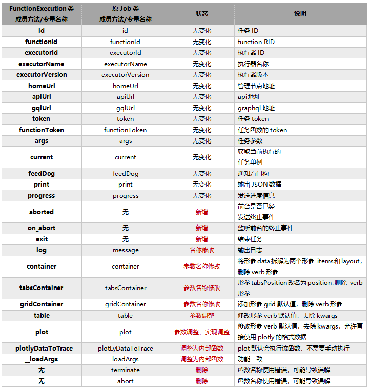

4 CloudPSS 官方计算功能更新

&ensp;&ensp; 4.1潮流计算内核新增“生成潮流文件”功能，可基于CloudPSS算例生成IEEE格式的潮流计算文件。

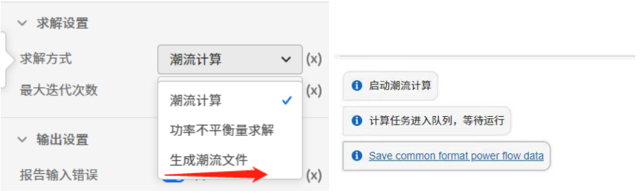

&ensp;&ensp; 4.2 电磁暂态仿真官方元件库新增元件24个，包括频率相关架空线、频率相关地缆线、频率相关等值网络、多维RLC元件、励磁设备电压补偿环节 GVCOMPEN、BPA励磁控制器FM~FT卡、BPA励磁控制器FU~FV卡、基于注入谐波源的扫频模块、双端LCC直流模型、单极双端LCC直流模型、直驱风场等值模型、含外部控制的直驱风场等值模型、双馈风场等值模型、含外部控制的双馈风场等值模型、含外部控制的光伏模型、MMC直流单端模块、MMC半桥子模块、阶梯函数发生器、多维常量输入、多维单步长延时模块、多维代数解环点、数据提取模块、状态空间方程模型、事件日志元件。

&ensp;&ensp; 4.3 其他

&ensp;&ensp;&ensp;&ensp; 4.3.1 修复了变压器电磁暂态仿真模型中分接头切换导致的数值问题。

&ensp;&ensp;&ensp;&ensp; 4.3.2 对三相可控静态负载元件新增了部分参数及状态监测。

&ensp;&ensp;&ensp;&ensp; 4.3.3 对三相断路器元件新增了部分参数及状态监测。

**2022.6.23更新**

1 SimStudio更新至v3.3.1版本

&ensp;&ensp; 1.1 在“实现”标签页中，新增“地理信息图”层级，支持导入并查看svg格式的地理信息图纸。

&ensp;&ensp; 1.2 在元件表功能中，新增导出数据至.xlsx文件的功能。

&ensp;&ensp; 1.3 搜索框支持加载更多搜索结果。

&ensp;&ensp; 1.4 优化了打开SimStudio工程时的元件加载性能。

&ensp;&ensp; 1.5 修复了元件在自环连接方式下复制粘贴出错的问题。

&ensp;&ensp; 1.6 修复了Merge 等动态引脚元件在使用表达式作为参数时出错的问题。

2 FuncStudio更新至v3.3.1版本

&ensp;&ensp; 2.1 修复了执行器的安全漏洞。

3 AppStudio更新至v3.3.1版本

&ensp;&ensp; 3.1 优化了控件的颜色/背景输入，支持了颜色选择器，新增上传自定义背景图片的功能。

&ensp;&ensp; 3.2 修复了输入框输入事件的重复触发问题。

&ensp;&ensp; 3.3 修复了选择器、单选框控件在添加新控件时的内容丢失问题。

&ensp;&ensp; 3.4 修复了部分控件设置项失效的问题，添加了部分新设置项。

**2022.5.23更新**

1 用户中心更新至v3.0.15版本

&ensp;&ensp; 1.1 增加了对软硬件一体化设备（CloudPSS Pro/Mini）最大注册数量显示支持。

&ensp;&ensp; 1.2 增加了node-deb组件支持。

2 SimStudio更新至v3.2.4版本

&ensp;&ensp; 2.1 大幅度优化了示波器输出通道配置页面的通道选择性能，解决了输出通道数量多时的卡顿问题。

**2022.4.13更新**

1 用户中心更新至v3.0.13版本

&ensp;&ensp; 1.1 拆分了SimStudio算例文件的“上传并打开”按钮，使用上传算例压缩包可批量导入嵌套依赖的算例（zip格式），使用上传项目文件可导入单个算例（.cmdl格式）。

**2022.4.11更新**

1 SimStudio更新至v3.2.1版本

&ensp;&ensp; 1.1 新增了外部触发式和固定频率触发式的Octave元件及其模板算例，相比每时步触发计算的Octave元件，计算方式更灵活，效率更高。

&ensp;&ensp;&ensp;&ensp; 1.1.1 固定频率触发式Octave元件默认自带Trigger参数组和Trigger参数（触发频率[Hz]），通过设置触发计算频率Trigger实现固定频率触发计算。

&ensp;&ensp;&ensp;&ensp; 1.1.2 外部触发式Octave元件自带默认自带Trigger参数组和Trigger虚拟输入引脚（外部触发信号输入端口[上升沿触发]），通过在外部给定上升沿信号实现条件触发计算。[示例算例](https://cloudpss.net/model/songyankan/test_Octave_Gain_Trigger)

&ensp;&ensp; 2.1 修复了Octave元件报错提示显示异常的问题

&ensp;&ensp; 2.2 新增了多级嵌套算例的快捷导入导出功能。若当前用户拥有算例全部自定义子元件/算例的可读权限时，在个人中心中可对该算例及其依赖元件/算例进行批量导出和导入。

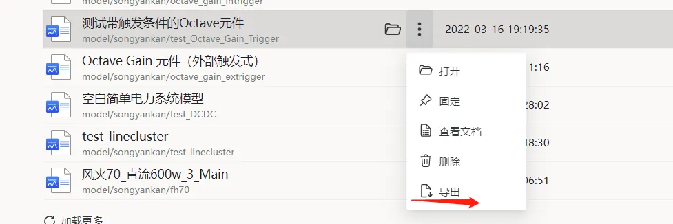

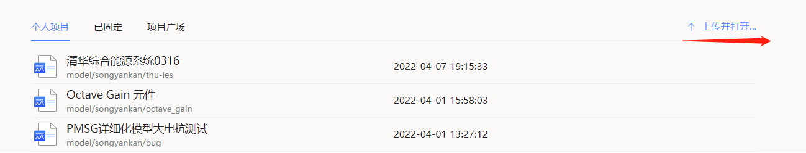

::: tip
注意：

1.可读权限定义为以下2种情况：

&ensp;&ensp; a)模块/算例为当前用户所有；

&ensp;&ensp; b)模块/算例非当前用户所有，但模块/算例的权限为“公开”，且已勾选“允许查看内部细节”。

2.批量导入算例时，全部依赖的子模块将保存至当前用户名下。若存在RID冲突，则会自动覆盖RID相同的算例。请谨慎使用。

::: 

2 AppStudio更新至v3.2.0版本

&ensp;&ensp; 2.1 改善了AppStudio和SimStudio在参数输入框中编辑复杂表达式的体验。在表达式输入模式下，选中输入框后，按Ctrl可呼出输入框的扩展编辑界面。在扩展编辑界面中，支持输入和编辑多行复杂表达式。

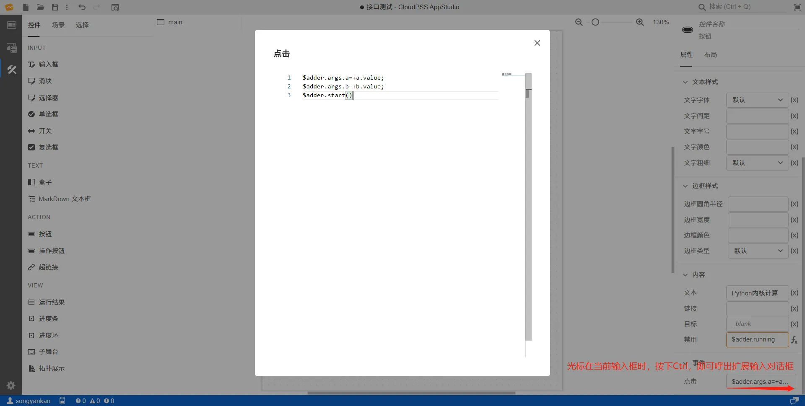
