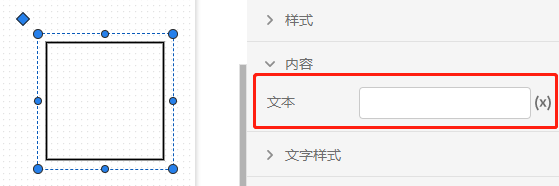
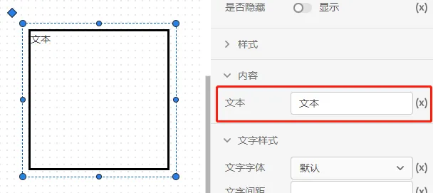
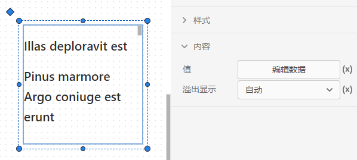
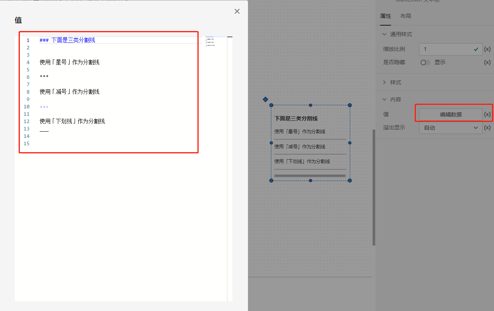
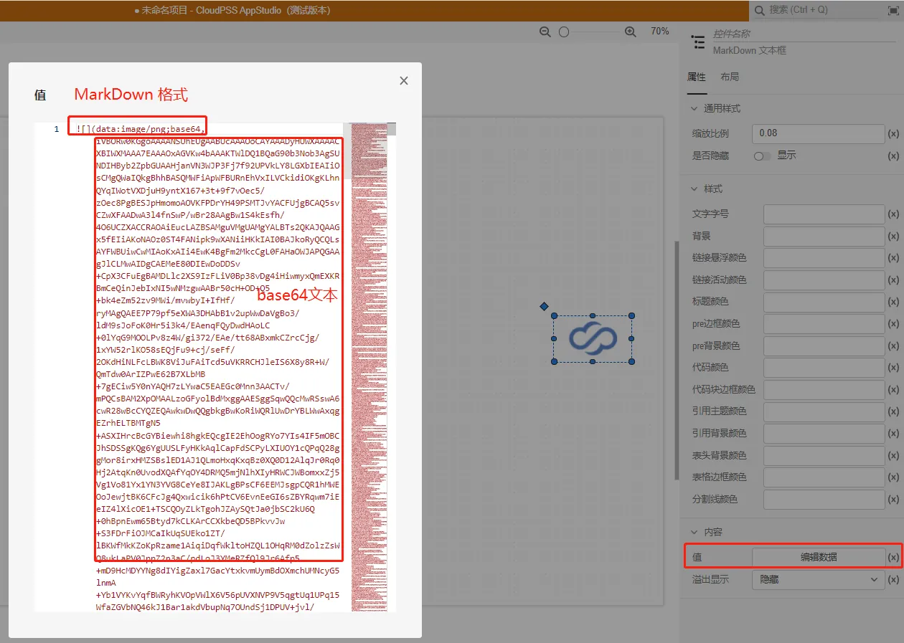

### 1. 盒子内容属性

文本：可以在盒子内输入需要展示的内容，支持值模式和表达式模式输入。

### 2. MarkDown 文本框内容属性

值：输入 MarkDown 文本，支持值模式和表达式模式输入。

溢出效果：调整文本溢出的效果，包括自动、滚动、可见、隐藏。

::: tip

盒子和 MarkDown 文本框除了可以展示文本外，还可以展示图片，在值模式下输入图片的base64文本即可。

:::

