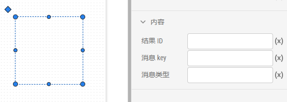
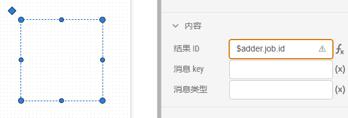
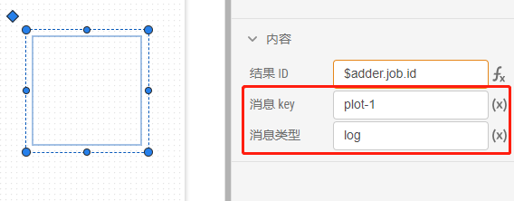
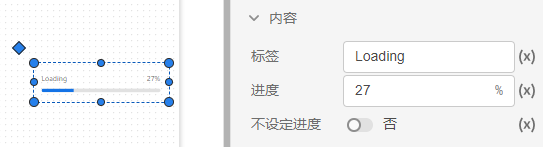
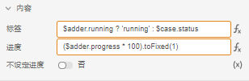
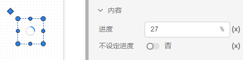
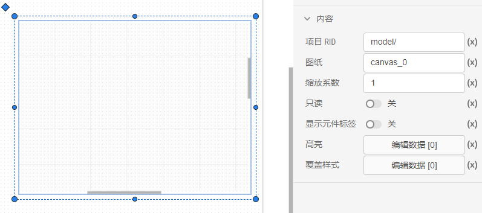
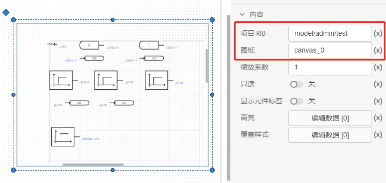
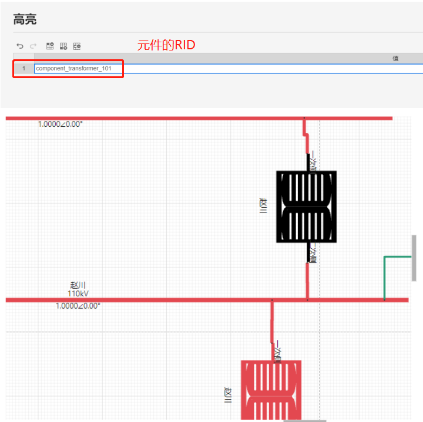

### 运行结果内容属性

结果ID ：输入`资源`标签页内函数资源的任务ID。

::: tip

在资源函数的任务未被执行前，该表达式为被识别，故有错误提示，并非表达式输入有误，可忽略。

:::

消息key ：根据输入的key值，来输出函数资源运行结果的。

消息类型 ：根据输入的类型，来输出函数资源运行结果的。

### 进度条内容属性

标签：可以在进度条的前面输入一些提示文字。 

进度：进度条的当前进度，可以配合函数操作表达式来实时跟踪资源函数的执行进度。

不设定进度：选中后进度条会一直滚动。

### 进度环内容属性

进度：进度环的当前进度，可以配合函数操作表达式来实时跟踪资源函数的执行进度，参考进度条。

不设定进度：选中后进度环会一直转动。

### 子舞台内容属性

场景：输入其他场景的名称，用于在当前场景内嵌套其他场景。

### 拓扑展示内容属性

项目 RID：输入需要展示拓扑电路的 SimStudio 项目 RID（model/用户名/唯一资源 ID ）。

图纸：针对有多张图纸的项目，输入需要展示拓扑电路图纸（默认是canvas0）。

缩放比例：对拓扑进行缩放默认是1。

只读：选择后无法对拓扑结构修改。

高亮：添加需要高亮显示拓扑元件ID。

覆盖样式：添加需要覆盖样式的元件ID、线条颜色、填充颜色和文本颜色。

