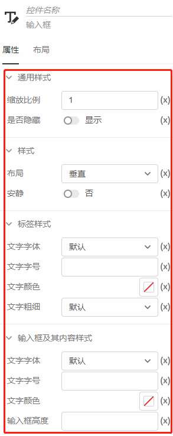
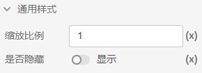
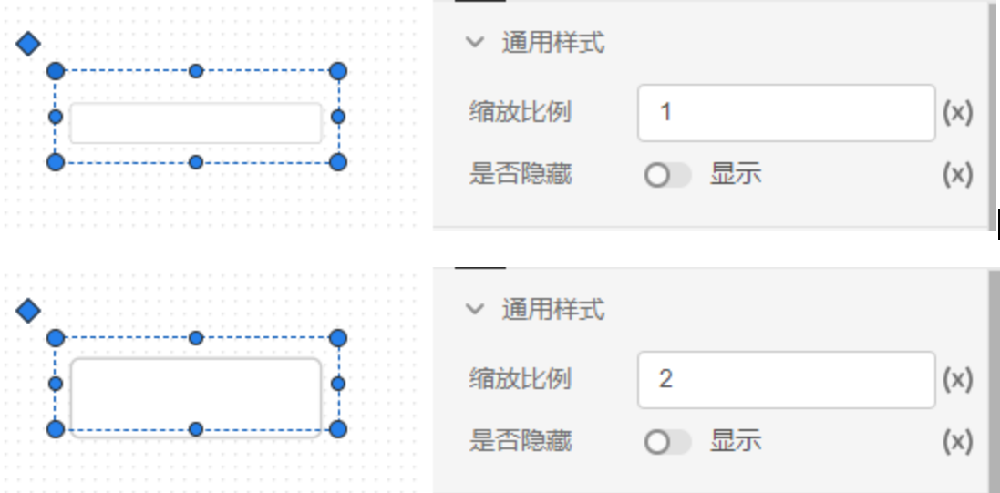
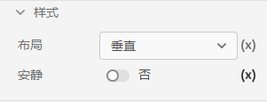
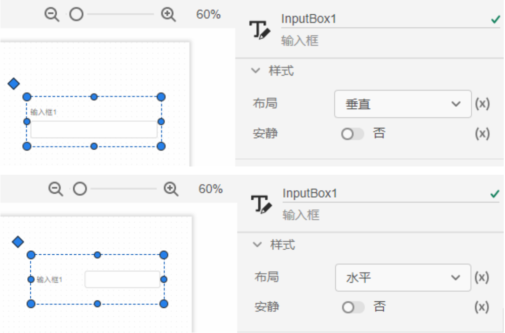
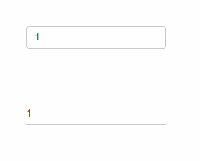
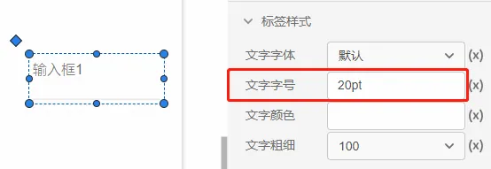
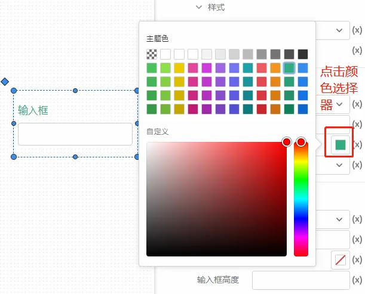
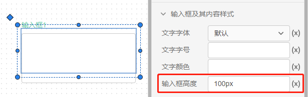

控件属性主要包括`通用样式`、`样式`、`标签样式`、`内容样式`四种，按照调整的格式类型又分为`布局样式`、`文字样式`、`颜色样式`三类，不同的控件之间的样式属性大同小异，以`输入框`控件的样式为例来介绍。

### 通用样式

缩放比例：用于调节输入框包括标签和内容文字大小的整体变化比例。

是否隐藏：选择默认正常显示，选择隐藏后，该输入框被隐藏。

### 样式

布局：可选择垂直和水平，指的是输入框的标签格式是垂直格式或者水平格式。

安静：可以调整输入框的显示格式。下图中靠上输入框是普通格式，靠下的输入框是安静格式。

### 标签样式

文字字体：可以选择不同类型的字体来调整标签文字。

文字字号：可以调整标签文字的大小，单位pt/cm。

文字颜色：输入`#`开头的十六进制颜色码来给标签文字着色和控制透明度。例如`##4472C411`

文字粗细：可以选择调整标签文字的粗细。

### 输入框及其内容样式

用于调整输入框内容的文本字体、文字字号、文字颜色和标签样式一致。

输入框高度：可以修改输入框的高度，单位px/cm。

