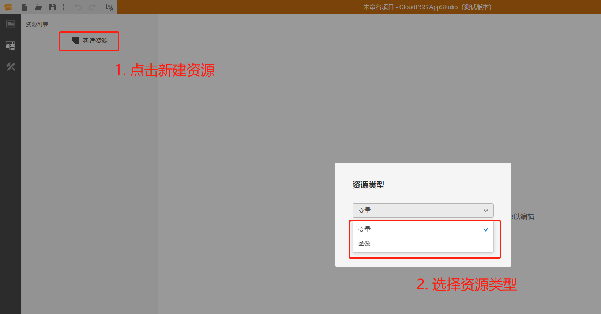
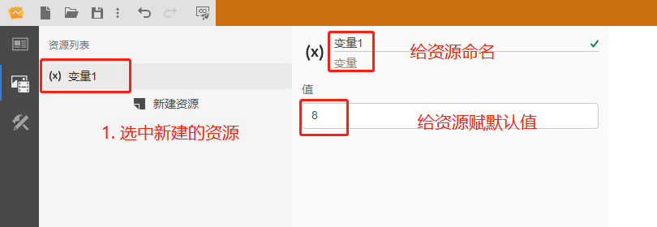
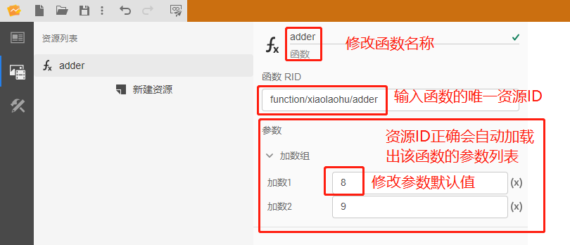

::: info

**`资源`标签页用于配置舞台使用的资源，包括静态资源和函数资源。首先在资源创建区点击「新建资源」按钮可以添加两种资源，一种为变量资源，一种为函数资源，接着点击创建好的资源，对该资源的名称、值、参数等信息进行配置。**

:::

### 1)	新建资源

### 2)	配置资源

#### 1)	变量资源

变量资源主要是定义一个公共变量，当成一个全局参数来使用。方便于第三个`场景`标签页内多个控件的使用，变量提供一个结果值，在资源配置区可以修改变量名称和变量的结果默认值。

:::tip

在`场景`标签页使用时，需要利用`$变量名称.value`形式的表达式来对变量的值进行操作。

:::

#### 2)	函数资源

函数资源主要用于添加FuncStudio上注册好的函数。方便于第三个`场景`标签页内多个控件对函数进行调用，在资源配置区`函数 RID `栏中填入保存在FuncStudio的函数 RID，填入后会自动加载出该函数的参数列表。
在资源配置区可以修改函数名称和函数参数的默认值。

:::tip

能添加的函数资源可以是自己账号在FuncStudio注册好的函数，可以是别的用户公开的FuncStudio函数。

`函数 RID `是在FuncStudio上保存函数时创建的唯一资源ID，可以在FuncStudio的主页或项目打开引导页面里面找到相应函数的RID。

![查找函数的RID]](./查找函数的RID.png "查找函数的RID")

目前提供的函数可操作的方法有：

$函数名称.value→获取函数运行后的结果

$函数名称. args→获取函数的输入参数

$函数名称. running→获取函数的运行状态

$函数名称. progress→获取执行此函数的进度

$函数名称. status→获取函数上次运行结果状态

$函数名称.job.id→获取函数的任务id

$函数名称.start( )→开始执行函数

$函数名称.terminate( )→终止函数的执行

:::

