::: info

**`场景`用于使用可视化控件设计舞台的交互场景，并将资源数据绑定到相应的可视化控件上，该标签页包含控件列表区、场景编辑区和属性操作区。**

:::

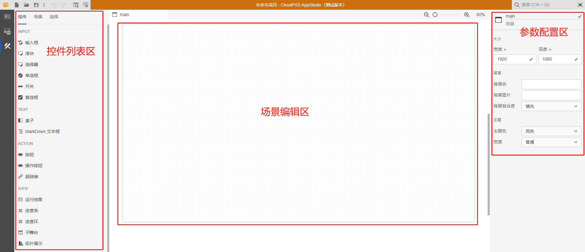

### 控件列表区

`场景`标签页的左侧是控件列表区，包括`控件`、`场景`、`选择`三部分。

#### 1）控件

目前提供的可使用`控件`有INPUT（输入类控件）、TEXT(文本类控件)、ACTION(操作类控件)、VIEW(视图类控件)。

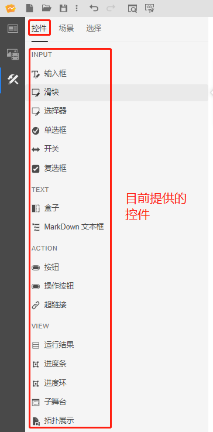

用户通过拖拽就可以把相应的控件添加到场景编辑区内。其中INPUT包括`输入框`、`滑块`、`选择器`、`单选框`、`开关`、`复选框`，TEXT`包括盒子`、`MarkDown 文本框`，ACTION包括`按钮`、`操作按钮`、`超链接`，VIEW包括`运行结果`、`进度条`、`进度环`、`子舞台`、`拓扑展示`。每个控件的使用方法详见[控件帮助](./Control/index.md)功能帮助。

#### 2）场景

当舞台需要展示的页面较多时，可利用`场景`添加功能将页面放置到不同的`场景`上，类似于SimStudio的图纸功能。注意：每个应用至少包含一个场景。
对任意的舞台都可添加任意数量的`场景`。首先点击场景选项，然后点击新建场景即可把新的场景添加到场景编辑区内。选中场景，点击鼠标右键即可对该场景进行剪贴、复制、创建副本、删除的操作。

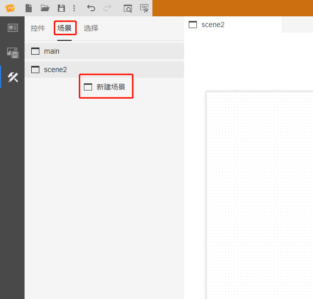

#### 3）选择

显示每个场景内部的所有控件，点击某个控件后，会在场景编辑区内自动选中该控件，方便用户找到快速找到想要操作的控件。

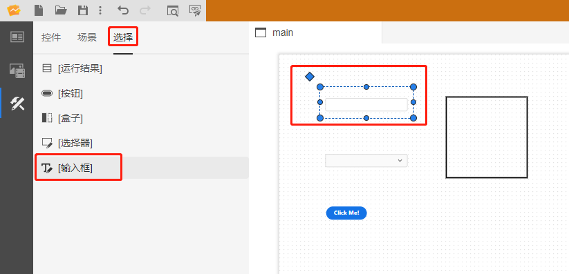

### 场景编辑区

`场景`标签页的中间是场景编辑区，用于在当前场景页内添加控件，并对控件进行拖放、平移、旋转、缩放等自定义的操作。

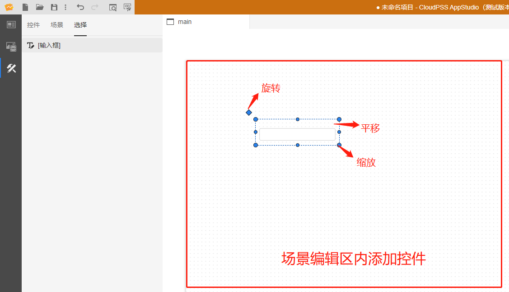

::: tip

在编辑舞台场景时，可以点击工具栏的`预览`快捷按钮，进入预览模式，在预览模式下，用户通过操作控件来检查各部分之间的联动是否正常，并及时查看舞台效果。

在舞台场景编辑完成并保存后，可以点击工具栏的`发布`快捷按钮，会自动复制一个应用发布链接，可以在浏览器中直接访问该链接或点击右下角的提示信息进入舞台应用（非CloudPSS用户无需登录也可通过链接来直接使用该应用）。

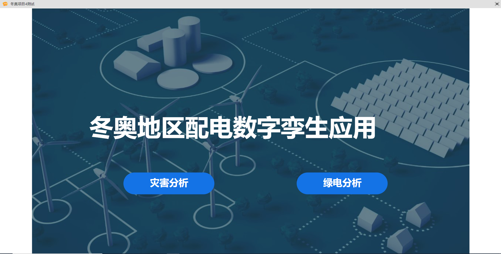

:::

### 属性操作区

`场景`标签页的右侧是属性操作区，主要负责对场景和控件的格式进行设置。

#### 场景属性修改

选中某一场景时可修改场景的名称和属性。

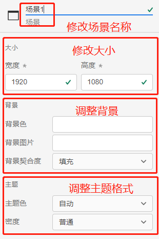

::: tip

每个场景建议都命名。

:::

#### 1）大小

可以调整场景的`高度`、`宽度`。

#### 2）背景

背景色：输入“#”开头的6位十六进制颜色码来调整场景的背景颜色。

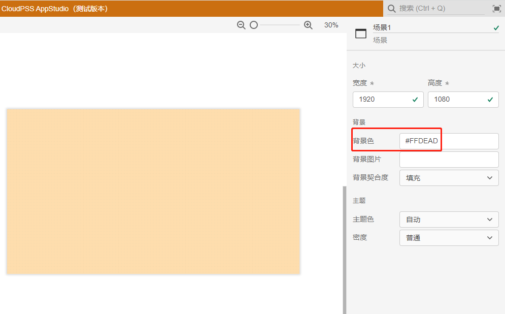

背景图片：将需要插入的图片URL链接或base64文本输入到框内。

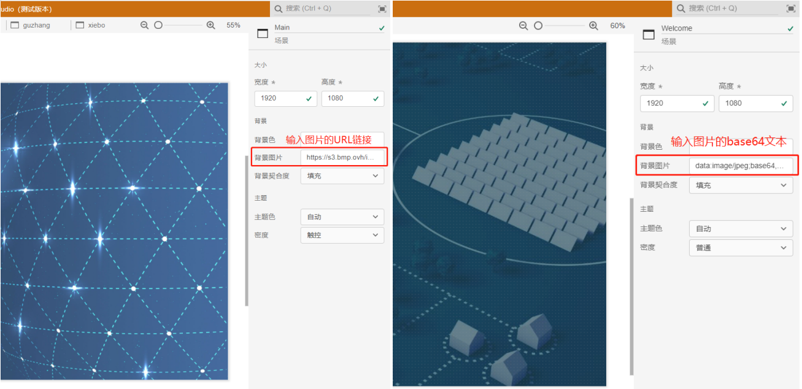

#### 3）主题

可以调整场景主题的`主题色`、`密度`。

#### 控件属性修改

选中某一控件时可修改控件名称、属性和布局。

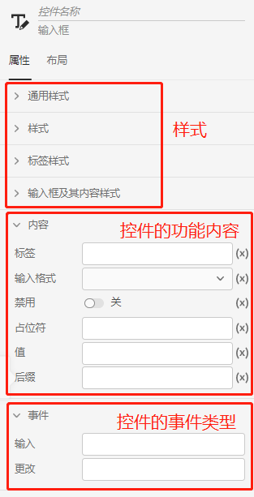

::: tip

需要赋值的控件必须命名。

:::

#### 1）属性

详见[控件属性帮助](../../control/index.md)帮助文档。

#### 2）布局

布局有两大功能，分别是大小和位置、排列。

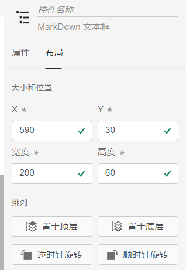

大小和位置用于修改控件的大小和左上角顶点的坐标。

当不同控件重叠在一起时，排列功能可以设置它们的重叠先后顺序，选择置于顶层或置于底层。排列功能还可以设置元件的旋转角度，可以点击顺时针旋转、逆时针旋转。
当框选多个控件时，排列功能可以设置它们的对齐方式和分布方式，如左对齐、水平居中、右对齐、顶端对齐、居中对齐、底端对齐、横向等距分布或纵向等距分布等。

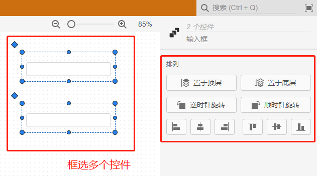
