本节主要介绍在AppStudio的搭建简单应用舞台的过程。以一个加法器应用为例。

### 前端实现

利用AppStudio`场景`标签页控件的 mathjs 表达式解析器(不添加FuncStudio的资源函数)来实现加法器应用场景的搭建。

首先登录到CloudPSS的主页，点击AppStudio图标进入AppStudio的个人中心，点击`新建空白项目`，即创建一个空白项目，并进入AppStudio工作台。

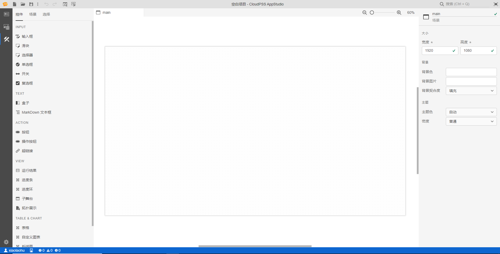

点击左侧的`场景`按钮，进入`场景`标签页，使用左侧的控件设计加法器的舞台场景。下面介绍三种不同的加法器舞台前端实现方法。

#### 1）使用控件的数据进行计算

##### 放置控件

在左侧的控件列表区内选择两个`输入框`元素，放置到中间的场景编辑区内。

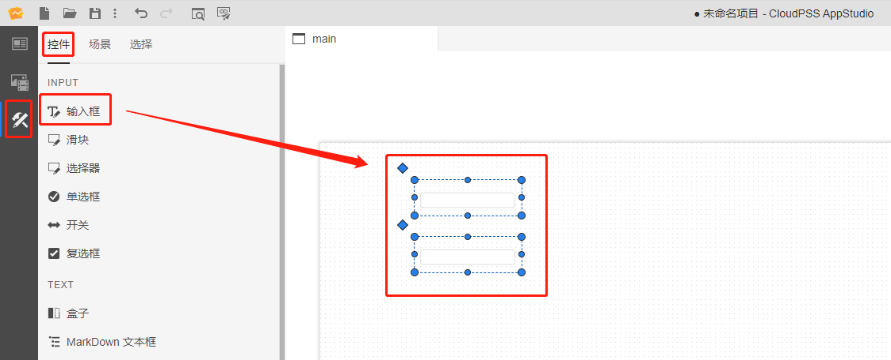

点击两个添加好的输入框控件选中后，在右侧的属性配置区内给输入框命名为`a`和`b`，默认值设置为`1`和`2`。

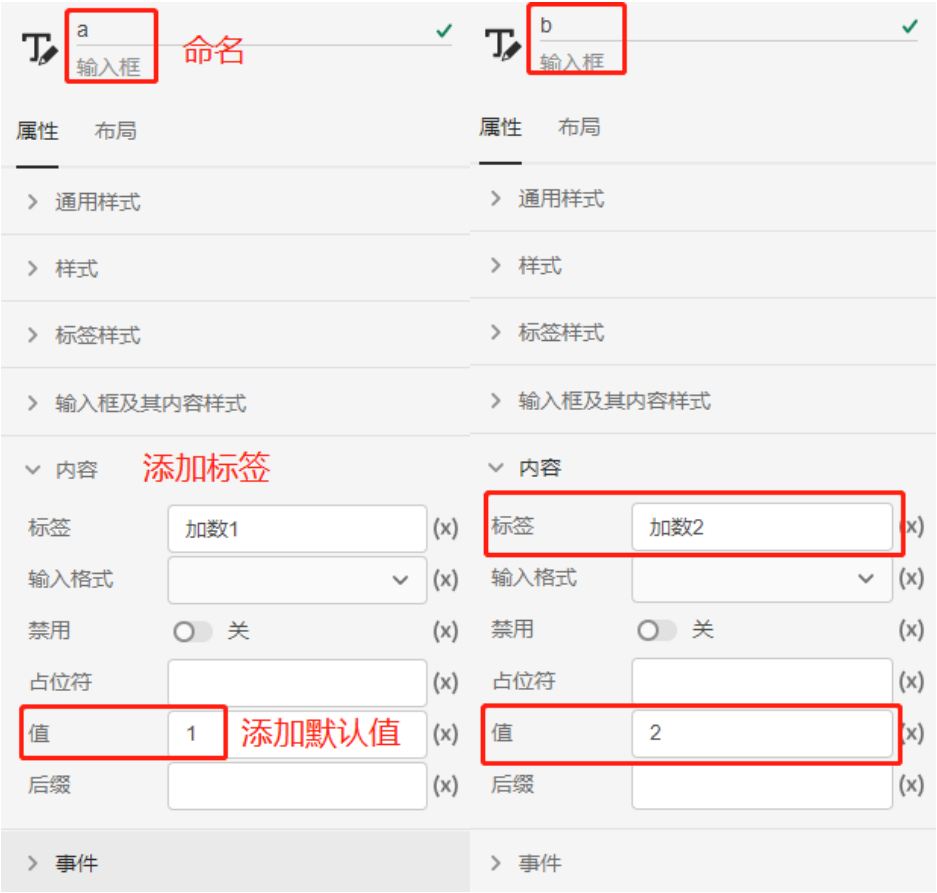

接着在控件列表区内选择一个 `MarkDown 文本框`控件，放置到中间的场景编辑区内。

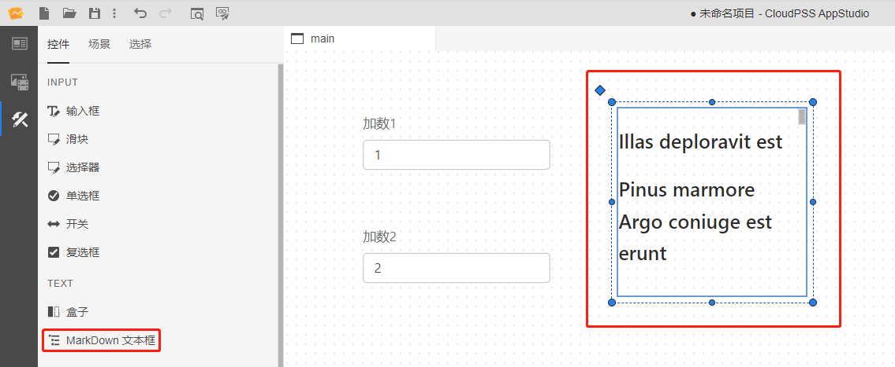

点击添加好的 MarkDown 文本框控件选中后，在属性配置区内给文本框命名为`c`，首先点击`内容`/`值`一栏最右边的`(x)`，从`值`模式切换到`表达式`模式，然后输入`a.value+b.value`，该表达式的意思表示计算输入框a的值和输入框b的值的和，注意 MarkDown 文本框会自动将数值类型的计算结果转换为字符串类型显示。

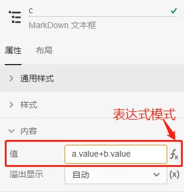

::: tip

切换到表达式模式下属性栏的边框会变成黄色，边框为黄色的属性栏只能输入表达式。

从`表达式`模式切换回`值`模式时原本输入的表达式会丢失。

`表达式`模式会自动检查当前属性栏内表达式的状态，若表达式输入有误，选中属性栏后，会在最右侧出现报错提示，鼠标悬浮到上面会显示报错信息；若表达式输入正确，会在最右侧自动计算出表达式的当前值。

:::

##### 预览效果

完成上述场景搭建后，点击工具栏的`预览`快捷按钮，会进入预览模式，展示出加法器的舞台效果，在预览模式内可以自定义修改输入框值，修改后，文本框会自动显示出相应的计算结果。

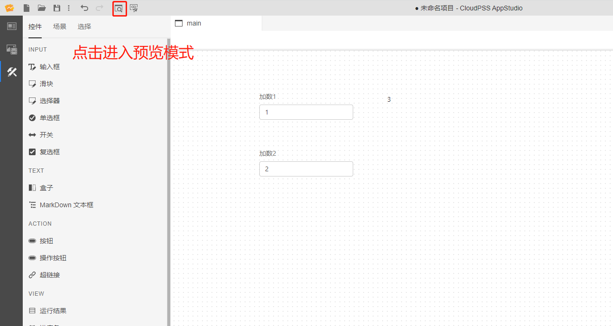

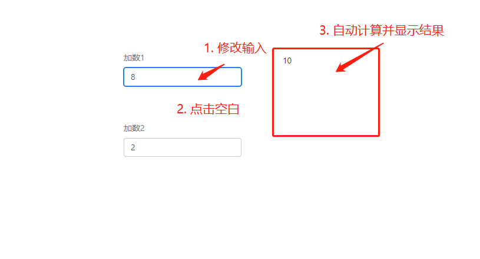

#### 2）利用事件触发机制进行计算

##### 放置控件

在上述场景的基础上，再在控件列表区选择一个 `MarkDown 文本框`控件，添加到场景编辑区，命名为`d`。

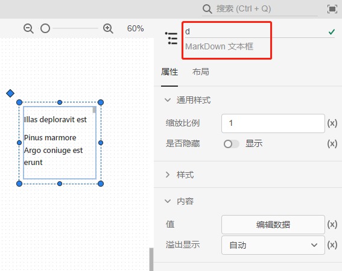

接着，在控件列表区选择一个`按钮`控件，放置到场景编辑区。选中添加好的按钮，在属性配置区内给按钮命名为`e`，在`内容`/`文本`属性栏内填入`点击计算`提示文本，并在`事件`/`点击`属性栏内填入`d.srcdoc=a.value+b.value`的表达式，即添加了一个点击按钮时触发计算的事件，通过点击该按钮计算输入框a的值和输入框b的值的和，并将值赋给MarkDown文本框`d`的`srcdoc`属性。

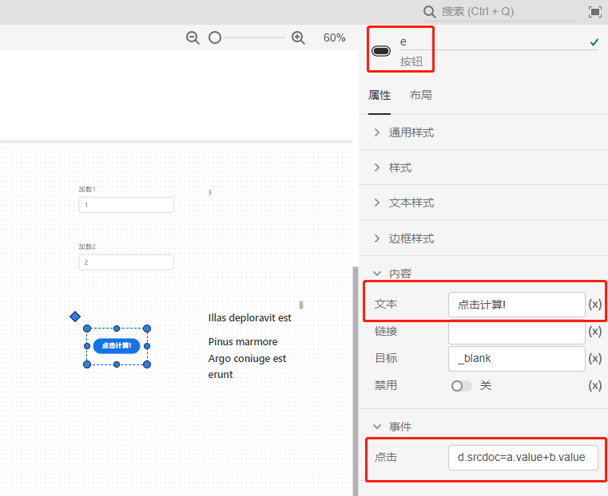

::: tip

`d.srcdoc`指`MarkDown 文本框` `d` 的`值`属性的键，同理每个控件的所有属性值都可以通过`控件名.属性键值`的表达式来获取。

将鼠标悬停在控件属性栏上，属性的键值会自动显示在左侧。

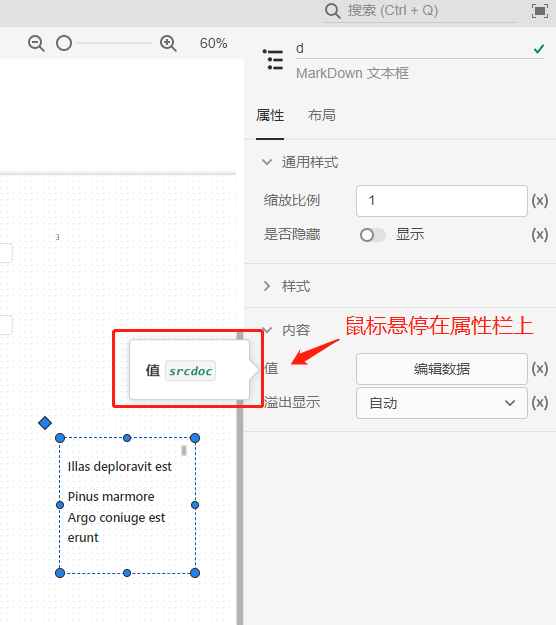

:::

##### 预览效果

在弹出的预览页面点击添加的按钮元素，在MarkDown文本框`d`中即可看到相应的计算结果。

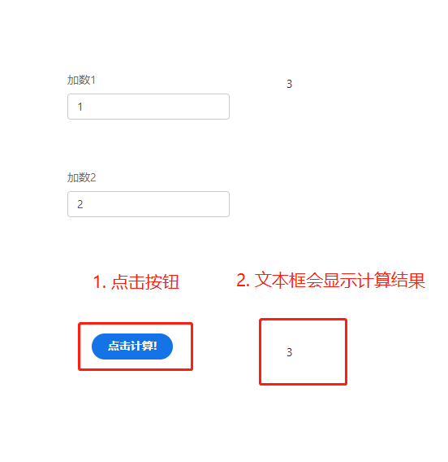

#### 3）使用变量资源的数据进行计算

##### 添加变量资源

在上述场景的基础上，点击左侧的`资源`按钮，进入`资源`标签页，在资源创建区点击`新建资源`，选择`变量`。

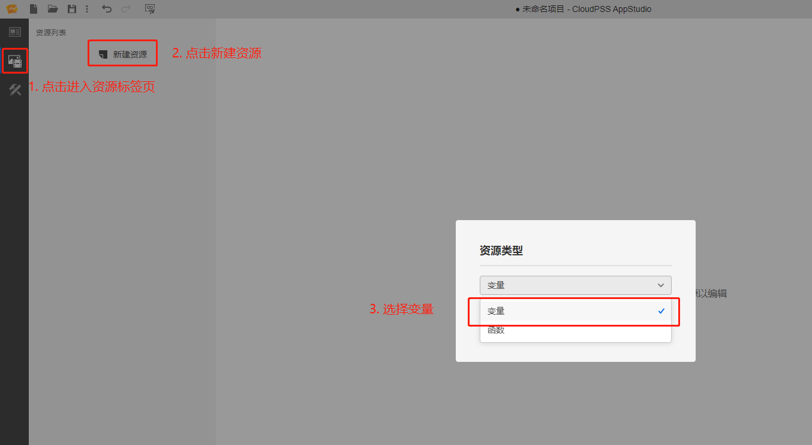

选中该变量，给其命名为`A`，并填入默认值。

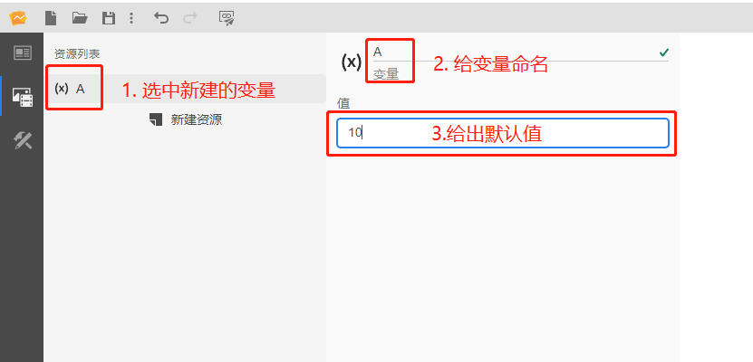

##### 放置控件

在控件列表区选择一个 `MarkDown 文本框`控件，添加到场景编辑区，选中添加好的MarkDown文本框，命名为`f`，在`值`属性栏内输入`$A.value+b.value`的表达式，表示计算变量资源A的值和输入框b的值之和。

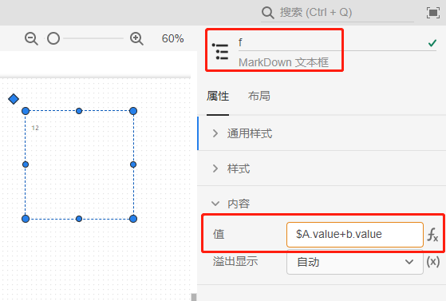

::: tip

引用`资源`标签页内的变量或者函数需要在表达式的前面加上`$`。

:::

##### 输入框添加事件

选中添加好的输入框`a`，在`事件`/`更改`属性栏内填入`$A.value=a.value`的表达式，即添加一个当输入框value值变更时触发的事件，将输入框`a`更改后的值来赋给变量资源`A`。

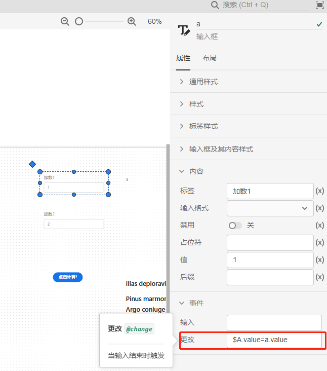

##### 预览效果

在预览模式下修改输入框`a`的值后，将输入框`a`的值赋值给变量资源`A`。

### 后端实现

介绍利用FuncStudio的资源函数来实现加法器应用场景的搭建，首先新建一个AppStudio空白项目。

#### 创建函数

在 FuncStudio 创建一个加法器函数，创建方法详见[FuncStudio入门案例](../../../funcstudio/guide/rumen/index.md)的介绍。

#### 添加函数资源

点击左侧的`资源`按钮，进入`资源`标签页，在资源创建区点击`新建资源`，选择`函数`。

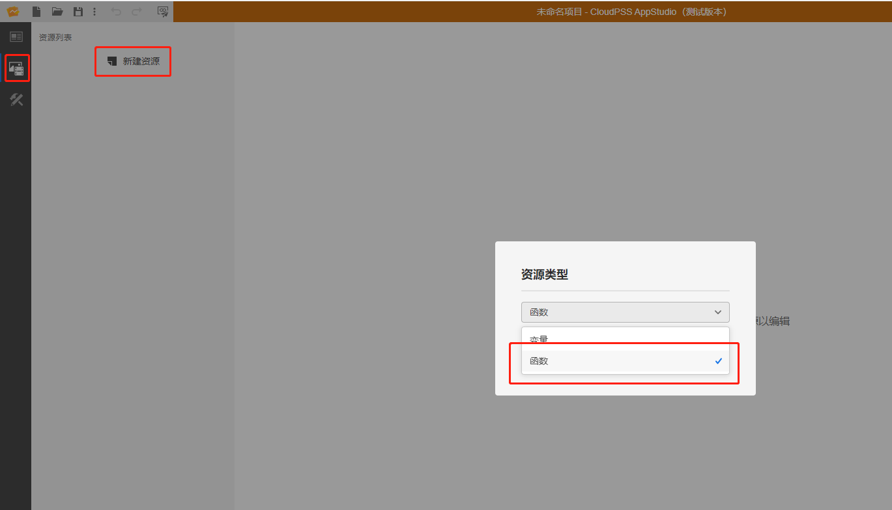

选中该函数，给函数命名为`adder`，并在`函数 RID`栏中输入上述在 FuncStudio 上创建一个加法器函数的 RID，输入正确的话会被自动识别出并加载该函数的参数列表。

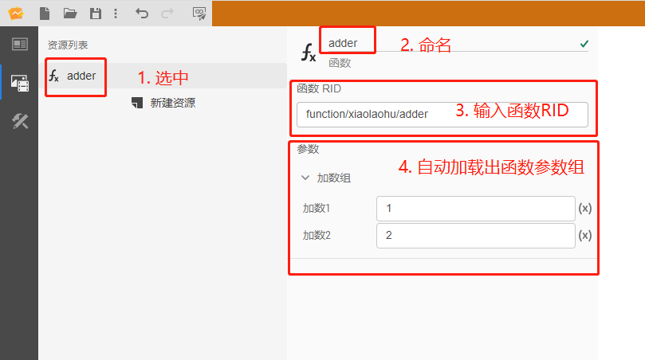

::: tip

在AppStudio中使用FuncStudio函数时需要保证该函数的执行器在线。

:::

#### 搭建场景

放置两个`输入框`控件，分别命名为`a`和`b`，默认值设置为`1`和`2`，并在`事件`/`更改`属性栏内分别输入`$adder.args.a=a.value`和`$adder.args.b=b.value`的表达式，添加一个当输入框值变更时触发的事件，对函数资源的参数进行赋值，即通过更改输入框的值对函数资源的两个参数进行赋值。其中`$adder.args.a`表示`资源`标签页中函数资源`adder`的参数`a`的键；`a.value`表示`场景`标签页中输入框控件`a`的值。

接着放置一个`按钮`元素，命名为`c`，在`内容`/`文本`栏内输入提示，并在`事件`/`点击`栏内输入`$adder.start()`的表达式，添加一个点击按钮时触发的事件，即通过点击该按钮对函数资源进行操作。其中`$adder.start()`表示开始执行`adder`函数。

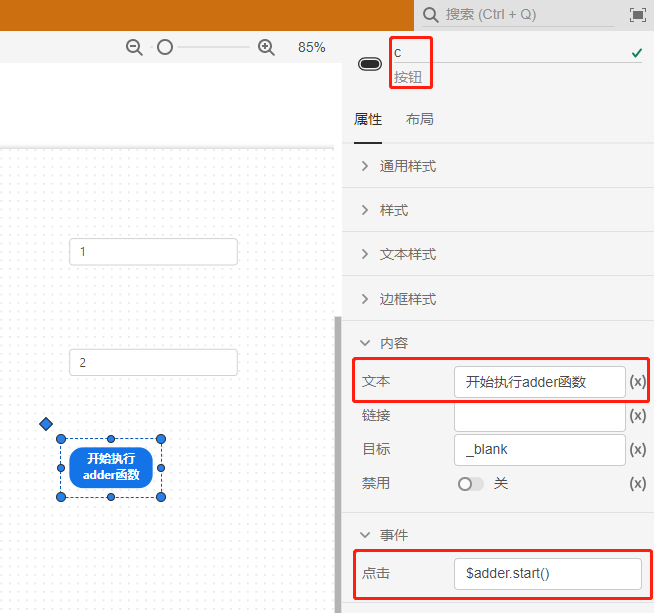

进一步放置一个 `MarkDown 文本框`控件，命名为`d`，在`d`的`值`栏内输入`$adder.status`的表达式，来获取`adder`函数的运行状态。

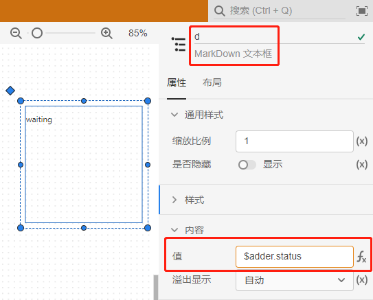

此外，在控件列表区选择两个`运行结果`控件，命名为`e`和`f`，在`内容`/`结果ID`栏内都输入`$adder.job.id`的表达式，将其绑定为`adder`函数的任务id；不同的是在运行结果`e`的`内容`/`消息类型`栏内输入`log`，让运行结果`e`仅识别并显示type为`log`的运行结果（也就是message函数的结果）；在运行结果`f`的`内容`/`消息key`栏内输入`plot-1`，让运行结果`g`仅识别并显示key为`plot-1`的运行结果。

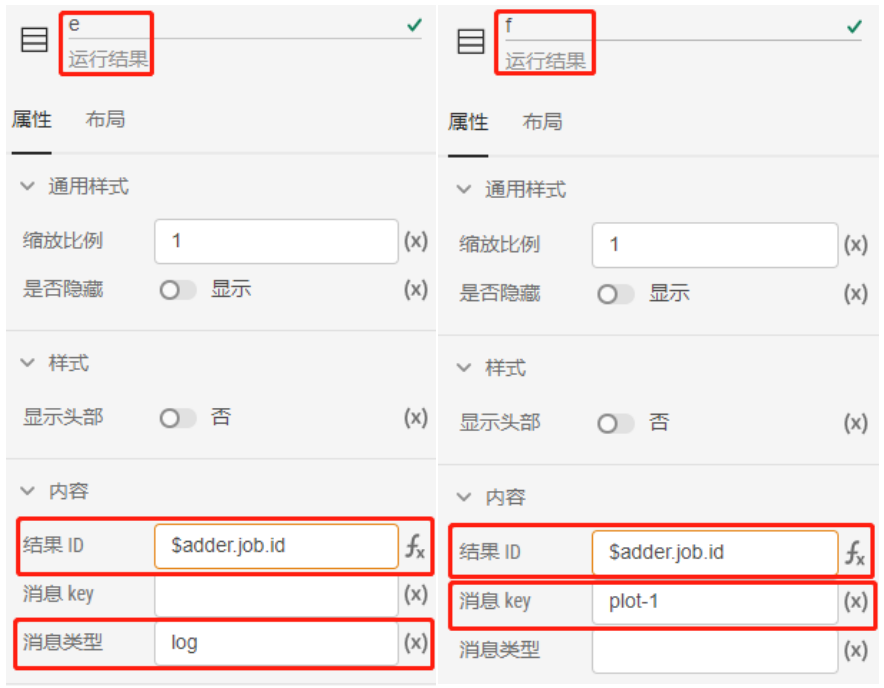

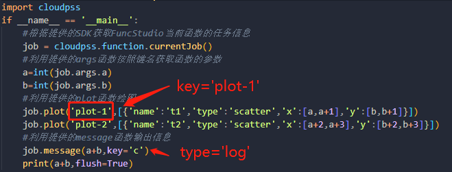

##### 预览效果

在搭建好上述舞台场景后，点击工具栏的`预览`快捷按钮，在预览模式下点击按钮，开始执行函数，在MarkDown文本框和运行结果中即可看到相应的计算结果，并且可以通过修改输入框的值来多次执行函数，查看运行结果的变化情况。

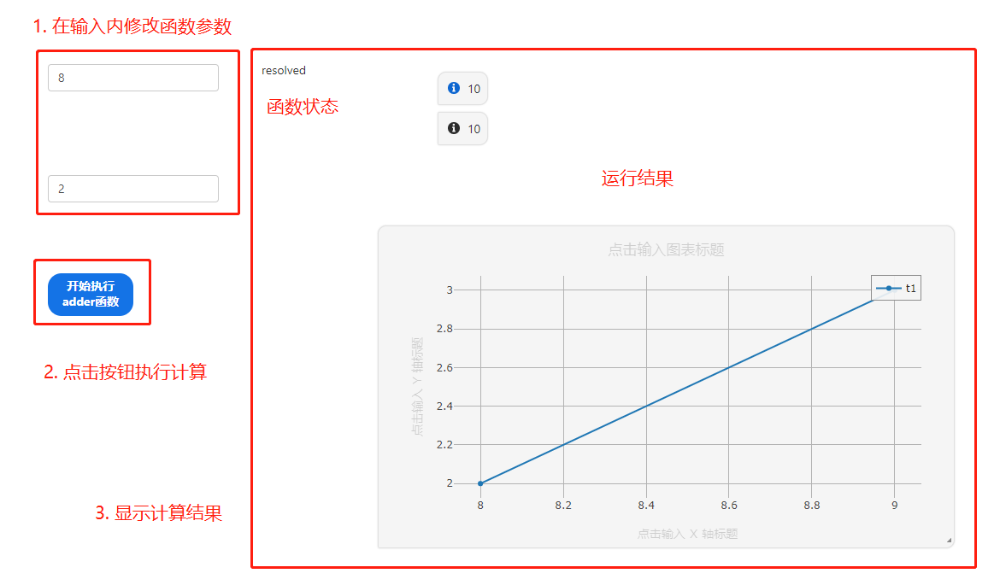
