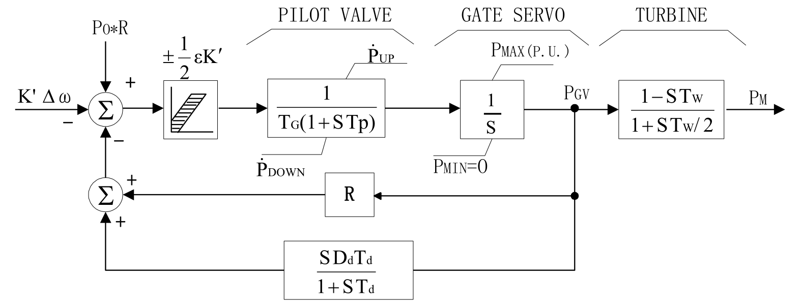

## 基本描述
> **该元件用以建模水轮机调速器模型**

## 参数列表

### 水轮机调速器和原动机模型（GH）

水轮机调速器和原动机模型（GH）

| 参数名 | 单位 | 描述 | 类型 | 备注 |
| ------ | ---- | ---- |:----:| ---- |
| Sbase | MVA | 功率基准值 | 实数（常量） |  |
| PMAX | MW | 最大原动机输出功率 | 实数（常量） |  |
| R | s | 调差系数 | 实数（常量） |  |
| Tg | s | 调速器响应时间 | 实数（常量） |  |
| Tp | s | 引导阀门时间常数 | 实数（常量） |  |
| Td | s | 软反馈时间常数, Td=5Tw | 实数（常量） |  |
| TW/2 | s | 水锤效应时间常数 | 实数（常量） |  |
| VELclose | p.u./s | 最大水门关闭速度，每秒标么。标么值一个单位等于 | 实数（常量） |  |
| VELopen | p.u./s | 最大水门开启速度，每秒标么。 | 实数（常量） |  |
| Dd | p.u. | 软反馈环节系数, Dd=2.5Tw/(2H) | 实数（常量） |  |
| ε | p.u. | 死区，为相对于系统频率的标么值 | 实数（常量） |  |

## 端口列表

| 端口名 | 描述 | 类型 | 数据维数 |
| ------ | ---- |:----:|:--------:|
| Pm0 |  | 输入 | 1 x 1 |
| wref |  | 输入 | 1 x 1 |
| w |  | 输入 | 1 x 1 |
| L2N |  | 输入 | 1 x 1 |
| PM |  | 输出 | 1 x 1 |

## 使用说明
BPA的GH型水轮机调速器框图如下所示。

## 相关元件
