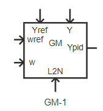

## 基本描述

[^_^]:

## 参数列表
### 调节系统模型4（GM）
| 参数名 | 单位 | 备注 | 类型 | 描述 |
| :--- | :--- | :--- | :--: | :--- |
| KW | p.u. | 频率偏差放大倍数 | 实数（常量） |  |
| TR | s | 频率测量环节时间常数（秒） | 实数（常量） |  |
| -DB1 | p.u. | 转速调节死区（负方向，相对于额定频率的标么值） | 实数（常量） |  |
| DB1 | p.u. | 转速调节死区（正方向，相对于额定频率的标么值） | 实数（常量） |  |
| Kp | p.u. | PID比例环节放大倍数 | 实数（常量） |  |
| Kd | p.u. | PID微分环节放大倍数 | 实数（常量） |  |
| Ki | p.u. | PID积分环节放大倍数 | 实数（常量） |  |
| Td | s | PID微分环节时间常数（秒） | 实数（常量） |  |
| INTG_MAX | p.u. | PID积分环节限幅上限INTG_MAX | 实数（常量） |  |
| INTG_MIN | p.u. | PID积分环节限幅下限INTG_MIN | 实数（常量） |  |
| PID_MAX | p.u. | 调压器放大器的时间常数（秒） | 实数（常量） |  |
| PID_MIN | p.u. | PID输出限幅环节的下限PID_MIN | 实数（常量） |  |
| DELT | s | 转速测量的延迟时间（秒） | 实数（常量） |  |
| DBMAX | p.u. | 一次调频负荷上限 | 实数（常量） |  |
| DBMIN | p.u. | 一次调频负荷下限 | 实数（常量） |  |

### 调节系统模型2继续卡（GJ+）
| 参数名 | 单位 | 备注 | 类型 | 描述 |
| :--- | :--- | :--- | :--: | :--- |
| Ep | p.u. | 系数 | 实数（常量） |  |
| -DB2 | p.u. | 负方向死区（标么值，本机额定功率为基准） | 实数（常量） |  |
| DB2 | p.u. | 正方向死区（标么值，本机额定功率为基准） | 实数（常量） |  |
| DBMAX2 | p.u. | 限幅上限 | 实数（常量） |  |
| DBMIN2 | p.u. | 限幅下限 | 实数（常量） |  |

## 端口列表

| 端口名 | 数据维数 | 描述 |
| :--- | :--:  | :--- |
| Yref | 1×1 | |
| wref | 1×1 | |
| w | 1×1 | |
| L2N | 1×1 | |
| Y | 1×1 | |

## 使用说明
BPA的GM调速器控制框图如下所示。

## 相关元件

