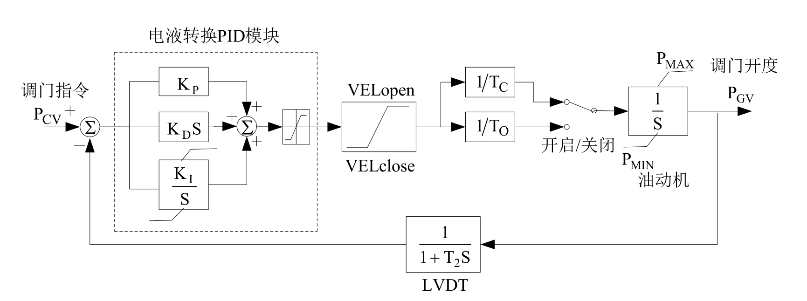
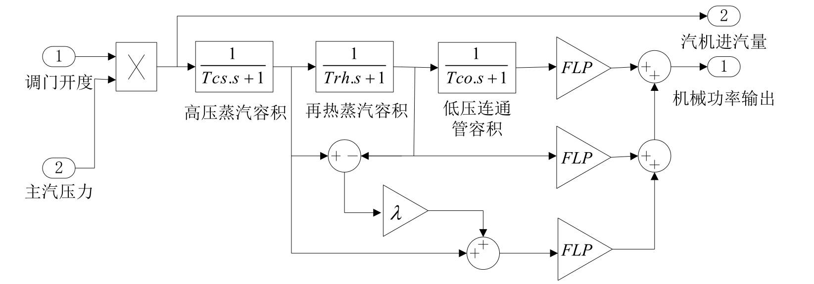

## 基本描述
> **该元件用以建模适用于汽轮机电气液压式调速系统模型**

## 参数列表

### 调节系统模型2（GJ）

调节系统模型2（GJ）

| 参数名 | 单位 | 描述 | 类型 | 备注 |
| ------ | ---- | ---- |:----:| ---- |
| Kmh | p.u. | 电机额定有功与电机额定容量的比值，Kmh=P_H/S_B | 实数（常量） |  |
| T1 | s | 转速测量环节时间常数T1（秒） | 实数（常量） |  |
| ε | p.u. | 转速偏差死区ε（相对系统频率的标么值，死区为±0.5ε） | 实数（常量） |  |
| K1 | p.u. | 转速偏差放大倍数K1 | 实数（常量） |  |
| 控制方式 |  | 控制方式选择，（各种方式下，一次调频均能自动投入） | 选择 |  |
| Kp | p.u. | PID比例环节倍数KP | 实数（常量） |  |
| Kd | p.u. | PID微分环节倍数KD | 实数（常量） |  |
| Ki | p.u. | PID积分环节倍数KI | 实数（常量） |  |
| INTG_MAX | p.u. | PID积分环节限幅上限INTG_MAX | 实数（常量） |  |
| INTG_MIN | p.u. | PID积分环节限幅下限INTG_MIN | 实数（常量） |  |
| PID_MAX | p.u. | 调压器放大器的时间常数（秒） | 实数（常量） |  |
| PID_MIN | p.u. | PID输出限幅环节的下限PID_MIN | 实数（常量） |  |
| K2 |  | 负荷控制前馈系数。 | 实数（常量） |  |
| Wmax | p.u. | 一次调频负荷上限 | 实数（常量） |  |
| Wmin | p.u. | 一次调频负荷下限 | 实数（常量） |  |

### 调节系统模型2继续卡（GJ+）

调节系统模型2继续卡（GJ+）

| 参数名 | 单位 | 描述 | 类型 | 备注 |
| ------ | ---- | ---- |:----:| ---- |
| TW_DELAY | s | 频率输入信号的纯延迟时间（秒） | 实数（常量） |  |
| TP_DELAY | s | 功率反馈信号的纯延迟时间（秒） | 实数（常量） |  |
| TR | s | 功率反馈信号对应的一阶惯性环节时间常数（秒） | 实数（常量） |  |
| TW2_delay | s | 频率信号放大后的纯延迟时间（秒） | 实数（常量） |  |
| TW_DELAY_PID | s | 频率信号放大后输入PID的纯延迟时间（秒） | 实数（常量） |  |
| DPup | p.u./s | 频率信号放大后输入PID信号的上升速率限制（ pu/秒） | 实数（常量） |  |
| DPdown | p.u./s | 频率信号放大后输入PID信号的下降速率限制（ pu/秒） | 实数（常量） |  |

### 电液伺服系统模型（GA）

电液伺服系统模型（GA）

| 参数名 | 单位 | 描述 | 类型 | 备注 |
| ------ | ---- | ---- |:----:| ---- |
| TC | s | 油动机关闭时间常数（秒） | 实数（常量） |  |
| TO | s | 油动机开启时间常数（秒） | 实数（常量） |  |
| VELclose | p.u. | 过速关闭系数（标么值） | 实数（常量） |  |
| VELopen | p.u. | 过速开启系数（标么值） | 实数（常量） |  |
| Pmax | p.u. | 最大原动机输出功率（油动机最大行程或调门最大开度） | 实数（常量） |  |
| Pmin | p.u. | 最小原动机输出功率（油动机最小行程或调门最小开度） | 实数（常量） |  |
| T1 | s | 油动机行程反馈环节（LVDT）时间（秒） | 实数（常量） |  |
| Kp | p.u. | PID模块比例放大环节倍数 | 实数（常量） |  |
| Kd (Td) | p.u. | PID模块微分环节倍数 | 实数（常量） |  |
| Ki | p.u. | PID模块积分环节倍数 | 实数（常量） |  |
| INTG_MAX | p.u. | PID模块积分环节限幅最大值 | 实数（常量） |  |
| INTG_MIN | p.u. | PID模块积分环节限幅最小值 | 实数（常量） |  |
| PID_MAX | p.u. | PID模块输出的限幅最大值 | 实数（常量） |  |
| PID_MIN | p.u. | PID模块输出的限幅最小值 | 实数（常量） |  |

### 电液伺服系统模型（GA+）

电液伺服系统模型（GA+）

| 参数名 | 单位 | 描述 | 类型 | 备注 |
| ------ | ---- | ---- |:----:| ---- |
| PGV_DELAY | s | 功率输出信号的纯延迟时间（秒） | 实数（常量） |  |

### 锅炉的主汽压力变化模型（GX）

锅炉的主汽压力变化模型（GX）

| 参数名 | 单位 | 描述 | 类型 | 备注 |
| ------ | ---- | ---- |:----:| ---- |
| Tsh | s | 过热器容积时间常数 | 实数（常量） |  |
| Td | s | 汽包蓄热容积时间常数 | 实数（常量） |  |
| Tw | s | 锅炉燃料释放的时间常数 | 实数（常量） |  |
| K |  | 过热器及主汽管道流量系数 | 实数（常量） |  |
| Tdelay | s | 燃料指令延时 | 实数（常量） |  |
| V_MAX | p.u. | 主汽压力输出环节上限 | 实数（常量） |  |
| V_MIN | p.u. | 主汽压力输出环节下限 | 实数（常量） |  |

### 串联组合、单再热器汽轮机模型（TB）

串联组合、单再热器汽轮机模型（TB）

| 参数名 | 单位 | 描述 | 类型 | 备注 |
| ------ | ---- | ---- |:----:| ---- |
| Tch | s | 蒸汽容积时间常数（秒） | 实数（常量） |  |
| Fhp | s | 高压缸功率比例 | 实数（常量） |  |
| Trh | s | 再热器时间常数 | 实数（常量） |  |
| Fip | p.u. | 中压缸功率比例 | 实数（常量） |  |
| Tco | s | 交叉管时间常数 | 实数（常量） |  |
| Flp | p.u. | 低压缸功率比例 | 实数（常量） |  |
| λ | p.u. | 高压缸功率自然过调系数 | 实数（常量） |  |

## 端口列表

| 端口名 | 描述 | 类型 | 数据维数 |
| ------ | ---- |:----:|:--------:|
| Pref |  | 输入 | 1 x 1 |
| PE |  | 输入 | 1 x 1 |
| wref |  | 输入 | 1 x 1 |
| w |  | 输入 | 1 x 1 |
| L2N |  | 输入 | 1 x 1 |
| F |  | 输入 | 1 x 1 |
| Pm |  | 输出 | 1 x 1 |

## 使用说明
PSASP的4型调速器框图如下所示，由电液调节系统、电液伺服机构、汽轮机模型、主汽压力变化模型组成。

## 相关元件

