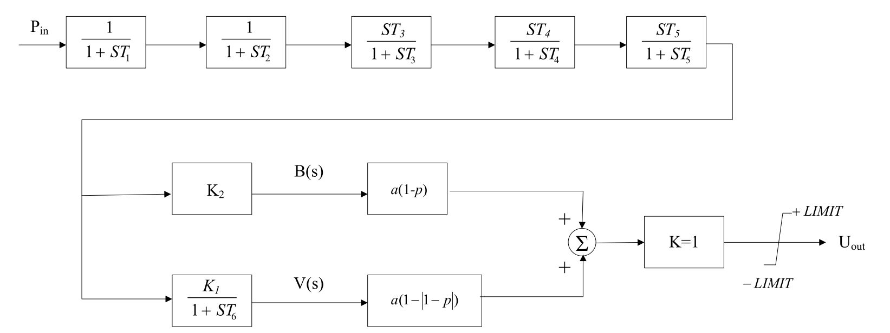

## 基本描述
> **该元件用以建模电力系统稳定器**

## 参数列表

### PSS模型（PSASP_PSS_5）

PSS模型（PSASP_PSS_5）

| 参数名 | 单位 | 描述 | 类型 | 备注 |
| ------ | ---- | ---- |:----:| ---- |
| T1 | s | 测量环节时间常数,单位为秒(s) | 实数（常量） |  |
| T2 | s | 测量环节时间常数,单位为秒(s) | 实数（常量） |  |
| T3 | s | 隔直环节时间常数,单位为秒(s) | 实数（常量） |  |
| T4 | s | 隔直环节时间常数,单位为秒(s) | 实数（常量） |  |
| T5 | s | 隔直环节时间常数,单位为秒(s) | 实数（常量） |  |
| K1 |  | 转速偏差放大倍数 | 实数（常量） |  |
| T6 | s | 速度信号时间常数,单位为秒(s) | 实数（常量） |  |
| K2 |  | 加速度信号放大倍数 | 实数（常量） |  |
| α |  | PSS可调幅值 | 实数（常量） |  |
| p |  | PSS可调相位 | 实数（常量） |  |
| K |  | 系数,一般为 1 | 实数（常量） |  |
| Vsmax | p.u. | PSS 输出上限,标幺值(p.u.) | 实数（常量） |  |
| Vsmin | p.u. | PSS 输出下限,标幺值(p.u.) | 实数（常量） |  |

## 端口列表

| 端口名 | 描述 | 类型 | 数据维数 |
| ------ | ---- |:----:|:--------:|
| Pref |  | 输入 | 1 x 1 |
| Pin |  | 输入 | 1 x 1 |
| ENAB |  | 输入 | 1 x 1 |
| Vs |  | 输出 | 1 x 1 |

## 使用说明
PSASP的5型PSS模型框图如下所示,本模型的输入信号取为功率偏差信号。

## 相关元件

