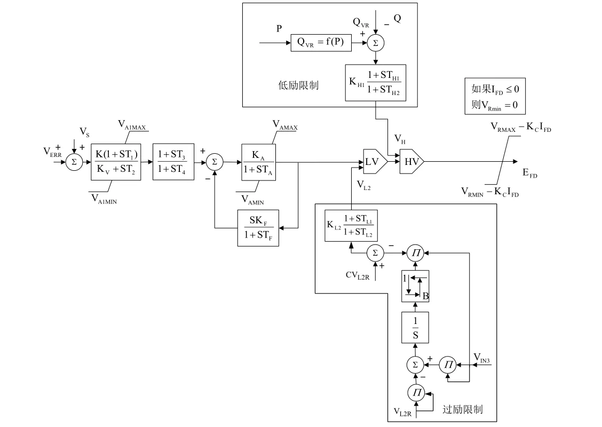
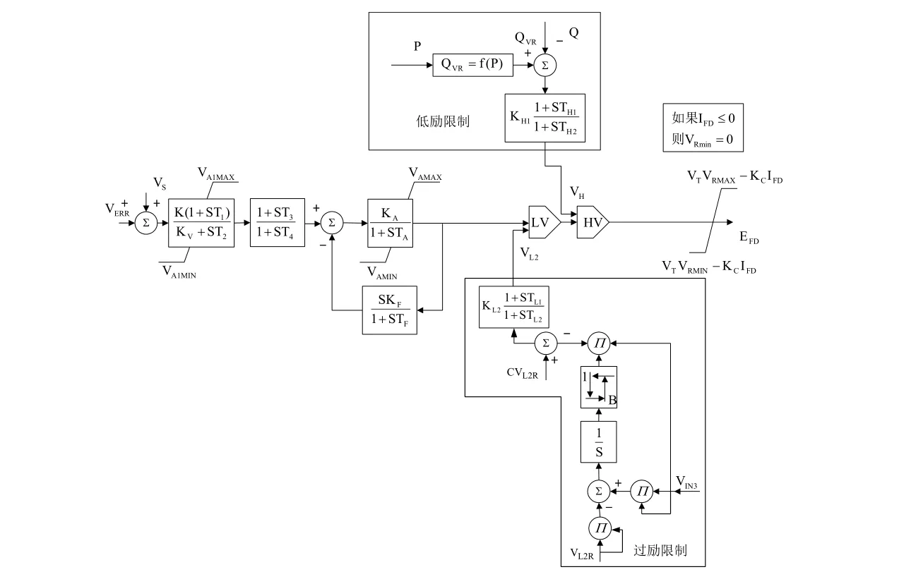

## 基本描述
> **该元件用以建模励磁器，可配置为以下2种BPA励磁器：**
>  + FU型励磁器
>  + FV型励磁器

## 参数列表

### Configuration

Configuration

| 参数名 |  描述 | 类型 | 备注 |
| ------ |  ---- |:----:| ---- |
| Model Type |  模型类型选择 | 选择 |  |
| PSS Signal Position |  选择PSS反馈信号Vs的输入位置 | 选择 |  |
| Is Over\-Excitation Enabled? |  过励限制是否接入 | 选择 |  |
| Is Under\-Excitation Enabled? |  欠励限制是否接入 | 选择 |  |

### AVR Parameters 1

AVR Parameters 1

| 参数名 | 单位 | 描述 | 类型 | 备注 |
| ------ | ---- | ---- |:----:| ---- |
| TR | s | 调节器输入滤波器时间常数（秒） | 实数（常量） |  |
| K | p.u. | 调节器增益（pu） | 实数（常量） |  |
| Kv | p.u. | 比例积分或纯积分调节选择因子 | 实数（常量） |  |
| T1 | s | 电压调节器时间常数1（秒） | 实数（常量） |  |
| T2 | s | 电压调节器时间常数2（秒） | 实数（常量） |  |
| T3 | s | 电压调节器时间常数3（秒） | 实数（常量） |  |
| T4 | s | 电压调节器时间常数4（秒） | 实数（常量） |  |
| KA | p.u. | 调压器增益（pu） | 实数（常量） |  |
| TA | s | 调压器放大器的时间常数（秒） | 实数（常量） |  |
| KF | p.u. | 调压器稳定回路增益（pu） | 实数（常量） |  |
| TF | s | 调压器稳定回路时间常数（秒） | 实数（常量） |  |

### AVR Parameters 2

AVR Parameters 2

| 参数名 | 单位 | 描述 | 类型 | 备注 |
| ------ | ---- | ---- |:----:| ---- |
| VAMAX | pu | 调节器最大内部电压（pu） | 实数（常量） |  |
| VAMIN | p.u. | 调节器最小内部电压（pu） | 实数（常量） |  |
| VRMAX | p.u. | 电压调节器最大输出（pu） | 实数（常量） |  |
| VRMIN | p.u. | 电压调节器最小输出（pu） | 实数（常量） |  |
| KC | p.u | 换相电抗的整流器负载因子 | 实数（常量） |  |

### Numerical Integration Configuration

Numerical Integration Configuration

| 参数名 |  描述 | 类型 | 备注 |
| ------ |  ---- |:----:| ---- |
| Enable Loop Iteration |  允许利用迭代解环，可以解决部分数值不稳定问题，提高计算精度，但会降低效率。建议在Kf>0时开启。 | 布尔 |  |
| Max Loop Iteration |  解环时的最大迭代次数 | 实数（常量） |  |
| Tolerance |  解环迭代收敛的容许误差。 | 实数（常量） |  |

### Monitoring

Monitoring

| 参数名 |  描述 | 类型 | 备注 |
| ------ |  ---- |:----:| ---- |
| Vr Measure |  内部量Vr输出信号 | 虚拟引脚（输出） |  |
| Vf Measure |  内部量Vf输出信号 | 虚拟引脚（输出） |  |
| Va Measure |  内部量Va输出信号 | 虚拟引脚（输出） |  |

## 端口列表

| 端口名 | 描述 | 类型 | 数据维数 |
| ------ | ---- |:----:|:--------:|
| Vref |  | 输入 | 1 x 1 |
| Vs |  | 输入 | 1 x 1 |
| VT |  | 输入 | 1 x 1 |
| Ef0 |  | 输入 | 1 x 1 |
| If |  | 输入 | 1 x 1 |
| S2M |  | 输入 | 1 x 1 |
| Vref0 |  | 输出 | 1 x 1 |
| Ef |  | 输出 | 1 x 1 |

## 使用说明
BPA的FU型和FV型励磁器控制框图如下所示:

## 相关元件

