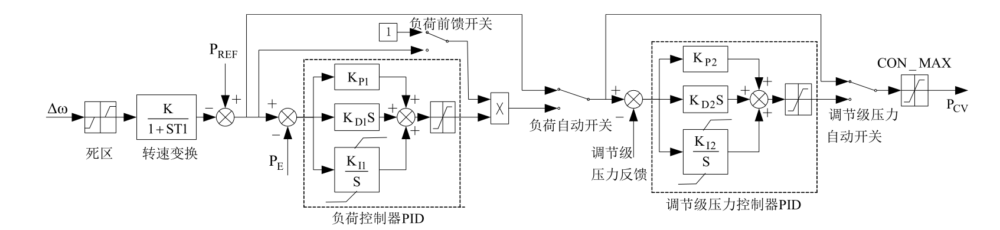

## 基本描述
> **该元件用以建模调节系统模型**

## 参数列表

### 调节系统模型1（GI）

调节系统模型1（GI）

| 参数名 | 单位 | 描述 | 类型 | 备注 |
| ------ | ---- | ---- |:----:| ---- |
| T1 | s | 转速测量环节时间常数T1（秒） | 实数（常量） |  |
| ε | p.u. | 转速偏差死区ε（相对系统频率的标么值，死区为±0.5ε） | 实数（常量） |  |
| K | p.u. | 转速偏差放大倍数K | 实数（常量） |  |
| 负荷自动开关 |  | 控制方式选择，（各种方式下，一次调频均能自动投入） | 选择 |  |
| Kp1 | p.u. | 负荷控制器PID比例环节倍数1 | 实数（常量） |  |
| Kd1 | p.u. | 负荷控制器PID微分环节倍1 | 实数（常量） |  |
| Ki1 | p.u. | 负荷控制器PID积分环节倍数1 | 实数（常量） |  |
| INTG_MAX1 | p.u. | PID积分环节限幅上限INTG_MAX1 | 实数（常量） |  |
| INTG_MIN1 | p.u. | PID积分环节限幅下限INTG_MIN1 | 实数（常量） |  |
| PID_MAX1 | p.u. | 调压器放大器的时间常数1（秒） | 实数（常量） |  |
| PID_MIN1 | p.u. | PID输出限幅环节的下限PID_MIN1 | 实数（常量） |  |
| 负荷前馈开关位置 |  | 负荷前馈开关位置， 1-投入， 2-切除，无缺省值，必须填写。 | 选择 |  |
| Wmax | p.u. | 一次调频负荷上限 | 实数（常量） |  |
| Wmin | p.u. | 一次调频负荷下限 | 实数（常量） |  |

### 调节系统模型1继续卡（GI+）

调节系统模型1继续卡（GI+）

| 参数名 | 单位 | 描述 | 类型 | 备注 |
| ------ | ---- | ---- |:----:| ---- |
| 调节级压力自动开关 |  | 调节级压力自动开关； 1-投入， 2-切除；无缺省值，必须填写 | 选择 |  |
| Kp2 |  | 调节级压力控制器PID比例环节倍数KP2 | 实数（常量） |  |
| Kd2 | s | 功率反馈信号的纯延迟时间（秒） | 实数（常量） |  |
| Ki2 |  | 调节级压力控制器PID积分环节倍数KI2 | 实数（常量） |  |
| INTG_MAX2 | p.u. | 调节级压力控制器PID积分环节限幅上限2 | 实数（常量） |  |
| INTG_MIN2 | p.u. | 调节级压力控制器PID积分环节限幅下限2 | 实数（常量） |  |
| PID_MAX2 | p.u. | 调节级压力控制器PID输出限幅环节的上限 | 实数（常量） |  |
| PID_MIN2 | p.u. | 调节级压力控制器PID输出限幅环节的下限 | 实数（常量） |  |
| CON_MAX | p.u. | 电液调节系统输出上限，标幺值(p.u.) | 实数（常量） |  |
| CON_MIN | p.u. | 电液调节系统输出下限，标幺值(p.u.) | 实数（常量） |  |

## 端口列表

| 端口名 | 描述 | 类型 | 数据维数 |
| ------ | ---- |:----:|:--------:|
| Pref |  | 输入 | 1 x 1 |
| PE |  | 输入 | 1 x 1 |
| wref |  | 输入 | 1 x 1 |
| w |  | 输入 | 1 x 1 |
| L2N |  | 输入 | 1 x 1 |
| PM1 |  | 输入 | 1 x 1 |
| Pcv |  | 输出 | 1 x 1 |

## 使用说明
BPA的GI型调节系统模型框图如下所示。

## 相关元件

