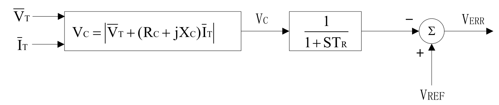

## 基本描述
> **该元件用以建模发电机机端电压变送器**

## 参数列表

### Configuration

Configuration

| 参数名 | 单位 | 描述 | 类型 | 备注 |
| ------ | ---- | ---- |:----:| ---- |
| Type |  | 计算类型 | 选择 |  |
| VBase | kV | 母线线电压基值 | 实数（常量） |  |
| SBase | MVA | 电机容量基值 | 实数（常量） |  |
| Xc | p.u. | 调差电抗Xc，以电机容量为基值 | 实数（常量） |  |
| Rc | p.u. | 调差电阻Rc，以电机容量为基值 | 实数（常量） |  |
| Tr | s | 量测环节延时 | 实数（常量） |  |

## 端口列表

| 端口名 | 描述 | 类型 | 数据维数 |
| ------ | ---- |:----:|:--------:|
| V\_3 | 三相电压向量瞬时值[kV] | 输入 | 3 x 1 |
| I\_3 | 三相电流向量瞬时值[kA] | 输入 | 3 x 1 |
| VT |  | 输入 | 1 x 1 |
| IT |  | 输入 | 1 x 1 |
| P | P | 输入 | 1 x 1 |
| Q | Q | 输入 | 1 x 1 |
| Vc |  | 输出 | 1 x 1 |

## 使用说明
发电机机端电压变送器框图如下所示。

模型可以选择两种计算方式：
>  + Input 3 phase vectors: 输入电压电流三相瞬时值，利用Clark变换计算Vc
>  + Input PQ: 输入电压电流有效值，以及额外的有功无功以计算功率因数

## 相关元件

