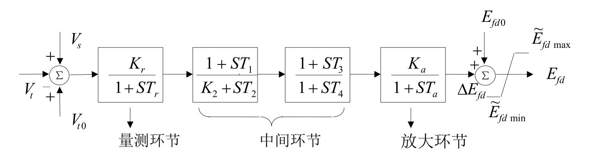

## 基本描述
> **该元件用以建模励磁调压器模型**

## 参数列表

### PSASP_AVR_2（自并励和自复励快速励磁系统）

PSASP_AVR_2（自并励和自复励快速励磁系统）

| 参数名 | 单位 | 描述 | 类型 | 备注 |
| ------ | ---- | ---- |:----:| ---- |
| Kr |  | 量测环节放大倍数 | 实数（常量） |  |
| Ka |  | 放大环节放大倍数 | 实数（常量） |  |
| K2 |  | 变换环节类型的参数。K2=0时为比例积分环节，K2=1时为移相环节。 | 实数（常量） |  |
| Vta | p.u. | 强励电压达Efdmax时的端电压，标幺值 | 实数（常量） |  |
| Vtb | p.u. | 强减电压达Efdmin时的端电压，标幺值 | 实数（常量） |  |
| Kpt |  | 自励电压系数 | 实数（常量） |  |
| Kit |  | 自励电流系数 | 实数（常量） |  |
| Ke |  | 换弧压降系数 | 实数（常量） |  |
| Efdmax | p.u. | 励磁电压上限，标幺值(p.u.) | 实数（常量） |  |
| Efdmin | p.u. | 励磁电压下限，标幺值(p.u.) | 实数（常量） |  |
| Tr | s | 量测环节时间常数，单位为秒(s) | 实数（常量） |  |
| Ta | s | 放大环节时间常数，单位为秒(s) | 实数（常量） |  |
| T1 | s | 中间环节时间常数，单位为秒(s) | 实数（常量） |  |
| T2 | s | 中间环节时间常数，单位为秒(s) | 实数（常量） |  |
| T3 | s | 中间环节时间常数，单位为秒(s) | 实数（常量） |  |
| T4 | s | 中间环节时间常数，单位为秒(s) | 实数（常量） |  |

## 端口列表

| 端口名 | 描述 | 类型 | 数据维数 |
| ------ | ---- |:----:|:--------:|
| Vref |  | 输入 | 1 x 1 |
| Vs |  | 输入 | 1 x 1 |
| VT |  | 输入 | 1 x 1 |
| Ef0 |  | 输入 | 1 x 1 |
| If |  | 输入 | 1 x 1 |
| S2M |  | 输入 | 1 x 1 |
| Vref0 |  | 输出 | 1 x 1 |
| Ef |  | 输出 | 1 x 1 |

## 使用说明
PSASP的2型励磁调节器框图如下所示，其中:  
$$\~{E}_{fdmax} = \frac{1}{V_{t0}V_{ta}}|K_{pt}\.{V_t} + jK_{it}\.{I}_t|E_{fdmax} - K_eI_{fd}$$ 
$$\~{E}_{fdmin} = \frac{1}{V_{t0}V_{tb}}|K_{pt}\.{V_t} + jK_{it}\.{I}_t|E_{fdmin} - K_eI_{fd}$$

## 相关元件

