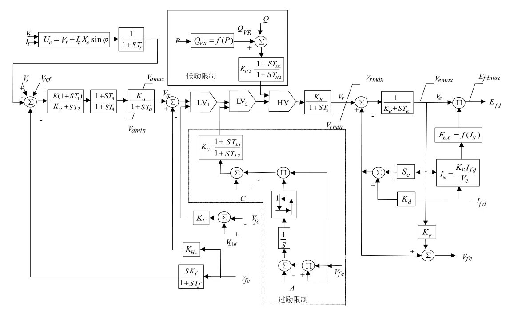
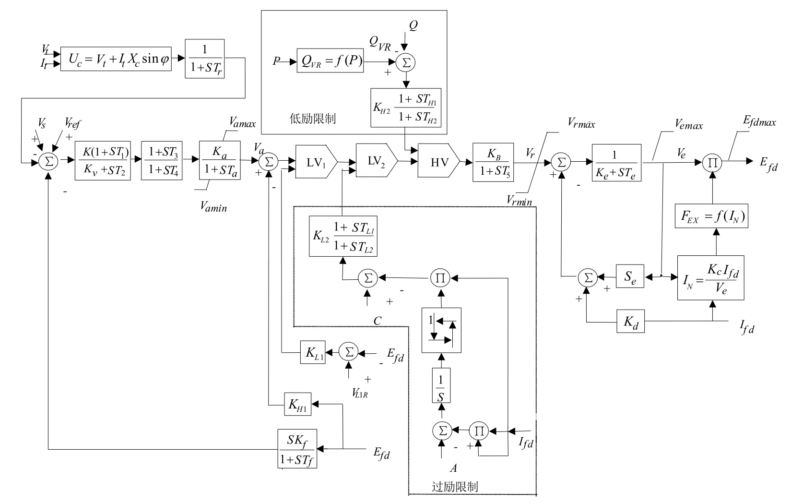
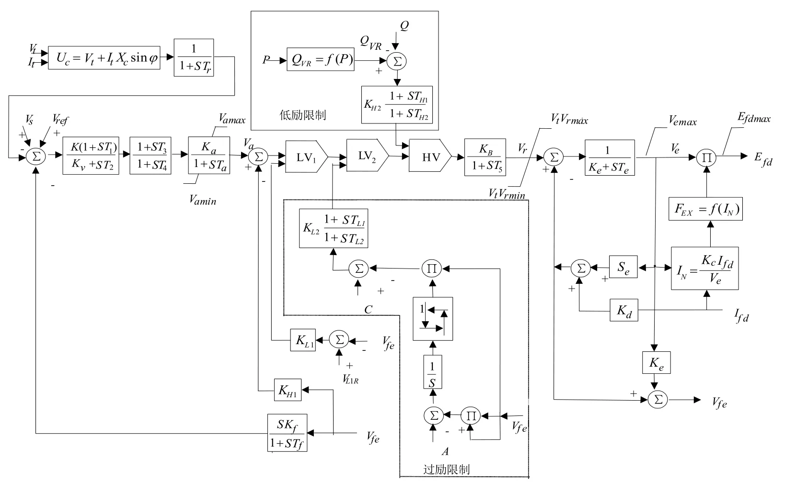
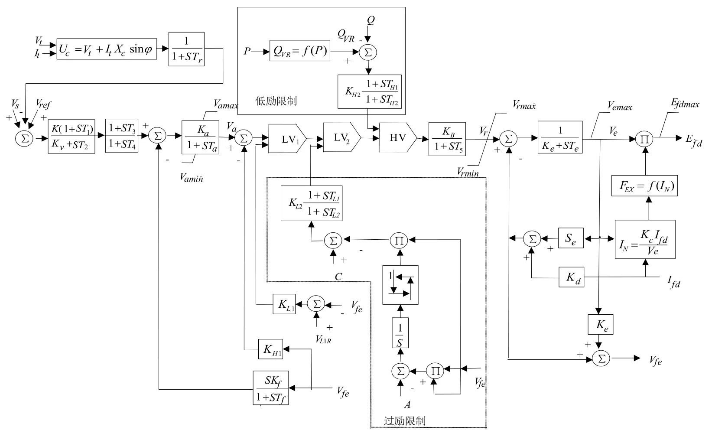
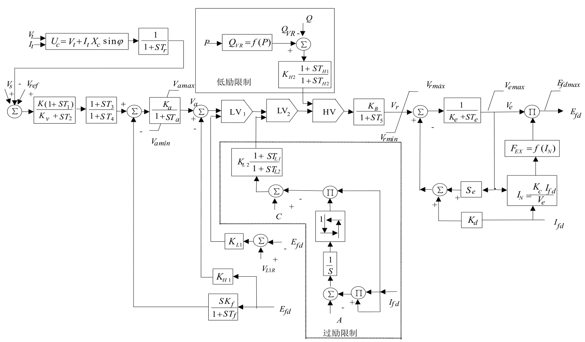
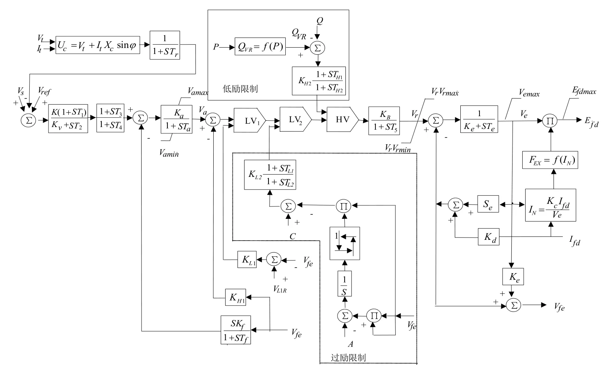
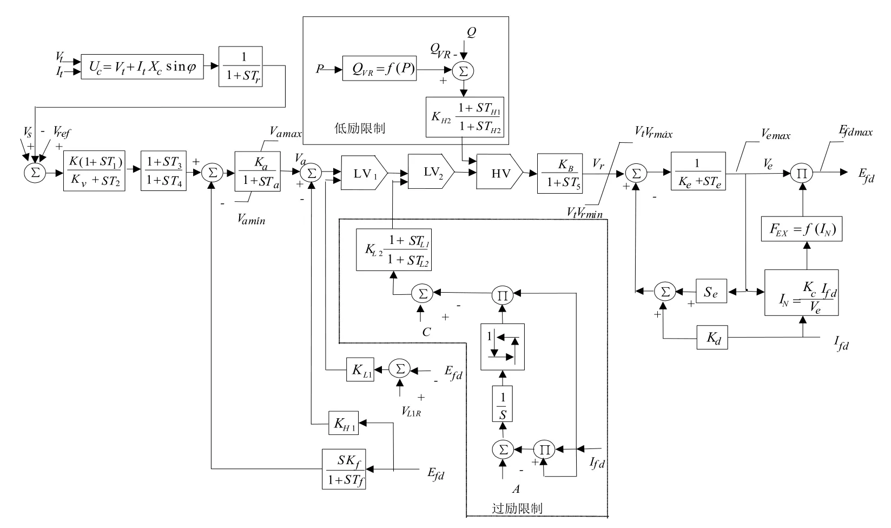

## 基本描述
> **该元件用以建模励磁调压器模型，可选择3-10型励磁调节器**

## 参数列表

### Configuration

Configuration

| 参数名 |  描述 | 类型 | 备注 |
| ------ |  ---- |:----:| ---- |
| Model Type |  模型类型选择 | 选择 |  |
| Is Over-Excitation Enabled? |  过励限制是否接入 | 选择 |  |
| Is Under-Excitation Enabled? |  欠励限制是否接入 | 选择 |  |

### AVR Parameters 1

AVR Parameters 1

| 参数名 | 单位 | 描述 | 类型 | 备注 |
| ------ | ---- | ---- |:----:| ---- |
| TR | s | 调节器输入滤波器时间常数（秒） | 实数（常量） |  |
| K | p.u. | 调节器增益（pu） | 实数（常量） |  |
| Kv | p.u. | 比例积分或纯积分调节选择因子 | 实数（常量） |  |
| T1 | s | 电压调节器时间常数1（秒） | 实数（常量） |  |
| T2 | s | 电压调节器时间常数2（秒） | 实数（常量） |  |
| T3 | s | 电压调节器时间常数3（秒） | 实数（常量） |  |
| T4 | s | 电压调节器时间常数4（秒） | 实数（常量） |  |
| KA | p.u. | 调压器增益（pu） | 实数（常量） |  |
| TA | s | 调压器放大器的时间常数（秒） | 实数（常量） |  |
| KF | p.u. | 调压器稳定回路增益（pu） | 实数（常量） |  |
| TF | s | 调压器稳定回路时间常数（秒） | 实数（常量） |  |
| KH | p.u. | 励磁机电流反馈增益（pu） | 实数（常量） |  |

### AVR Parameters 2

AVR Parameters 2

| 参数名 | 单位 | 描述 | 类型 | 备注 |
| ------ | ---- | ---- |:----:| ---- |
| VAMAX | pu | 调节器最大内部电压（pu） | 实数（常量） |  |
| VAMIN | p.u. | 调节器最小内部电压（pu） | 实数（常量） |  |
| KB | p.u. | 第二级调节器增益（pu） | 实数（常量） |  |
| T5 | s | 第二级调节器时间常数（秒） | 实数（常量） |  |
| KE | p.u. | 励磁机自励磁系数（pu） | 实数（常量） |  |
| TE | s | 励磁机时间常数（秒） | 实数（常量） |  |
| C1 | p.u. | 用于求取励磁机饱和系数Se的参数，Se=C1*exp(C2*Efd) | 实数（常量） |  |
| C2 | p.u. | 用于求取励磁机饱和系数Se的参数，Se=C1*exp(C2*Efd) | 实数（常量） |  |
| VRMAX | p.u. | 电压调节器最大输出（pu） | 实数（常量） |  |
| VRMIN | p.u. | 电压调节器最小输出（pu） | 实数（常量） |  |
| KC | p.u | 换相电抗的整流器负载因子 | 实数（常量） |  |
| KD | p.u | 去磁因子（pu） | 实数（常量） |  |
| EFDMAX | p.u | 最大励磁电压（pu） | 实数（常量） |  |

### Over-Excitation Limiter

Over-Excitation Limiter

| 参数名 | 单位 | 描述 | 类型 | 备注 |
| ------ | ---- | ---- |:----:| ---- |
| KL1 | p.u | 励磁机励磁电流限制增益（pu） | 实数（常量） |  |
| VL1R | p.u | 励磁机电流限制（pu） | 实数（常量） |  |

### Monitoring

Monitoring

| 参数名 |  描述 | 类型 | 备注 |
| ------ |  ---- |:----:| ---- |
| Vr Measure |  内部量Vr输出信号 | 虚拟引脚（输出） |  |
| Vf Measure |  内部量Vf输出信号 | 虚拟引脚（输出） |  |
| Va Measure |  内部量Va输出信号 | 虚拟引脚（输出） |  |

## 端口列表

| 端口名 | 描述 | 类型 | 数据维数 |
| ------ | ---- |:----:|:--------:|
| Vref |  | 输入 | 1 x 1 |
| Vs |  | 输入 | 1 x 1 |
| VT |  | 输入 | 1 x 1 |
| Ef0 |  | 输入 | 1 x 1 |
| If |  | 输入 | 1 x 1 |
| S2M |  | 输入 | 1 x 1 |
| Vref0 |  | 输出 | 1 x 1 |
| Ef |  | 输出 | 1 x 1 |

## 使用说明
PSASP的3型励磁调节器框图如下所示，它主要应用于无刷励磁系统。

PSASP的4型励磁调节器框图如下所示，并联校正的信号、时间常数补偿信号均取自$E_{fd}$，它主要应用于有刷励磁系统。

PSASP的5型励磁调节器框图如下所示，并联校正的信号、时间常数补偿信号均取自调节器的输出电流（即交流励磁机的励磁电流），它主要应用于无刷励磁系统。

PSASP的6型励磁调节器框图如下所示，并联校正的信号、时间常数补偿信号均取自$E_{fd}$，它主要应用于有刷励磁系统。

PSASP的7型励磁调节器框图如下所示，与 3 型的区别在于并联校正环节加入点位置不同，3 型加入点在串联校正环节之前，而 7 型加入点在串联校正环节之后。

PSASP的8型励磁调节器框图如下所示，与 4 型的区别在于并联校正环节加入点位置不同，4 型加入点在串联校正环节之前，而 8 型加入点在串联校正环节之后。

PSASP的9型励磁调节器框图如下所示，与 5 型的区别在于并联校正环节加入点位置不同，5 型加入点在串联校正环节之前，而 9 型加入点在串联校正环节之后。

PSASP的10型励磁调节器框图如下所示，与 6 型的区别在于并联校正环节加入点位置不同，6 型加入点在串联校正环节之前，而 10 型加入点在串联校正环节之后。

## 相关元件

