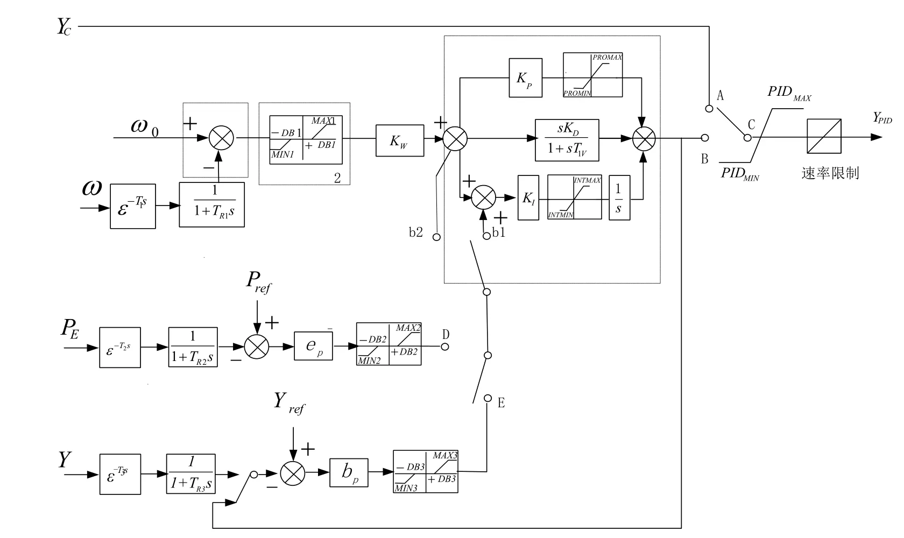
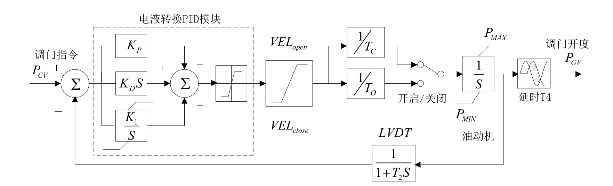
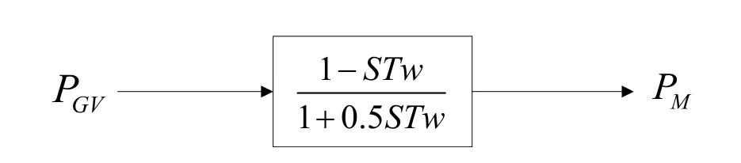

## 基本描述
> **该元件用以建模适用于水轮机调速器模型**

## 参数列表

### 调节系统模型4（GM）

调节系统模型4（GM）

| 参数名 | 单位 | 描述 | 类型 | 备注 |
| ------ | ---- | ---- |:----:| ---- |
| KW | p.u. | 频率偏差放大倍数 | 实数（常量） |  |
| TR | s | 频率测量环节时间常数（秒） | 实数（常量） |  |
| -DB1 | p.u. | 转速调节死区（负方向，相对于额定频率的标么值） | 实数（常量） |  |
| DB1 | p.u. | 转速调节死区（正方向，相对于额定频率的标么值） | 实数（常量） |  |
| Kp | p.u. | PID比例环节放大倍数 | 实数（常量） |  |
| Kd | p.u. | PID微分环节放大倍数 | 实数（常量） |  |
| Ki | p.u. | PID积分环节放大倍数 | 实数（常量） |  |
| Td | s | PID微分环节时间常数（秒） | 实数（常量） |  |
| INTG_MAX | p.u. | PID积分环节限幅上限INTG_MAX | 实数（常量） |  |
| INTG_MIN | p.u. | PID积分环节限幅下限INTG_MIN | 实数（常量） |  |
| PID_MAX | p.u. | 调压器放大器的时间常数（秒） | 实数（常量） |  |
| PID_MIN | p.u. | PID输出限幅环节的下限PID_MIN | 实数（常量） |  |
| DELT | s | 转速测量的延迟时间（秒） | 实数（常量） |  |
| DBMAX | p.u. | 一次调频负荷上限 | 实数（常量） |  |
| DBMIN | p.u. | 一次调频负荷下限 | 实数（常量） |  |

### 调节系统模型继续卡（GM+）

调节系统模型继续卡（GM+）

| 参数名 | 单位 | 描述 | 类型 | 备注 |
| ------ | ---- | ---- |:----:| ---- |
| DELT2 | s | 测量延迟时间（秒） | 实数（常量） |  |
| TR2 | s | 测量环节时间常数（秒） | 实数（常量） |  |
| Ep | p.u. | 系数 | 实数（常量） |  |
| -DB2 | p.u. | 负方向死区（标么值，本机额定功率为基准） | 实数（常量） |  |
| DB2 | p.u. | 正方向死区（标么值，本机额定功率为基准） | 实数（常量） |  |
| DBMAX2 | p.u. | 限幅上限 | 实数（常量） |  |
| DBMIN2 | p.u. | 限幅下限 | 实数（常量） |  |
| ITYP |  | 模式选择，=1为功率模式，=2为开度模式，=0为无功率或开度模式 | 选择 |  |
| ITYP2 |  | 开度模式选择，=0输入信号为开度Y，=1输入信号为YPID | 选择 |  |

### 调节系统模型继续卡（GM#）

调节系统模型继续卡（GM#）

| 参数名 | 单位 | 描述 | 类型 | 备注 |
| ------ | ---- | ---- |:----:| ---- |
| PROMAX | p.u. | PID比例环节限幅上限 | 实数（常量） |  |
| PROMIN | p.u. | PID比例环节限幅下限 | 实数（常量） |  |
| B12 |  | 功率或开度信号输入PID位置选择， 0为积分输入， 1为PID输入 | 选择 |  |
| ISID |  | PID积分限幅位置（ 0为积分后， 1为积分前比例后） | 选择 |  |
| Kmh | p.u. | 电机额定有功与电机额定容量的比值，Kmh=P_H/S_B | 实数（常量） |  |

### 电液伺服系统模型（GA）

电液伺服系统模型（GA）

| 参数名 | 单位 | 描述 | 类型 | 备注 |
| ------ | ---- | ---- |:----:| ---- |
| TC | s | 油动机关闭时间常数（秒） | 实数（常量） |  |
| TO | s | 油动机开启时间常数（秒） | 实数（常量） |  |
| VELclose | p.u. | 过速关闭系数（标么值） | 实数（常量） |  |
| VELopen | p.u. | 过速开启系数（标么值） | 实数（常量） |  |
| Pmax | p.u. | 最大原动机输出功率（油动机最大行程或调门最大开度） | 实数（常量） |  |
| Pmin | p.u. | 最小原动机输出功率（油动机最小行程或调门最小开度） | 实数（常量） |  |
| T1 | s | 油动机行程反馈环节（LVDT）时间（秒） | 实数（常量） |  |
| Kp | p.u. | PID模块比例放大环节倍数 | 实数（常量） |  |
| Kd (Td) | p.u. | PID模块微分环节倍数 | 实数（常量） |  |
| Ki | p.u. | PID模块积分环节倍数 | 实数（常量） |  |
| INTG_MAX | p.u. | PID模块积分环节限幅最大值 | 实数（常量） |  |
| INTG_MIN | p.u. | PID模块积分环节限幅最小值 | 实数（常量） |  |
| PID_MAX | p.u. | PID模块输出的限幅最大值 | 实数（常量） |  |
| PID_MIN | p.u. | PID模块输出的限幅最小值 | 实数（常量） |  |

### 电液伺服系统模型（GA+）

电液伺服系统模型（GA+）

| 参数名 | 单位 | 描述 | 类型 | 备注 |
| ------ | ---- | ---- |:----:| ---- |
| PGV_DELAY | s | 功率输出信号的纯延迟时间（秒） | 实数（常量） |  |

### 水轮机模型（TW）

水轮机模型（TW）

| 参数名 | 单位 | 描述 | 类型 | 备注 |
| ------ | ---- | ---- |:----:| ---- |
| TW | s | 水锤效应时间常数（秒） | 实数（常量） |  |

## 端口列表

| 端口名 | 描述 | 类型 | 数据维数 |
| ------ | ---- |:----:|:--------:|
| wref |  | 输入 | 1 x 1 |
| w |  | 输入 | 1 x 1 |
| Yref(Pref) |  | 输入 | 1 x 1 |
| Pe |  | 输入 | 1 x 1 |
| L2N |  | 输入 | 1 x 1 |
| Pm |  | 输出 | 1 x 1 |

## 使用说明
PSASP的7型调速器框图如下所示，由调节系统模型、液压系统模型以及水轮机模型组成。

## 相关元件

