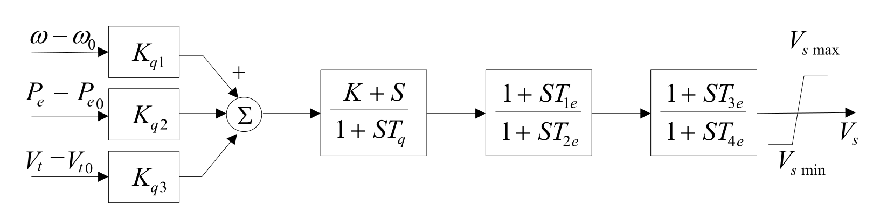

## 基本描述
> **该元件用以建模电力系统稳定器**

## 参数列表

### PSS模型（PSASP_PSS_1）

PSS模型（PSASP_PSS_1）

| 参数名 | 单位 | 描述 | 类型 | 备注 |
| ------ | ---- | ---- |:----:| ---- |
| Kq1 |  | 转速偏差放大倍数 | 实数（常量） |  |
| Kq2 |  | 电磁功率偏差放大倍数 | 实数（常量） |  |
| Kq3 |  | 电压偏差放大倍数 | 实数（常量） |  |
| K |  | 改变环节类型的系数。 K=0，为隔直环节（惯性微分环节）； K=1，为移相环节 | 实数（常量） |  |
| Vsmax | p.u. | PSS 输出上限，标幺值(p.u.) | 实数（常量） |  |
| Vsmin | p.u. | PSS 输出下限，标幺值(p.u.) | 实数（常量） |  |
| Tq | s | 隔直环节时间常数，单位为秒(s) | 实数（常量） |  |
| T1e | s | 移相环节时间常数，单位为秒(s) | 实数（常量） |  |
| T2e | s | 移相环节时间常数，单位为秒(s) | 实数（常量） |  |
| T3e | s | 移相环节时间常数，单位为秒(s) | 实数（常量） |  |
| T4e | s | 移相环节时间常数，单位为秒(s) | 实数（常量） |  |

## 端口列表

| 端口名 | 描述 | 类型 | 数据维数 |
| ------ | ---- |:----:|:--------:|
| VT0 |  | 输入 | 1 x 1 |
| VT |  | 输入 | 1 x 1 |
| ω0 |  | 输入 | 1 x 1 |
| ω |  | 输入 | 1 x 1 |
| ENAB |  | 输入 | 1 x 1 |
| Pe0 |  | 输入 | 1 x 1 |
| Pe |  | 输入 | 1 x 1 |
| Vs |  | 输出 | 1 x 1 |

## 使用说明
PSASP的1型PSS模型框图如下所示，输入信号根据需要可取转速偏差、功率偏差、端电压偏差。模型采用两级移相结构。

## 相关元件

