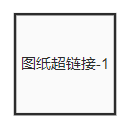

## 基本描述

[^_^]:

> **该元件用于快速定位到所链接的图纸，便于查看该图纸中元件的连接等信息。**

## 参数列表
### Configuration
| 参数名 |备注 | 类型 | 描述 |
| :--- | :--- | :--: | :--- | :--- |
| Name |  元件名称 | 文本 | 此处输入绝对值函数的名称（可缺省） |
| 图层 | 绑定图层 | 选择 | 选择需要链接到图纸，主系统和所有子系统中的所有图纸可供选择 |

## 端口列表

## 使用说明

该元件功能类似于Windows系统的快捷方式。选择“超链接”元件，右侧格式面板中，可以更改元件名称，在“链接图纸”选项中选择用户想要链接的图纸即可。双击该该元件，可直接跳转到所链接的图纸。

图纸超链接在图纸切换中的应用详见[图纸功能](../../../../features/Workbench/Design/Canvas/index.md)。

## 相关元件
