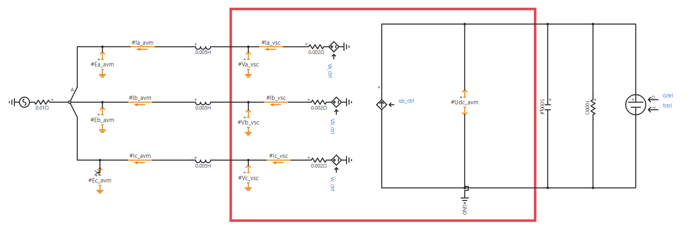
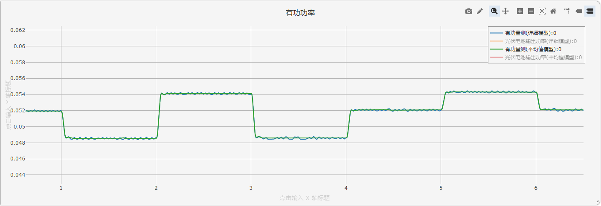

## 描述
随着电力电子变换技术的进步，太阳能光伏逆变并网发电比例逐步提升。对集中式、分布式光伏发电系统的详细建模和仿真对于研究光伏并网带来的影响具有重要意义。

CloudPSS提供了光伏并网发电系统的详细模型和平均模型，并提供了两种模型的对比。用户可根据需要，自行选择相应的模型，并在此基础上进行修改和研究。

## 模型介绍

光伏并网发电系统由光伏电池组的工程参数模型（参数更易获取）、电压源变换器（详细/平均模型）、变流器控制系统和最大功率点跟踪（MPPT）算法构成。

其中，电压源变换器的详细模型由6个分立的IGBT及其反并联二极管组成，如下图。

变换器的平均模型由交流侧3个受控电压源和直流侧一个受控电流源组成，如下图。

变流器的控制系统采用定直流电压-无功功率控制（VQ控制）。其中，直流电压给定值由MPPT控制模块指定。详细模型的控制系统由电网电压定向、电压环-电流环双闭环控制、参考信号生成、SPWM控制四部分构成。MPPT采用扰动算法。

平均模型的控制系统省略了SPWM控制，但增加了变流器平均模型控制（其主要作用是保证交流侧和直流侧的功率平衡）。

## 仿真

根据所选择的模型设定仿真步长，对光伏并网发电系统进行电磁暂态仿真。其中，详细模型由于含有离散开关事件，必须在`运行`标签页->`电磁暂态仿真方案`>`求解器设置`处选择`开关/离散事件处理增强`选项，采用较小的仿真步长进行仿真。若PWM载波频率为$f_c$，则建议仿真步长应小于$1/({20f_c})$。选用平均模型时，由于不存在开关事件，故可选择`常规（默认）`选项，设置较高的仿真步长（建议50μs，通常不超过100μs）。 

### 仿真1：禁用MPPT控制

将详细模型和平均模型建立在统一算例工程中，进行如下设定。
* 保持详细模型和平均模型的给定条件相同，设置算例的起止时间及积分步长（5μs）等基本信息；
* 设定`运行`标签页参数方案列表中的`光照/温度随机变化频率`为1Hz；
* 设定`运行`标签页参数方案列表中的`使能最大功率点追踪控制`选择否，即**禁用MPPT控制**。

点击`启动任务`，即可得到仿真结果。详细化模型和平均化模型的直流电压和有功功率仿真结果对比如下图所示。

直流侧直流电压参考值设置为0.8kV，直流侧电压维持在0.8kV。

光照/温度随机变化频率为1Hz，环境条件发生变化时，直流电压产生波动并维持在直流电压参考值，有功功率随着环境的变化而发生变化。

### 仿真2：启用MPPT控制

将详细模型和平均模型建立在统一算例工程中，进行如下设定。
* 保持详细模型和平均模型的给定条件相同，设置算例的起止时间及积分步长（5μs）等基本信息；
* 设定`运行`标签页参数方案列表中的`光照/温度随机变化频率`为1Hz；
* 设定`运行`标签页参数方案列表中的`使能最大功率点追踪控制`选择是，即**启用MPPT控制**。

点击`启动任务`，即可得到仿真结果。详细化模型和平均化模型的直流电压和有功功率仿真结果对比如下图所示。

直流侧直流电压参考值设置为该环境条件下由MPPT控制得到的最大功率点电压，直流侧电压维持在最大功率点电压。环境条件发生变化时，最大功率也发生变化。

可见，详细模型和平均模型结果一致。在实际应用时，若需研究控制算法、系统级动态，为提升仿真效率，可采用平均模型。