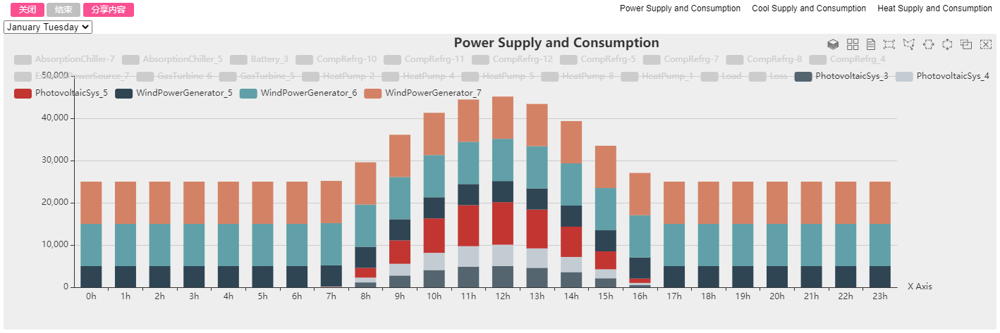

## 模型描述

选取某集中式综合能源系统作为建模仿真的研究对象，系统中有一个220千伏的主变电站和三个110千伏变电站，变电站探索“多站融合”的模式，即“变电站+分布式能源站+数据中心、充换电站、储能站、基站、屋顶光伏”。主要设备包括可再生能源发电设备（光伏和风电）、蓄电池、燃气轮机、吸收式制冷机、燃气锅炉、电压缩制冷机、变压器、输电线路，并和公共电网连通，集中式与分布式供热综合能源系统的主要区别在于集中式系统中，供热统一由燃气锅炉提供。系统结构拓扑如下图所示：

*模型拓扑结构图如下：*

## 模型参数及边界条件

1. 输入设备额定参数和运行参数
2. 输入气象参数如典型日光照辐射强度参数
3. 输入典型日电、热、冷负荷参数
4. 输入各设备的运行策略

负荷参数

系统负荷主要有电负荷、冬季供暖负荷和夏季制冷负荷，以某负荷用户为例，其典型日下的负荷数据如下表所示：

*电负荷：*

## 结果分析

利用CloudPSS-IESLab平台对集中式供热的综合能源系统进行为期一年的仿真，并对各项计算结果进行分析。

### 供电分析：

可再生能源（光伏和风力发电）在能源结构改革和综合能源系统中发挥了重要作用，由下图可知，可再生能源发电功率波动较大，在5～65MW之间。

### 夏季供冷分析：

### 经济性和环保性分析：

用户可以在CloudPSS-IESLab平台的计算结果基础上进行进一步的分析。对于综合能源系统，经济性和环保性是重要的两个指标。我们收集了主要设备经济参数和二氧化碳排放系数，如下所示：

*主要设备经济参数：*

*主要设备二氧化碳排放系数：*

在上述参数的基础上，计算了项目投资和二氧化碳年排放量，其结果如下所示：

