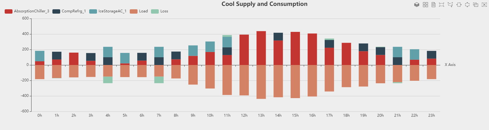

## 模型描述

多能耦合、协同互补的综合能源系统是未来多能源利用的方向，涵盖了各种形式和特点的多能源，目前将供气系统、供热系统与电力系统等集成的综合能源园区因应用广泛发展迅速，既实现电力、燃气、供热等一体化多能互补，又实现源网荷储全环节高度协调与灵活互动、集中化与分布式相互结合。以某典型综合光储能源园区微电网系统为例，搭建开展综合能源系统模型并仿真：

该园区电源设备有：燃气轮机、外部电源、光伏组件；储能设备包含蓄电池和蓄冰空调；主要负荷包括充电桩负荷、电负荷、冷水负荷、热水负荷和热气负荷，其冷热源设备包括：电压缩制冷机、吸收式制冷机、余热锅炉、燃气锅炉、尾气排放装置；输变电系统设备包括母线、传输线和变压器。

*模型拓扑结构图如下：*

## 模型参数及边界条件

1. 输入园区设备额定参数和运行参数
2. 输入园区的气象参数如典型日光照辐射强度参数
3. 输入园区的典型日电、热、冷负荷参数
4. 输入园区综合能源系统的运行策略

*典型日光照水平：*

*电负荷：*

*热负荷：*

*冷负荷：*

*运行策略：*

## 开始仿真

正确设置完所有元件参数后，点击仿真控制模块中的“开始”按钮，系统自动校验通过后即可开始仿真。仿真计算结果以能量供需组成图的形式显示在工作台中央。用户也可通过选中具体元件在系统监控面板中查看其运行状态。

## 仿真结果分析验证

*供冷仿真结果示例：*

*外部电网供电购电仿真结果示例：*

*供热负荷仿真结果示例：*

## 相关视频

@[youku](XNDY1MzIzNjE1Ng)