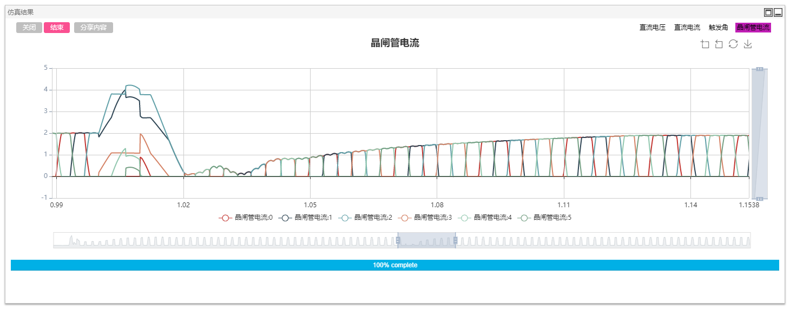

## 描述

基于电网换相换流器的高压直流(Line commutated converter high voltage direct current, LCC-HVDC)输电系统具有输送功率大、技术成熟等优点，近年来在电力系统中发挥越来越大的作用。

CloudPSS 提供了国际大电网组织提供的 LCC-HVDC 标准测试系统。在标准测试系统上，CloudPSS 进一步提供了单极 12 脉动、单极双 12 脉动、双极 12 脉动、双极双 12 脉动四种 LCC-HVDC 仿真模型，用户可根据需要进行选取。现以单极单 12 脉动为例进行仿真模型的介绍。单极双 12 脉动、双极 12 脉动与双极双 12 脉动的电气与控制系统类似，此处介绍从略。

## 模型介绍

单极 12 脉动 LCC-HVDC 模型如图所示，其中每个 6 脉波桥换流器与对应的换流变压器进行连接，进一步与交流侧母线连接。交流母线上，并联有交流滤波器组与电容器组，电容器组主要用于交流侧的无功补偿；滤波器组用于滤除交流测的谐波，同时也具有一定的无功补偿的作用。整流侧与逆变侧通过直流线路相连接。

在直流系统的控制系统模型中，整流侧采用定电流控制，逆变侧一般情况下采用定熄弧角控制，并配有低压限流保护环节，如下图所示。

## 仿真

设定合适的仿真步长（10μs 或 20μs），对 LCC-HVDC 系统进行电磁暂态仿真。

### 仿真 1：稳态运行测试

设置算例的起止时间及积分步长等基本信息。点击`格式面板`->`电磁暂态`>`仿真控制`>`开始`，选择相应的计算节点，即可得到仿真结果。算例中已输出整流侧与逆变侧的直流电压、直流电流和触发角波形，用户可根据实际需求自行设置输出波形。通过仿真结果我们可以看到直流系统快速进入稳态运行状态。

### 仿真 2：换相失败故障测试

换相失败故障是 LCC-HVDC 中最为常见的故障类型。在逆变侧交流母线上设置三相短路故障。算例模板中的故障时间受全局变量控制，通过设置`全局参数`选项中的`$FaultStart`与`$FaultEnd`可以设置故障起止时间。该交流故障可以引起直流系统发生换相失败故障。

通过量测逆变侧六脉动换流桥元件的晶闸管电流，还可绘制详细的桥内部 6 个晶闸管的电流。

