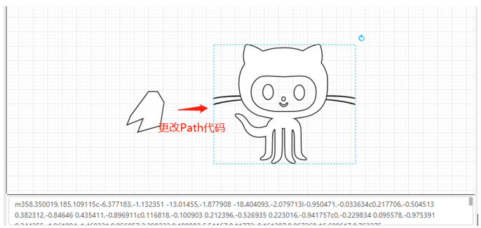
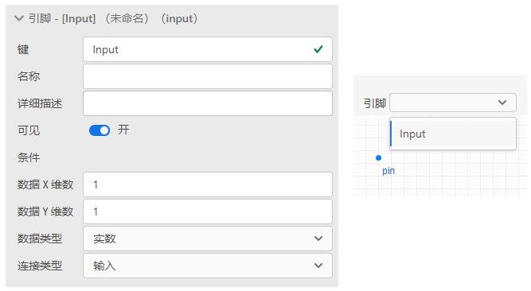
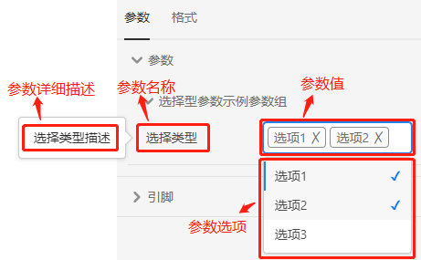
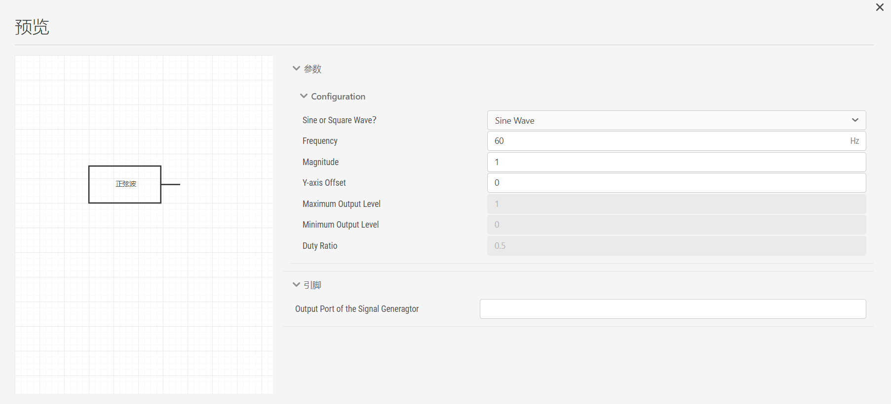

::: info
**模块封装用于为当前模型提供对外的图标、参数以及引脚定义。在CloudPSS SimStudio中，每个仿真项目都由电气、控制、量测、输出等类型元件按照一定拓扑关系构成。`接口`标签页的模块封装功能可将仿真项目打包为一个完整的“盒子”，并对其对外的特性（图标、参数和引脚）进行设计。保存后的“盒子”可在其他算例中直接使用，极大地提高了用户构建大型算例、模块化算例的灵活性。**
:::

`接口`标签页包含三部分：图标绘制窗口、引脚编辑栏、参数编辑栏，分别介绍如下：

## 图标绘制窗口

图标绘制窗口预置了包括矩形、圆形、直线、文字、自定义图形以及引脚6种类型的图形库。鼠标左键点击相应图形，并拖拽到绘图窗口内可实现图形的放置，点击图形的蓝色选中框或旋转按钮，可实现图形的缩放及旋转。图形可通过点击“线条和填充”来设置线条及填充属性。通过“条件”输入框，可实现图形显示与否与参数配置之间的联动。例如，在参数组Configuration分组下新建键名为Switch的实数型参数，在“条件”框内输入“true”或置空，则表示该图形一直**显示**；在“条件”框内输入“Switch>=10”，则表示该图形仅在参数Switch的值大于等于10的条件下才**显示**；在“条件”框内输入“false”，则表示该图形一直**不显示**；

自定义图形支持用户输入SVG的path代码来自由构建复杂的图形。基本方法为：利用IE浏览器查看SVG图形的path代码，并将该代码复制到自定义图形的输入框内。

引脚图形需要与引脚编辑栏中实际的引脚进行配对绑定，例如在引脚编辑栏新建键名为Input的实数型输入引脚，选中引脚图形，在“引脚”框内下拉选择“Input”键名，即可完成引脚的配对绑定。

::: tip
**注意**：一个完整的模块封装需要有两次引脚绑定操作，一次为引脚图形与引脚键名的绑定（即上述描述过程），一次为仿真拓扑的输入输出引脚与封装模块的引脚键名的绑定（即将封装图标与仿真拓扑进行绑定）。

:::

## 引脚编辑栏

引脚编辑栏的配置表格如下所示：

|名称|描述|示例|
| :--- | :--:  | :--- |
|键|键对应的英文单词，可认为是该引脚的表示名称|如，InputPort，ControlPort，Udc等|
|名称|该引脚的英文描述|如，The input port of the control block|
|详细描述|该引脚的中文描述|如，控制模块的输入引脚|
|可见| |无|
|条件|该元件显示的条件，可与参数编辑栏的参数键配合使用，以便控制引脚的显示与否|如，Switch==1，Key>10等|
|数据X维数|该引脚所对应数据的X维数|根据该引脚连接元件的数据类型进行填写，例如该引脚链接了三相电阻(3X1维数据类型)的一端，则此处写3|
|数据Y维数|该引脚所对应数据的Y维数|根据该引脚连接元件的数据类型进行填写，例如该引脚链接了三相电阻(3X1维数据类型)的一端，则此处写1|
|数据类型|该引脚所连接元件的数据类型，可以为real(实数型)、integer(整数型)、logical(逻辑型)、text(文本型)|根据该引脚连接元件的数据类型进行选取，例如该引脚链接了电阻，则此处选取为real；该引脚链接了PI控制器的输入，则此处选取为real|
|连接类型|该引脚所连接元件的类型，可以为electrical(电气类型)、input(输入类型)、output(输出类型)|根据该引脚连接元件的类型进行选取，例如该引脚链接了电阻，则此处选取为electrical；该引脚链接了PI控制器的输入，则此处选取为input|

## 参数编辑栏

参数编辑栏可实现对参数组、参数的配置。参数组为参数的分组，添加参数前必须为其新建一个分组。

### 添加、编辑、删除参数分组

点击“添加分组”即可添加新的参数分组，参数分组有利于对参数属性进行分类管理。在添加参数分组时，可进行如下配置：

| 名称 | 描述 | 示例 |
| :--- | :--:  | :--- |
|名称 | 分组名称 | 如，实数型参数示例参数组 |
|详细描述 | 分组描述 | 如，实数型参数示例 |
|条件|参数显示的条件，可输入逻辑表达式|如, ture|

点击分组，右键菜单可选择执行剪切、复制、创建副本、删除、撤销/重做、预览等操作。需要调节参数组顺序时，可直接上下拖动参数组。

::: tip
**预览操作**可对新建的模块封装进行预览，用户可通过预览功能及时查看元件参数配置以及各部分联动是否正常。可在图标绘制窗口、引脚编辑栏以及参数编辑栏右击菜单选择预览选项，或单击工具栏的预览图标进行封装预览。

:::

### 添加、编辑、删除参数

鼠标单击选定某一参数分组，然后点击“添加参数”，即可在该分组下添加参数。点击某一参数，右键菜单可选择执行剪切、复制、创建副本、删除、撤销/重做、预览等操作。

在添加参数时可以选择不同的参数类型，包括实数型、整数型、文本类型、布尔类型、选择类型、多选类型、表格类型以及虚拟引脚类型8种。

不同参数类型的详细配置方法如下所示：

#### 实数型

实数型参数配置如下所示：

| 名称 | 描述 | 示例 |
| :--- | :--:  | :--- |
| 键 | 	参数名，须以字母开头，作为唯一标识符 | 	如，Ra |
| 名称 | 	参数显示名称，可输入各种类型字符串 | 如，电阻a的阻值 |
| 详细描述 | 参数详细描述 | 如，电阻阻值 |
| 条件	| 参数显示的条件，可输入逻辑表达式 | 如，ture |
| 类型 | 选择参数类型 | 实数型选“实数” |
| 输入类型 | 选择输入类型，选取“常量”或“变量” | 如，选取“常量” |
| 默认值 | 填入参数页的参数值，输入非实数会报错 | 如，3.14159 |
| 最小值 | 参数下限，参数值小于下限报错| 如，0 |
| 最大值 | 参数上限，参数值大于上限报错| 如，1e9 |
| 区间 | 选择区间类型	| 如，选取“开区间” |
| 单位 | 	参数单位 |	如，Ω |

模块封装采用该类型参数配置后，在使用该模块时，右侧参数栏的显示如下图所示：

#### 整数型

整数型参数配置如下所示：

| 名称 | 描述 | 示例 |
| :--- | :--:  | :--- |
| 键 | 	参数名，须以字母开头，作为唯一标识符 | 	如，N |
| 名称 | 	参数显示名称，可输入各种类型字符串 | 如，MMC上桥臂模块数 |
| 详细描述 | 参数详细描述 | 如，上桥臂模块数 |
| 条件	| 参数显示的条件，可输入逻辑表达式 | 如，ture |
| 类型 | 选择参数类型 | 实数型选“整数” |
| 输入类型 | 选择输入类型，选取“常量”或“变量” | 如，选取“常量” |
| 默认值 | 填入参数页的参数值，输入非整数会报错 | 如，60 |
| 最小值 | 参数下限，参数值小于下限报错| 如，1 |
| 最大值 | 参数上限，参数值大于上限报错| 如，100 |
| 区间 | 选择区间类型	| 如，选取“开区间” |
| 单位 | 	参数单位 |	如，个 |

模块封装采用该类型参数配置后，在使用该模块时，右侧参数栏的显示如下图所示：

#### 文本类型

文本类型参数配置如下所示：

| 名称 | 描述 | 示例 |
| :--- | :--:  | :--- |
| 键 | 	参数名，须以字母开头，作为唯一标识符 | 	如，Name |
| 名称 | 	参数显示名称，可输入各种类型字符串 | 如，元件名称 |
| 详细描述 | 参数详细描述 | 如，元件名称 |
| 条件	| 参数显示的条件，可输入逻辑表达式 | 如，ture |
| 类型 | 选择参数类型 | 文本类型选“文本” |
| 输入类型 | 选择输入类型，选取“常量”或“变量” | 如，选取“常量” |
| 默认值 | 填入参数页的参数值 | 如，限幅器 |
| 最小长度 | 文本最小长度 | 如，0 |
| 最大长度 | 文本最大长度 | 如，1e9 |
| 模式 | 	|  |
| 错误消息 |	|	 |

模块封装采用该类型参数配置后，在使用该模块时，右侧参数栏的显示如下图所示：

#### 布尔类型

布尔类型参数配置如下所示：

| 名称 | 描述 | 示例 |
| :--- | :--:  | :--- |
| 键 | 	参数名，须以字母开头，作为唯一标识符 | 	如，Switch |
| 名称 | 	参数显示名称，可输入各种类型字符串 | 如，开关状态 |
| 详细描述 | 参数详细描述 | 如，开关状态 |
| 条件	| 参数显示的条件，可输入逻辑表达式 | 如，ture |
| 类型 | 选择参数类型 | 布尔类型选“布尔” |
| 输入类型 | 选择输入类型，选取“常量”或“变量” | 如，选取“常量” |
| 默认值 | 填入参数页的参数值，点击选择 | 如，开通 |
| 选项 | 点击编辑数据，显示选项配置窗口进行编辑 | 如，键值0对应关断，键值1对应开通 |

编辑数据选项配置窗口如下图所示：

模块封装采用该类型参数配置后，在使用该模块时，右侧参数栏的显示如下图所示：

#### 选择类型

选择类型参数配置如下所示：

| 名称 | 描述 | 示例 |
| :--- | :--:  | :--- |
| 键 | 	参数名，须以字母开头，作为唯一标识符 | 	如，Control |
| 名称 | 	参数显示名称，可输入各种类型字符串 | 如，控制方式 |
| 详细描述 | 参数详细描述 | 如，请选择控制方式 |
| 条件	| 参数显示的条件，可输入逻辑表达式 | 如，ture |
| 类型 | 选择参数类型 | 选择类型选“选择” |
| 输入类型 | 选择输入类型，选取“常量”或“变量” | 如，选取“常量” |
| 默认值 | 填入参数页的参数值 | 如，PQ控制 |
| 选项 | 点击编辑数据，显示选项配置窗口进行编辑 | 如，键值1对应PQ控制，键值2对应VQ控制 |

编辑数据选项配置窗口如下图所示：

模块封装采用该类型参数配置后，在使用该模块时，右侧参数栏的显示如下图所示：

#### 多选类型

多选类型参数配置如下所示：

| 名称 | 描述 | 示例 |
| :--- | :--:  | :--- |
| 键 | 	参数名，须以字母开头，作为唯一标识符 | 	如，MultiSelect |
| 名称 | 	参数显示名称，可输入各种类型字符串 | 如，选择类型 |
| 详细描述 | 参数详细描述 | 如，选择类型描述 |
| 条件	| 参数显示的条件，可输入逻辑表达式 | 如，ture |
| 类型 | 选择参数类型 | 多选类型选“多选” |
| 输入类型 | 选择输入类型，选取“常量”或“变量” | 如，选取“常量” |
| 默认值 | 填入参数页的参数值，点击进行多选 | 如，选项1，选项2 |
| 选项 | 点击编辑数据，显示选项配置窗口进行编辑 | 如，键值1对应选项1，键值2对应选项2 |

编辑数据选项配置窗口如下图所示：

模块封装采用该类型参数配置后，在使用该模块时，右侧参数栏的显示如下图所示：

::: tip
**多选类型**中键对应键值是或的关系，比如多选选择“选项1”和“选项2”，MultiSelect=1或2。
:::

#### 表格类型

选择类型参数配置如下所示：

| 名称 | 描述 | 示例 |
| :--- | :--:  | :--- |
| 键 | 	参数名，须以字母开头，作为唯一标识符 | 	如，Table |
| 名称 | 	参数显示名称，可输入各种类型字符串 | 如，表格名称 |
| 详细描述 | 参数详细描述 | 如，表格详细描述 |
| 条件	| 参数显示的条件，可输入逻辑表达式 | 如，ture |
| 类型 | 选择参数类型 | 表格类型选“表格” |
| 输入类型 | 选择输入类型，选取“常量”或“变量” | 如，选取“常量” |
| 默认值 | 填入参数页的参数值，参数值，点击后可进行表格数据修改，须先输入行数和列定义 | 填写表格数据 |
| 最小行数 | 表格最小行数 | 如，2 |
| 最大行数 | 表格最大行数 | 如，10 |
| 列定义 | 点击编辑数据，显示列定义配置窗口定义列	| 如，第一列对应电阻阻值，为实数类型 |

列定义配置窗口如下图所示：

模块封装采用该类型参数配置后，在使用该模块时，右侧参数栏的显示如下图所示：

::: tip

**表格类型**中第a行b列的值用Table[a,b]来表示。

:::

#### 虚拟引脚

通过配置虚拟引脚类型参数可实现模块的虚拟输入输出引脚。虚拟引脚类型参数配置如下所示：

| 名称 | 描述 | 示例 |
| :--- | :--:  | :--- |
| 键 | 	参数名，须以字母开头，作为唯一标识符 | 	如，A |
| 名称 | 	参数显示名称，可输入各种类型字符串 | 如，输入引脚；或者如输出引脚 |
| 详细描述 | 参数详细描述 | 如，启动输入信号；或者如，量测输出信号 |
| 条件	| 参数显示的条件，可输入逻辑表达式 | 如，ture |
| 类型 | 选择参数类型 | 虚拟引脚类型选“虚拟引脚” |
| 输入类型 | 选择输入类型，选取“常量”或“变量” | 如，选取“常量” |
| 默认值 | 填入参数页的参数值，输入类型填填写以@开头的字符串，输出类型填写以#开头的字符串 | 如，输入以@开头的信号名；或者如，输出以#开头的信号名 |
| 数据X维数 | 所连接虚拟引脚的维度，行数|如，1|
| 数据Y维数 | 所连接虚拟引脚的维度，列数|如，1|
| 数据类型 | 输入或输出数据类型 |如，Real|
| 连接类型 | 连接引脚类型 |如，Input；或者如，Output|

::: tip

在封装模块时，配置一个虚拟的输入引脚，填写键为InputPin、名称为输入引脚、详细描述为输入以@开头的信号名、条件为ture、类型为虚拟引脚、默认值为@Pin_IN、数据X/Y维度分别为1和1、数据类型为实数、连接类型为输入。此时封装后的模块参数页及参数输入方法如下图所示：

在封装后的模块内，使用该虚拟输入引脚的方法如下图所示：

:::

::: tip

在封装模块时，配置一个虚拟的输出引脚，填写键为OutPin、名称为输出引脚、详细描述为输入以#开头的信号名、条件为ture、类型为虚拟引脚、默认值为#Pin_OUT、数据X/Y维度分别为1和1、数据类型为实数、连接类型为输出。此时封装后的模块参数页及参数输入方法如下图所示：

在封装后的模块内，使用该虚拟输出引脚的方法如下图所示：

:::

总结来说，[模块端口](../../../components/comp_PSS/comp_PSSSystem/BasicComp/SystemPort/index.md)元件给模块提供了与外部电路连接的实体引脚，而虚拟引脚类型参数提供了与外部电路连接的虚拟引脚。

## 如何构建一个模块封装？

进行模块封装通常有以下两种情况：

（1）	用户先建立封装的图形、引脚、参数，再进行拓扑图的构建，即由顶层往底层设计；

（2）	用户先建立拓扑图，再进行封装，即由底层往顶层设计。

两种情况的操作方法仅存在微小差异，本文仅给出第二种情况的封装流程说明。本例为可选式正弦/方波发生器的封装构建。

### 步骤1：编辑拓扑图

在`实现`标签页，拖拽正弦波发生器至拓扑编辑窗口的图纸上，将频率(\$Fre)、幅值(\$Mag)以及偏移量(\$Offset)设置为带\$符引用的全局参数，注意需在\$前加上`=`。拖拽方波发生器至图纸上，将频率(\$Fre)、信号最大值(\$Max)、信号最小值(\$Min)、占空比(\$D)设置为带$符引用的全局参数，同样需要加`=`进行赋值。拖拽选择器至图纸上，设置其控制端为常量输入元件，其值(\$Switch)设置为带\$符引用的全局参数，加`=`完成赋值。连线形成如下拓扑：

通过控制常量输入元件\$Switch对应的参数值，即可控制选择器的输出为正弦波或方波。

### 步骤2：定义参数列表

在`接口`标签页的参数编辑栏，进行如下图所示的参数配置。

其中键Switch为选择型参数，其余参数为普通的实数型参数。键Switch的详细配置如下图所示。即键Switch的值要么为0，要么为1。键值为0时，可控制选择器输出为方波，键值为1时，可控制选择器输出为正弦波。

键Max是隶属于方波的参数，因此希望键Switch的值为1，即输出为正弦波时，Max参数框不支持编辑，也即不可见。此时可对Max键的显示条件设置为“Switch==0”，如下图所示。

### 步骤3：添加模块端口引脚

该可选式正弦/方波发生器的端口引脚仅有一个输出引脚，该引脚连接类型为输出，1X1维，数据类型为实数。定义该引脚的键名为Output, 在引脚编辑栏进行如下图所示的参数配置。

在`实现`标签页，添加[模块端口](../../../components/comp_PSS/comp_PSSSystem/BasicComp/SystemPort/index.md)元件至图纸上，连接至选择器的输出端，配置该端口的Pin Key为Output。

### 步骤4：利用图标绘制窗口设计模块的图标样式

绘制如下图所示的模块封装图标。拖拽引脚图形至图标绘制窗口，选择该引脚图形对应的引脚键名为Output，设置“方波”文字的显示条件为Switch\==0，“正弦波”文字的显示条件为Switch\==1。

### 步骤5：模块封装预览

在图标绘制窗口[[鼠标右键]]选择预览或点击页面顶部菜单栏的`预览`按钮，可弹出如下界面，对构建的模块封装进行预览测试。

### 步骤6：添加项目描述与说明文档

在`总览`标签页，添加该模块的名称，点击`显示高级设置`，可以设置项目类型与权限。因为该项目为模块封装，所以在项目类型一栏选择`元件`。权限可以设为私有或公开，若设为`私有`，则只有用户自己能看到该封装的模块，若设为`公开`，则该项目会同步到仿真广场中，勾选`允许查看内部细节`，则所有用户都可查看该模块的拓扑。

`元件标签`为该模块在模型库中的分组。  

  

`描述`为项目的简要描述，可以使用MarkDown输入。`文档`是对该模块的说明，在`接口`标签页将参数列表和引脚列表定义好后，`文档`会自动生成相关参数列表和端口列表的描述，显示参数和端口的信息，用户只需要手动添加模块的功能或使用说明即可。`文档`同样支持MarkDown输入，页面右侧会实时渲染编写的效果。MarkDown语法的介绍详见[MarkDown语法介绍](../../Other/Markdown/index.md)功能帮助。

  

  

### 步骤7：项目保存

点击页面顶部菜单栏的`保存`或`另存为`按钮，保存该项目。在弹出的保存窗口上，输入该项目的`资源ID`，资源ID是项目的唯一标识符，不能与其它项目同名。同时，窗口中可以再次确认项目的名称、类型、权限以及元件标签和描述等。若权限设为`私有`，则该项目只会出现在云空间的`个人仿真`中；若权限设为`公开`，则该项目会出现在`仿真广场`中。

  