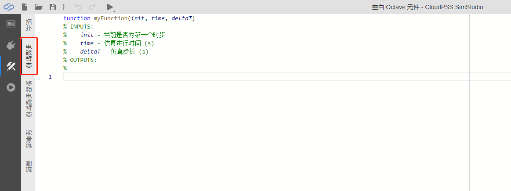

::: info
**在一些场合，使用已有的控制元件实现复杂的控制逻辑较为困难，而使用代码实现则相对简单。
CloudPSS SimStudio支持创建自定义控制元件，通过Matlab/Octave语言，可方便地实现复杂的控制逻辑。**
:::

本例以一个可调高度和时间间隔的阶梯波发生器，向用户展示自定义控制元件的创建和使用方法。

## 新建自定义控制元件  

在CloudPSS SimStudio工作台，点击左上角的`新建`，在弹出的窗口中，选择项目模板下的**空白Octave元件**。点击窗口右下角的新建按钮，即可完成新建。

## 编辑代码

在新建的空白Octave元件页面，选择左侧`电磁暂态`标签，跳转到电磁暂态元件代码编辑窗口。

CloudPSS SimStudio已提供了三个内置变量，分别是*init*（当前是否为第一个时步）、*time*（仿真进行时间）和*deltaT*（仿真步长），用户可以直接使用这三个变量参与控制逻辑实现。

## 参数与引脚定义

## 元件图形设计

## 元件名称与权限设置

## 元件描述与说明

