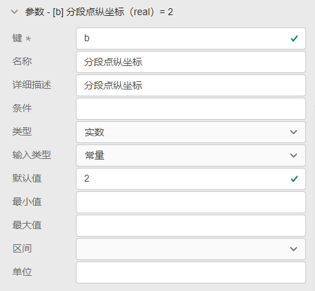

::: info
**在一些场合，使用已有的控制元件实现复杂的控制逻辑较为困难，而使用代码实现则相对简单。
CloudPSS SimStudio支持创建自定义控制元件，通过Matlab/Octave语言，可方便地实现复杂的控制逻辑。**
:::

本例以一个可调斜率和分段点的分段函数，向用户展示自定义控制元件的创建和使用方法。

## 新建自定义控制元件  

在CloudPSS SimStudio工作台，点击左上角的`新建`，在弹出的窗口中，选择项目模板下的**空白Octave元件**。点击窗口右下角的新建按钮，即可完成新建。

## 参数与引脚定义

元件的参数与引脚类型可参考[参数及引脚体系](../ParameterSystem.md)帮助文档，参数与引脚的添加和设置方法可参考[模块封装](../Mask.md)帮助文档。    
  

本例中需要用到的可设置参数有第一段函数斜率*k1*、第二段函数斜率*k2*、分段点横坐标*a*和分段点纵坐标*b*。 在`接口`标签页的参数列表定义中作如下设置。  

本例中需要用到的引脚有一个输入引脚和一个输出引脚。在`接口`标签页的引脚列表定义中作如下设置。

## 元件图形设计

在元件图形设计窗口绘制元件图标，并添加两个引脚，分别与input和output绑定。

## 编辑代码

切换到`实现`标签页，选择`电磁暂态`标签，跳转到电磁暂态元件代码编辑窗口。此时，由于已经定义好元件的参数和引脚，它们的键名会自动识别并列出。

同时，CloudPSS SimStudio已提供了三个内置变量，分别是*init*（当前是否为第一个时步）、*time*（仿真进行时间）和*deltaT*（仿真步长），用户可以直接使用这三个变量参与控制逻辑实现。

将可调斜率和分段点的分段函数代码填入代码编辑窗口。

## 元件名称与权限设置

## 元件描述与说明

