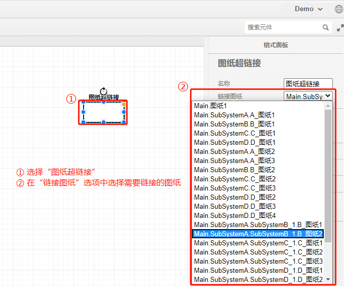

当仿真拓扑较大时，可利用图纸功能将拓扑分开放置到不同的图纸上，图纸间的元件引脚通过标号进行连接。**注意：每个系统至少包含一个图纸**。

## 添加图纸

对任意的主系统(Main)或子系统(SubSystem)都可添加任意数量的图纸。以在“SubSystemB”子系统中添加新的图纸为例，操作方法如下图所示：

**注意：新添加的图纸名称不能重复，否则会报错**。

## 删除图纸

选择待删除的图纸，右键选择“删除”即可完成删除。图纸删除后，该图纸内的所有元件也将随之删除。以删除“SubSystemB”子系统中的“B_图纸2”为例，删除图纸的操作方法如下图所示：

## 重命名图纸

选择待重命名的图纸，右键单击弹出“重命名”选项，点击后弹出图纸重命名框。用户输入图纸新名称，点击“重命名”即完成所选图纸的重命名。

## 图纸超链接

当仿真系统较大且具有大量的图纸时，为了便于快速定位到某一特定图纸，CloudPSS提供了图纸超链接功能。该功能类似于Windows系统的快捷方式，使用方法为：拖拽“图纸超链接”元件至工作空间，点击该元件并在右侧参数面板的“链接图纸”选项中选择想要链接的图纸。完成后，双击该“超链接”元件，可直接跳转到所链接的图纸。使用方法如下图所示：

