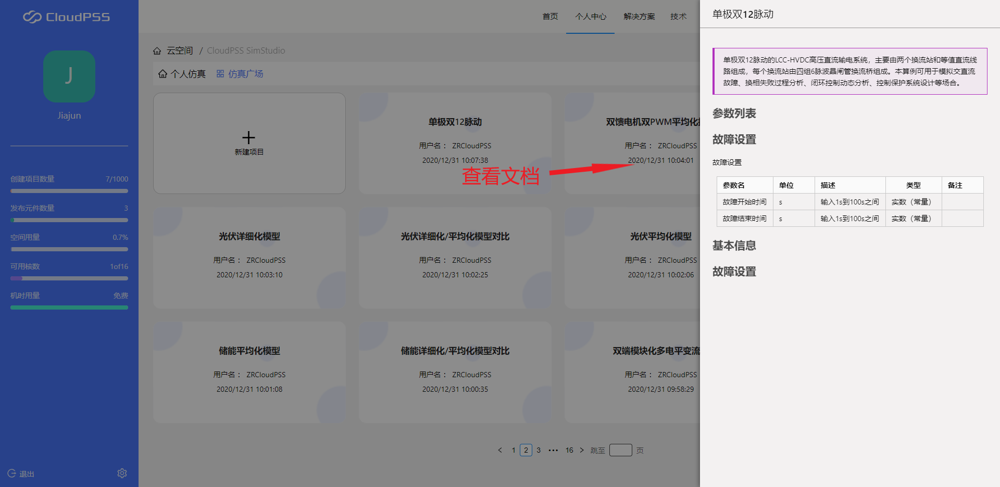

用户登录成功后，页面将跳转至`个人中心`，如图所示。该界面包含功能链接、功能应用、系统信息、用户设置等。

## 功能链接

提供了相关功能的链接入口，具体为：

+ 首页：CloudPSS主页面。

+ 个人中心：个人中心主页面。

+ 解决方案：介绍CloudPSS提供的综合解决方案和成功案例。

+ 技术：介绍CloudPSS云仿真核心技术和研究成果。

+ 新闻动态：显示有CloudPSS管理员发布的新闻信息。

+ 服务：介绍CloudPSS团队提供的服务。

+ 文档：用户帮助文档系统。

## 功能应用

点击功能应用卡片，可以查看该应用的简单介绍，同时可以通过功能按钮进行页面跳转，如图所示。  

点击`进入工作台`，会打开一个新页面并新建一个未命名项目。

点击`进入云空间`，会进入对应功能应用的云空间页面，该页面包含：

+ 个人仿真：用于存储用户的仿真项目文件。

+ 仿真广场：用于显示他人发布的仿真项目文件。  

鼠标移至任一仿真项目文件，会显示文件操作按钮，可对项目文件进行`打开`、`删除`(仅限个人仿真项目文件)以及`查看文档`操作，如图所示。

在仿真项目文件上点击`打开`按钮，会跳转到工作台页面并打开该仿真项目。

在仿真项目文件上点击`查看文档`按钮，页面右侧会出现该仿真项目的文档描述。

## 系统信息
 
显示了用户云空间信息与系统信息。包含：

+ 创建项目数量
  
+ 发布元件数量
  
+ 空间用量
  
+ 可用核数
  
+ 机时用量

## 用户设置
	
点击页面左下角`退出`按钮可以退出当前登录的用户账号。

点击`用户设置`按钮，进入用户设置页面，可以更改当前用户的基本设置与安全设置等。

点击页面右上角用户头像旁的下拉箭头，可以进行快速页面跳转和页面主题设置，如下图所示。

用户首次登录时默认为亮色主题，可以在此切换，且切换后在下次登录时页面会保留该主题设置。

