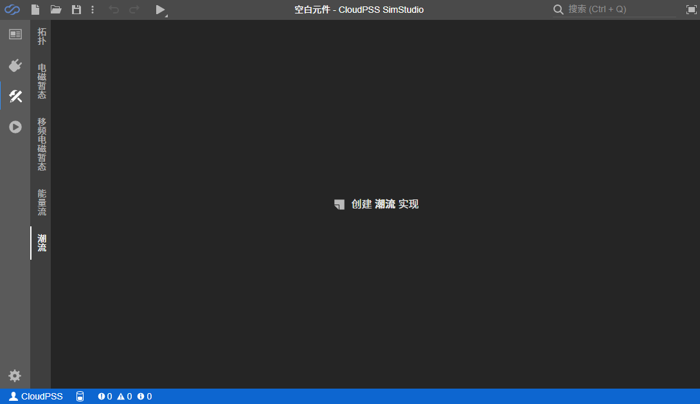

通过元件实现中“潮流”模型实现功能，用户可以为拓扑实现的元件提供简化的潮流模型，或为 Octave 代码实现的电磁暂态元件提供相应的潮流模型。

在项目类型为“元件”的项目实现页面，选择“潮流”实现，点击“创建**潮流**实现”按钮，即可为相应元件创建对应的潮流模型。

## 模型介绍

元件的潮流实现分为两部分，“潮流模型定义”和“潮流输出定义”，前者将元件映射到潮流计算过程中的各类阻抗和负荷模型，后者则用于生成元件的潮流回写数据，将需要的潮流结果写回元件参数，用于暂态仿真初始化等功能。

### 潮流模型定义

在潮流实现页面左侧对潮流模型定义进行编辑。点击“新建潮流模型”创建新的空白潮流模型定义，也可以使用拖放和复制粘贴功能复用已有的模型定义。

潮流模型各字段说明如下：

#### 键

潮流模型的唯一标识符，在该元件的所有潮流模型中要求唯一。要求为合法的标识符（以字母开头，仅包含字母、数字或下划线）。用于标识潮流模型，在输出定义中进行引用获取相应的潮流结果。

#### 名称

潮流模型的名称，用于区分同一元件中的多个模型，在输出潮流结果时也会显示。

当元件只有一个潮流模型时，此项建议置空。

#### 详细描述

模型的详细描述。可使用 MarkDown 输入。

#### 条件

决定模型是否生效的条件表达式。

#### 模型类型

潮流模型类型。CloudPSS 潮流计算应用现提供以下几种潮流模型，用于对元件的潮流计算过程进行建模。

##### 母线

用于抽象潮流计算中的节点。所有其他潮流模型都必须直接或通过短路线连接到母线上。官方元件[三相交流母线](../../../components/comp_PSS/comp_PSSelectrical/ThreePhaseComp/Bus_3p/index.md)即使用了此模型。

该模型包含以下参数：

| 参数名称 | 说明 |
|  绑定引脚 | 该模型绑定的元件引脚 |
| 初始电压 | 母线初始电压，用于设定潮流计算的迭代初值 |
| 初始相角 | 母线初始相角，用于设定潮流计算的迭代初值 |
| 电压基值 | 母线电压基值，用于在潮流计算过程中将参与计算的 |
| 频率 | 母线工作频率，一般为 50Hz，相连的母线必须采用相同频率 |

#### 

### 潮流输出定义

### 表达式书写

## 案例介绍

### 静态负载

### 三相传输线

### 三相三绕组变压器