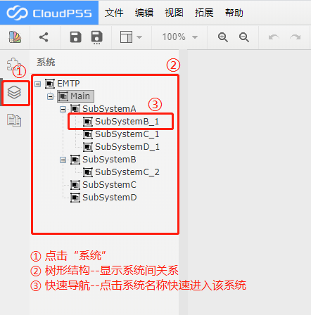
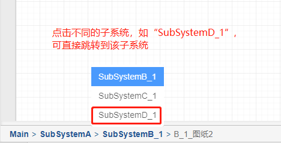

系统栏功能利用树状图形式来展现当前算例的系统嵌套结构，点击系统名称可实现快速导航并定位至该系统。当创建新的子系统时，该树形图将同步生成新的分支。删除某一子系统后，该树形图将删除该节点下的所有分支。创建及删除子系统的步骤详见[系统功能](System.md)。一个包含多个子系统的典型算例的系统栏如下图所示：

## 面包屑导航

在仿真算例搭建过程中，为便于用户快速切换子系统，CloudPSS提供了面包屑导航功能。该功能位于仿真主界面的左下方，显示了当前子系统的树状路径。用户可快速点选对应的树形图节点并切换至其他树形分支。如下图所示：

