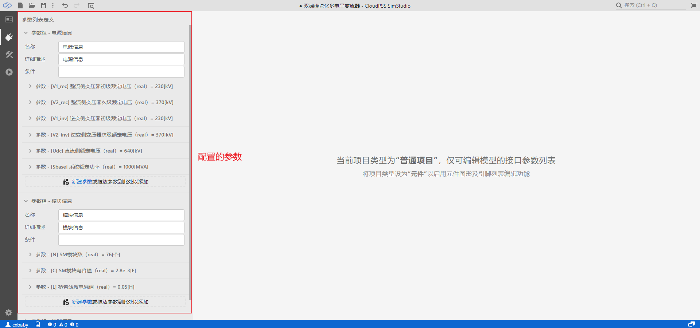

::: info
**当仿真拓扑构建完毕之后，可在`运行`标签页对仿真方案进行配置，并开始仿真计算生成仿真结果。**
:::

## 仿真方案配置

仿真方案配置包括了参数方案配置以及计算方案配置两部分，系统默认会添加一组参数方案和计算方案，如下图所示。

### 1)	参数方案配置：
对于同一个项目，CloudPSS SimStudio支持配置不同的参数运行方案，便于用户快速对比不同参数条件下的仿真结果。在`接口`标签页可以给当前项目添加参数，参数列表将会显示于项目参数的列表内。例如对MMC算例添加一系列参数，并添加不同模块数的参数方案，如下图所示。

参数方案配置的具体使用方法详见[参数方案配置](../../Basic/ParameterCal/index.md)功能帮助。

### 2)	计算方案配置：
CloudPSS SimStudio支持潮流仿真、电磁暂态仿真、移频电磁暂态仿真三种类型仿真计算。用户可根据仿真涉及的应用方向，进行计算方案的配置。潮流仿真支持潮流计算以及功率不平衡量两种求解方式，输出结果为表格形式，潮流仿真的基本原理详见[潮流仿真](../../Powerflow/PowerFlowIntro/index.md)功能帮助。电磁暂态仿真和移频电磁暂态仿真支持启动参数设置以及断面参数设置，相关功能的的使用方法详见[断面保存及导入](../../EMTP/Snapshot/index.md)、 [潮流断面启动](../../EMTP/Initialization/index.md)功能帮助。电磁暂态仿真和移频电磁暂态仿真的仿真输出结果为图线形式，可通过输出通道参数框进行输出通道的选择及配置。电磁暂态仿真和移频电磁暂态仿真的基本原理详见[电磁暂态仿真](../../EMTP/EMTPIntro/index.md)及[移频电磁暂态仿真](../../SFEMT/SFAIntro/index.md)功能帮助。

## 仿真结果显示：

CloudPSS SimStudio对用户的每一次仿真结果都进行存储，用户可通过切换左侧的仿真结果标签进行结果查看，结果标签可进行导出以及删除操作。仿真结果由报错信息、数据结果图形、仿真信息三部分组成。当仿真出现不收敛等错误情况时，报错信息将会给出相应的提示；数据结果图形支持缩放、重命名坐标轴名称、重命名标题名称、下载图像等操作；仿真信息主要显示仿真的耗时等数据。

