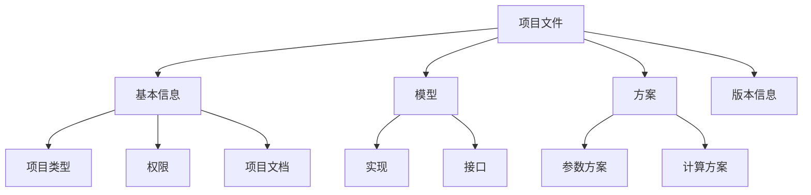

::: tip
**CloudPSS SimStudio 相比前代产品，在定位、设计和功能角度都有了很大的革新。这篇文档将引导新老用户快速熟悉 CloudPSS SimStudio 的基本设计理念和常用功能，从而快速掌握算例构建的能力。**

:::
欢迎使用 CloudPSS SimStudio，模型工坊！

在真正介绍如何使用 CloudPSS SimStudio 之前，我希望先花费几分钟的时间来介绍一下 CloudPSS SimStudio 的设计框架。这能帮助你更清晰地理解 CloudPSS 的模型组织方法。

## 为什么要设计CloudPSS SimStudio？
这是你可能会问到的第一个问题。那我们先来看一下目前CloudPSS平台面临的挑战。
- **大规模复杂算例**
  
  随着功能逐渐完善，用户开始利用 CloudPSS 完成大规模交直流电网全电磁暂态仿真、多能耦合综合能源系统仿真和电力信息物理系统仿真等仿真应用，探索能源互联网运行机理更复杂的系统特性。所构建的算例模型种类繁多，规模越来越大。因此，复杂算例的建模体验和计算效率需要得到保证。

- **多元用户需求**
  
  5年来，CloudPSS线上用户从最初的数十人发展到现在的近万人，涵盖了电气、能源及自动化专业的学生、学者及专业从业人员。不同用户群体对建模仿真的功能需求差异巨大。为了向更多用户提供快捷方便的建模仿真服务，CloudPSS平台需要同时兼顾初级、普通和专业用户的多样化仿真需求。

- **应用接入能力**
  
  目前，CloudPSS已开放潮流计算、电磁暂态仿真、移频暂态仿真和综合能源能量流计算四类应用。未来，我们还将开放更多成熟的应用及接口供大家开发和使用。如何在CloudPSS框架下接入各种用户自定义模型、应用，也是平台着力解决的问题。

- **与人工智能的融合**
  
  作为新一代的能源互联网云仿真平台，CloudPSS将结合高精度仿真、高性能计算和人工智能技术，利用云端异构并行计算资源，帮助用户实现能源系统海量运行场景仿真分析，准确判断复杂不确定性影响下系统运行特性和安全边界。这些仿真结果可被进一步用于训练能源互联网专用人工智能体，形成优化规划设计和系统调控方案。

- **与数字孪生的融合**
  
  近年来，能源电力系统正在经历快速数字化演进，亟需先进的数字孪生技术。因此，CloudPSS平台不仅需要具备数字孪生体模型构建及管理的能力，不断迭代更新，增强仿真、加速和优化等功能，同时也要进一步开放仿真内核API接口，设计适用于大规模电网实时仿真和人工智能决策的异构计算平台，研发数字孪生可视化应用集成工具，全面支撑高度可扩展和可定制的数字孪生展示和应用系统开发。

因此，传统的CloudPSS框架已无法兼顾上面的挑战。平台亟需在建模仿真功能、模型组织管理、仿真任务调度、模型应用接口等方面开展深度创新。至此，**CloudPSS SimStudio——模型工坊**，诞生了！
:::success 
### 这些需求，CloudPSS SimStudio统统安排上！
:::

## CloudPSS SimStudio的设计框架

### 1. 设计理念

为解决这些问题，我们吸取了Simulink、PSCAD、PowerFactory等工业软件在模型管理和应用扩展方面的优点，在综合考虑了建模难度、建模效率、模型规范化、接口扩展性等多方面因素后，设计了一种“模块化系统”的模型管理框架。

:::question 什么是“模块”？
这个概念类似于Simulink中的Module。在CloudPSS SimStudio中，**模块**是由一个元件、一组元件组成的拓扑、一个区域网络、或是用户自定义程序所封装而成的完整系统。**模块是描述模型信息的基本单元**。每个独立的元件、每个算例，都可认为是一个模块。
:::

:::question 什么是“模块化系统”？
我们可以将模块类比为程序设计中的“**函数**”。“函数”存在接口，可以被其他模块调用。同样，在CloudPSS中，针对每个模块，我们可以为其定义灵活的参数和引脚接口，通过不同模块之间连接和多层嵌套的组合，对大规模系统进行有序、高效的管理。
:::

### 2. 项目文件的组织

基于“模块化系统”的设计理念，我们进一步设计了项目文件这一模块管理和组织方法。在CloudPSS SimStudio中，一个**项目文件**是组织和管理一套模块的模型描述及其多个仿真方案的集合。**项目文件**主要包含**模型**和**方案**两部分。其中，

- **模型（Model）**，用于描述当前模块中模型设计的全部数据，包含模型的**实现**和**接口**两部分。
  - **实现（Design）**：使用拓扑图、连接关系、参数和代码来描述模型实现细节。
  - **接口（Interface）**：设计模型的外部调用接口，包括模型的参数、引脚和图标。
- **方案（Scheme）**，用于管理和存储仿真方案，包含**参数方案**和**计算方案**两部分。
  - **参数方案（Parameter Scheme）**：用于管理和存储多套参数。
  - **计算方案（Computation Scheme）**：根据应用的不同，管理和存储不同计算方案（如潮流计算、电磁暂态仿真、移频电磁暂态仿真等）的算法配置。

此外，CloudPSS 项目文件还涉及到项目类型、项目文档、权限管理、版本管理等其他内容。如有兴趣，可以按照这里的指示跳转到相应页面阅读。

### 3. 全新工作台设计

为了兼容不同用户的使用需求和不同应用的接入需求，全新的工作台采用了Web Components组件化设计方法，在定制化、效率和灵活性上相比前代产品均有显著提升。

对应项目文件的组织框架，全新的工作台整体分为**总览**、**接口**、**实现**和**运行**四个标签页。其中，
- **总览（Summary）**，用于配置项目名称、类型、权限等基本信息，编写项目文档。
- **接口（Interface）**，用于配置模型的外部调用接口，包括模型的`参数`、`引脚`和`图标`。
- **实现（Design）**，可以使用图纸、参数和拓扑连接关系，设计模型的内部实现细节。这一页面的用法与前代产品相似。
- **运行（Run）**，用于管理和存储参数方案和计算方案，配置仿真任务，查看仿真结果。

## 还是感觉很复杂？
放心！我们考虑到这一点了。在CloudPSS SimStudio中，我们做了大量的易用性调整。

### 特性1：针对不同需求用户的定制化页面

实际使用过程中，不同需求的用户看到的**界面复杂程度**是不一样的。我们提供了**简单项目**、**普通项目**和**元件**三类项目模板供用户进行选择。如果你只希望利用CloudPSS SimStudio做一点简单的建模仿真实验，可以选择**简单项目**。在此，你只需要使用到**实现**和**运行**两个标签页。当你熟悉了简单的建模和仿真操作后，可以再结合自己的需求开启更复杂的功能。

### 特性2：项目向导、模板和帮助引导
CloudPSS SimStudio完善了项目向导功能，提供了更加丰富的项目模板。同时，在新工作台的每个标签页上，我们也大量标注了明确的引导性文字，来提示用户的下一步操作。

### 特性3：即时错误校验
CloudPSS SimStudio内置了即时错误校验功能。用户在搭建算例的同时，每一步操作完成的1s后，后台会同步对项目文件进行校验，并再状态栏的左下角实时指出错误和引导性文字，帮助用户修改模型。

## 我该如何使用CloudPSS SimStudio？

为更方便我们的用户快速掌握平台使用能力，我们根据需求的不同，将用户群体分为以下几类。大家可以根据自己的需求灵活阅读相应文档，快速上手CloudPSS SimStudio。

:::info 学习型用户
- 我只希望用CloudPSS来学习电气专业知识
- 我希望熟悉电力系统模型和仿真工具，搭建简单仿真算例
- 我希望完成课程实验
:::success 
你只需要在`项目类型`处选择`简单项目`，按照[**快速入门**](../../guide/rumen/index.md)中的3个算例构建提示，掌握CloudPSS SimStudio的基础功能，学习[**量测和输出系统**](../../features/Basic/Measure/index.md)，即可实现上述需求。
:::

:::info 研究型用户
- 我希望使用CloudPSS做方式计算、参数优化、控制器设计等模型和算法研究
- 我需要做多场景分析
- ...
:::success 
在掌握CloudPSS SimStudio的基础功能后，你需要进一步了解CloudPSS的[**参数和引脚体系**](../../features/Basic/ParameterSystem/index.md)、[**元件表**](../../features/Basic/ComponentTable/index.md)、[**参数方案配置**](../../features/Basic/ParameterCal/index.md)功能。在`项目类型`处选择`普通项目`，即可使用CloudPSS完成这些研究。
:::

:::info 专业型用户
- 我希望使用CloudPSS构建含数万节点的大规模电网算例
- 我需要团队协作
- 我需要自定义元件和自定义应用
- ...
:::success 
你需要进一步掌握[**模块封装**](../../features/Basic/Mask/index.md)、[**模块调用**](../../features/Basic/System/index.md)、[**权限管理**](../../features/Workbench/Summary/index.md)等功能。在`项目类型`处选择`元件`，即可使用CloudPSS构建自定义元件。
:::

:::info 其他用户
- 我希望获得更快的建模仿真体验。
- 觉得线上版平台还无法满足我的需求。
- ...
:::success 
没问题！请直接通过CloudPSS公众号与我们联系。CloudPSS SimStudio也提供私有化部署和软硬件一体化版本。相比线上版本，软硬件一体化版本的功能和性能更强大。同时，我们也提供其他高级仿真功能和定制化开发服务。
:::

最后，祝大家在模型工坊“玩”得顺利！
